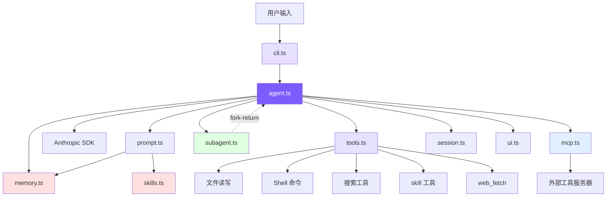

# 引言

## 项目定位

一个 ~3400 行的 TypeScript 实现，覆盖 Claude Code 的核心：Agent Loop、工具系统、上下文压缩、记忆、技能、多 Agent、MCP、Plan Mode、权限。参考 Claude Code 开源快照（~50 万行 TS）的设计，只保留最小必要组件。

**核心思路**：`while (true)` 循环里模型决定下一步做什么 —— 有 tool_use 就执行并回喂结果，无 tool_use 就退出。

## 架构全景



## 文件行数

| 文件 | 行数 | 职责 |
|------|------|------|
| `agent.ts` | ~1081 | Agent 主循环、消息构造、API 调用、工具编排、子 Agent、4 层压缩、预算、Plan Mode |
| `tools.ts` | ~858 | 13 个工具 + 5 种权限模式 + mtime 防护 + 延迟加载 |
| `memory.ts` | ~392 | 4 类型 + 文件存储 + 语义召回 + 异步预取 |
| `cli.ts` | ~340 | CLI 入口、参数、REPL |
| `prompt.ts` | ~230 | 模板 + @include + 变量替换 + 记忆/技能注入 |
| `ui.ts` | ~211 | 终端颜色/格式化 |
| `subagent.ts` | ~199 | 3 内置 + 自定义 Agent 发现 |
| `skills.ts` | ~175 | frontmatter 解析 + inline/fork 双模式 |
| `mcp.ts` | ~266 | JSON-RPC over stdio、工具发现与转发 |
| `session.ts` | ~62 | 会话 JSON 持久化 |
| `frontmatter.ts` | ~41 | YAML frontmatter 解析 |

## 快速开始

```bash
git clone https://github.com/Windy3f3f3f3f/claude-code-from-scratch.git
cd claude-code-from-scratch
npm install
export ANTHROPIC_API_KEY=sk-ant-xxx
npm run dev
```

## 常用启动选项

```bash
mini-claude --yolo "run all tests"          # 跳过所有确认
mini-claude --plan "analyze this codebase"  # 只分析不修改
mini-claude --accept-edits "refactor"       # 自动批准文件编辑
mini-claude --dont-ask "check style"        # 需确认的操作自动拒绝
mini-claude --thinking "analyze this bug"   # Extended Thinking
mini-claude --resume                        # 恢复上次会话
mini-claude --max-cost 0.50 --max-turns 20  # 预算控制
```

## 章节地图

| 章节 | 本项目 | Claude Code 对应 |
|------|--------|-----------------|
| **Phase 1：Coding Agent 骨架** | | |
| [1. Agent Loop](docs/01-agent-loop.md) | `agent.ts::chatAnthropic()` | `src/query.ts::queryLoop` |
| [2. 工具系统](docs/02-tools.md) | `tools.ts` | `src/Tool.ts` + `src/tools/` (66+) |
| [3. System Prompt](docs/03-system-prompt.md) | `prompt.ts` | `src/constants/prompts.ts` |
| [4. CLI 与会话](docs/04-cli-session.md) | `cli.ts` + `session.ts` | `src/entrypoints/cli.tsx` |
| [5. 流式输出](docs/05-streaming.md) | `agent.ts` stream | `src/services/api/claude.ts` |
| [6. 权限与安全](docs/06-permissions.md) | `tools.ts::checkPermission()` | `src/utils/permissions/` (52KB) |
| [7. 上下文管理](docs/07-context.md) | `agent.ts::checkAndCompact()` | `src/services/compact/` |
| **Phase 2：进阶能力** | | |
| [8. 记忆系统](docs/08-memory.md) | `memory.ts` | `src/utils/memory.ts` |
| [9. 技能系统](docs/09-skills.md) | `skills.ts` | `src/utils/skills.ts` + `SkillTool/` |
| [10. Plan Mode](docs/10-plan-mode.md) | `agent.ts` + `tools.ts` + `cli.ts` | `EnterPlanMode` / `ExitPlanMode` |
| [11. 多 Agent](docs/11-multi-agent.md) | `subagent.ts` + `agent.ts` | `src/tools/AgentTool/` |
| [12. MCP 集成](docs/12-mcp.md) | `mcp.ts` | `src/services/mcpClient.ts` |
| [13. 架构对比](docs/13-whats-next.md) | — | — |
