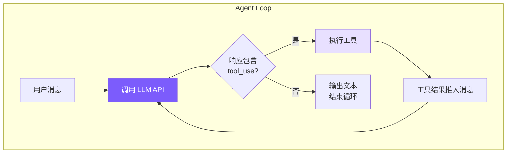

# 1. Agent Loop — 核心循环

一个 while 循环：调用 LLM → 有 tool_use 就执行 → 结果喂回 → 重复，直到没有 tool_use。



## 参考：Claude Code 的做法

- **双层架构**：`QueryEngine`（会话级，~1155 行）+ `queryLoop`（单轮级，~1728 行）
- **`async function*`**：queryLoop 是异步生成器，天然背压 + 线性控制流
- **7 种 continue reason**：next_turn / collapse_drain_retry / reactive_compact_retry / max_output_tokens_escalate / max_output_tokens_recovery / stop_hook_blocking / token_budget_continuation
- **错误扣留**：可恢复错误先不 yield，恢复成功用户无感知
- **`StreamingToolExecutor`**：API 流式响应期间并行执行工具

我们的实现：单类合并两层，只处理 `next_turn`，串行执行工具。

## 核心实现

```typescript
// agent.ts — chatAnthropic
private async chatAnthropic(userMessage: string): Promise<void> {
  this.anthropicMessages.push({ role: "user", content: userMessage });
  // 在 turn boundary 触发 auto-compact：此时最后一条是纯文本 user，
  // compactAnthropic 内部的 slice(0, -1) 不会切断 tool_use ↔ tool_result 配对
  await this.checkAndCompact();

  while (true) {
    if (this.abortController?.signal.aborted) break;

    const response = await this.callAnthropicStream();
    this.totalInputTokens += response.usage.input_tokens;
    this.totalOutputTokens += response.usage.output_tokens;
    this.lastInputTokenCount = response.usage.input_tokens;

    const toolUses = response.content.filter(
      (b): b is Anthropic.ToolUseBlock => b.type === "tool_use"
    );
    this.anthropicMessages.push({ role: "assistant", content: response.content });

    if (toolUses.length === 0) {
      printCost(this.totalInputTokens, this.totalOutputTokens);
      break;
    }

    const toolResults: Anthropic.ToolResultBlockParam[] = [];
    for (const toolUse of toolUses) {
      if (this.abortController?.signal.aborted) break;
      const input = toolUse.input as Record<string, any>;
      printToolCall(toolUse.name, input);

      const perm = checkPermission(toolUse.name, input, this.permissionMode, this.planFilePath);
      if (perm.action === "deny") {
        toolResults.push({ type: "tool_result", tool_use_id: toolUse.id,
          content: `Action denied: ${perm.message}` });
        continue;
      }
      if (perm.action === "confirm" && perm.message && !this.confirmedPaths.has(perm.message)) {
        const confirmed = await this.confirmDangerous(perm.message);
        if (!confirmed) {
          toolResults.push({ type: "tool_result", tool_use_id: toolUse.id,
            content: "User denied this action." });
          continue;
        }
        this.confirmedPaths.add(perm.message);
      }

      const result = await executeTool(toolUse.name, input);
      printToolResult(toolUse.name, result);
      toolResults.push({ type: "tool_result", tool_use_id: toolUse.id, content: result });
    }

    this.anthropicMessages.push({ role: "user", content: toolResults });
  }
}
```

## 消息数组的增长

```
第 1 轮:
  { role: "user",      content: "帮我修复 bug" }
  { role: "assistant", content: [text + tool_use(read_file)] }
  { role: "user",      content: [tool_result("文件内容...")] }

第 2 轮:
  ...前 3 条,
  { role: "assistant", content: [text + tool_use(edit_file)] }
  { role: "user",      content: [tool_result("编辑成功")] }

第 3 轮:
  ...前 5 条,
  { role: "assistant", content: [text("已修复!")] }  ← 无 tool_use → break
```

每轮 +2 条。工具结果用 `role: "user"` 推入是 Anthropic API 协议要求，通过 `tool_use_id` 关联回调用。

## AbortController

```typescript
async chat(userMessage: string): Promise<void> {
  this.abortController = new AbortController();
  try { await this.chatAnthropic(userMessage); }
  finally { this.abortController = null; }
  printDivider();
  this.autoSave();
}

abort() { this.abortController?.abort(); }
```

`abort()` 后 signal 变 `aborted`，循环在下一个检查点退出；signal 同时传给 API 请求。
