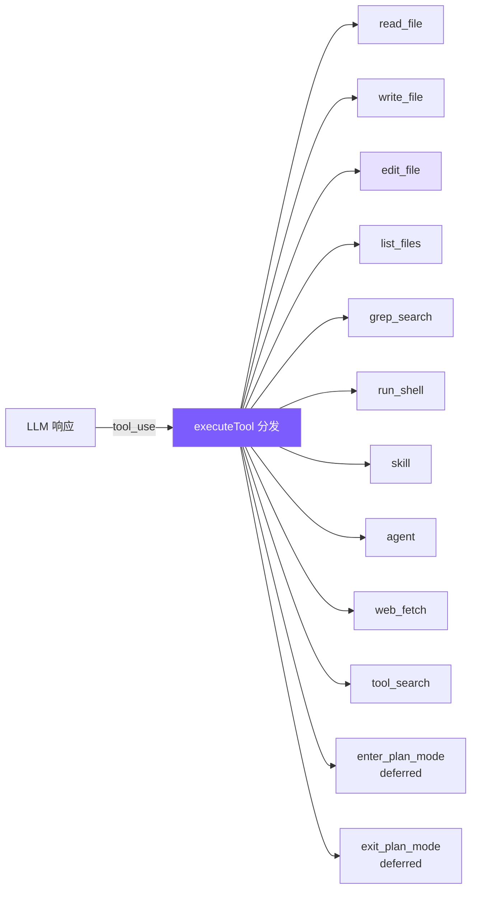

# 2. 工具系统

13 个工具（6 核心 + web_fetch + tool_search + skill + agent + 2 plan mode）+ read-before-edit + mtime + 延迟加载。



## 参考：Claude Code 的做法

**统一 `Tool` 泛型接口**：`isConcurrencySafe(input)` 接收参数（同工具不同参数不同语义，`ls` 只读、`rm` 非只读），`prompt(options)` 每工具自带 system prompt 片段，React 渲染方法自带。

**`buildTool` 工厂 fail-closed 默认值**：`isConcurrencySafe`/`isReadOnly`/`isDestructive` 默认 `false` —— 错标只读为写只是多弹窗，反过来会危险。

**注册三层流水线**：
- Layer 1：`getAllBaseTools()` 直接 import + `feature()` 编译时宏做死代码消除
- Layer 2：`getTools()` 运行时按 SIMPLE 模式/deny 规则/`isEnabled()` 过滤
- Layer 3：`assembleToolPool()` 内置在前 + MCP 追加，分区排序保护缓存断点

**8 阶段执行生命周期**：查找 → 两阶段验证（Zod + 业务）→ 并行启动 Hook & Bash 分类器 → 权限检查 → `call()` 流式进度 → 大结果磁盘持久化 → Post-Hook → `tool_result` 返回。**核心哲学：错误是数据，不是异常** —— 任何阶段错误都作为 `is_error: true` 的 tool_result 返回，让模型自我纠正。

**并发控制**：非并发安全独占，多个并发安全并跑。`StreamingToolExecutor` 检测到完整 block 就启动，工具延迟约 1s 藏进 5-30s 流窗口。上限 `MAX_TOOL_USE_CONCURRENCY = 10`。

**edit_file 14 步验证**（按 I/O 成本排序）：最关键 3 个是 read-before-edit（代码强制、非 prompt 建议）、mtime 检测外部修改、配置文件 JSON Schema 校验。

**为什么 search-and-replace**（对比其它方案）：

| 方案 | 致命缺陷 |
|------|---------|
| 行号编辑 | 位置相关，多步编辑要重算 |
| AST 编辑 | 语法错文件恰恰最需编辑，AST 解析器却直接报错 |
| Unified diff | LLM 严格格式表现差 |
| 全文件重写 | 浪费 Token + 遗漏未修改代码 + 不易 review |
| **字符串替换** | 幻觉安全 —— 对不上就失败，模型重读纠正 |

## 简化决策

| Claude Code | mini-claude | 理由 |
|-------------|-------------|------|
| 66+ 工具类，独立目录 | 1 个文件 + 6 个函数 | 教程无需工业级模块化 |
| 8 阶段生命周期 | switch 分发 | 省 Hook / 分类器 |
| StreamingToolExecutor 并发 | 流式提前执行 + 只读并行 | 简化调度 |
| 14 步验证流水线 | 唯一性 + 引号容错 + read-before-edit + mtime | 保留最关键的 |
| 三级大结果限制 | 单层 50K 截断 | 够防上下文爆炸 |

## 工具定义

```typescript
// tools.ts —— Anthropic 原生 schema，直接传 API
export const toolDefinitions: ToolDef[] = [
  {
    name: "read_file",
    description: "Read the contents of a file. Returns the file content with line numbers.",
    input_schema: {
      type: "object",
      properties: { file_path: { type: "string", description: "The path to the file to read" } },
      required: ["file_path"],
    },
  },
  {
    name: "write_file",
    description: "Write content to a file. Creates the file if it doesn't exist, overwrites if it does.",
    input_schema: {
      type: "object",
      properties: {
        file_path: { type: "string", description: "The path to the file to write" },
        content: { type: "string", description: "The content to write to the file" },
      },
      required: ["file_path", "content"],
    },
  },
  {
    name: "edit_file",
    description: "Edit a file by replacing an exact string match with new content. The old_string must match exactly.",
    input_schema: {
      type: "object",
      properties: {
        file_path: { type: "string" },
        old_string: { type: "string", description: "The exact string to find and replace" },
        new_string: { type: "string" },
      },
      required: ["file_path", "old_string", "new_string"],
    },
  },
  // ... list_files, grep_search, run_shell, skill, agent, web_fetch, tool_search, enter/exit_plan_mode
];
```

静态数组 + switch，13 个工具用不着类体系。

## 分发器

```typescript
// tools.ts
export async function executeTool(name: string, input: Record<string, any>): Promise<string> {
  let result: string;
  switch (name) {
    case "read_file":   result = readFile(input as any); break;
    case "write_file":  result = writeFile(input as any); break;
    case "edit_file":   result = editFile(input as any); break;
    case "list_files":  result = await listFiles(input as any); break;
    case "grep_search": result = grepSearch(input as any); break;
    case "run_shell":   result = runShell(input as any); break;
    default: return `Unknown tool: ${name}`;
  }
  return truncateResult(result);  // 50K 保护
}
```

`default` 返回字符串而非抛异常 —— 让模型能纠正幻觉出的工具名。

## edit_file — 核心

```typescript
function editFile(input: { file_path: string; old_string: string; new_string: string }): string {
  try {
    const content = readFileSync(input.file_path, "utf-8");
    const count = content.split(input.old_string).length - 1;
    if (count === 0) return `Error: old_string not found in ${input.file_path}`;
    if (count > 1)  return `Error: old_string found ${count} times. Must be unique.`;
    const newContent = content.replace(input.old_string, input.new_string);
    writeFileSync(input.file_path, newContent);
    return `Successfully edited ${input.file_path}`;
  } catch (e: any) { return `Error editing file: ${e.message}`; }
}
```

**唯一性检查**是核心：0 次 = 幻觉，>1 次 = 上下文不足。**宁可失败也不猜测**。

## 引号容错

LLM tokenization 可能把直引号变弯引号，无容错就 100% 失败：

```typescript
function normalizeQuotes(s: string): string {
  return s
    .replace(/[\u2018\u2019\u2032]/g, "'")   // curly single → straight
    .replace(/[\u201C\u201D\u2033]/g, '"');   // curly double → straight
}

function findActualString(fileContent: string, searchString: string): string | null {
  if (fileContent.includes(searchString)) return searchString;
  const normSearch = normalizeQuotes(searchString);
  const normFile = normalizeQuotes(fileContent);
  const idx = normFile.indexOf(normSearch);
  if (idx !== -1) return fileContent.substring(idx, idx + searchString.length);
  return null;
}
```

匹配后返回**文件中的原始字符串**（而非规范化版本），保留原始字符风格。成功后打印 `@@ -N,1 +N,1 @@` 简易 diff（行号 = `old_string` 前面的 `\n` 数）。

## 其它工具（要点）

**read_file**：`readFileSync` + 加行号（供 LLM 定位；`edit_file` 匹配的是内容，不是行号）。

**write_file**：`mkdirSync({recursive: true})` 自动建父目录，模型不必额外 shell。System prompt 引导优先 `edit_file`。

**grep_search**：`grep --line-number --color=never -r`，退出码 1（无匹配）不视为错误，2+ 才是；截断前 100 条附加 `... and N more`。（Claude Code 用 ripgrep，我们用系统 grep。）

**run_shell**：`execSync` + timeout；失败时**同时**返回 stdout & stderr（编译器常在 stderr 报错的同时 stdout 有部分输出）；空输出返回 `"(no output)"` 避免困惑。

**web_fetch**：30s timeout + HTML 去标签 + 50KB 上限；标记 `CONCURRENCY_SAFE`。

## 结果截断（保留头尾）

```typescript
const MAX_RESULT_CHARS = 50000;
function truncateResult(result: string): string {
  if (result.length <= MAX_RESULT_CHARS) return result;
  const keepEach = Math.floor((MAX_RESULT_CHARS - 60) / 2);
  return (
    result.slice(0, keepEach) +
    "\n\n[... truncated " + (result.length - keepEach * 2) + " chars ...]\n\n" +
    result.slice(-keepEach)
  );
}
```

保留头尾（很多输出关键信息在末尾：编译错误摘要、测试统计）。

## Read-before-edit + mtime 防护

```typescript
// tools.ts — executeTool 中的 mtime 追踪
export async function executeTool(
  name: string, input: Record<string, any>,
  readFileState?: Map<string, number>  // filepath → mtimeMs
): Promise<string> {
  switch (name) {
    case "read_file":
      result = readFile(input as any);
      if (readFileState && !result.startsWith("Error")) {
        const absPath = resolve(input.file_path);
        try { readFileState.set(absPath, statSync(absPath).mtimeMs); } catch {}
      }
      break;

    case "write_file": {
      const absPath = resolve(input.file_path);
      if (readFileState && existsSync(absPath)) {
        if (!readFileState.has(absPath))
          return "Error: You must read this file before writing. Use read_file first.";
        if (statSync(absPath).mtimeMs !== readFileState.get(absPath)!)
          return "Warning: file was modified externally. Please read_file again.";
      }
      result = writeFile(input as any);
      if (readFileState && !result.startsWith("Error")) {
        try { readFileState.set(absPath, statSync(absPath).mtimeMs); } catch {}
      }
      break;
    }
    // edit_file 同理
  }
}
```

- `readFileState` Map 挂在 Agent 实例上，key 绝对路径，value `mtimeMs`
- 新文件跳过检查（`existsSync` false 时不强制先读）
- mtime 不一致 = 文件被外部修改 → 警告而非静默覆盖

## 延迟加载

工具多了（66+）时，全部 schema 一起发浪费 token。**deferred 工具只发名称，模型用 `tool_search` 按需激活**。

```typescript
// tools.ts
{
  name: "enter_plan_mode",
  description: "Enter plan mode to switch to a read-only planning phase...",
  input_schema: { type: "object", properties: {} },
  deferred: true,  // ← 标记
},

const activatedTools = new Set<string>();

export function getActiveToolDefinitions(allTools?: ToolDef[]): Anthropic.Tool[] {
  const tools = allTools || toolDefinitions;
  return tools
    .filter(t => !t.deferred || activatedTools.has(t.name))
    .map(({ deferred, ...rest }) => rest);
}

// tool_search 执行
case "tool_search": {
  const query = (input.query as string || "").toLowerCase();
  const matches = toolDefinitions.filter(t => t.deferred).filter(t =>
    t.name.toLowerCase().includes(query) ||
    (t.description || "").toLowerCase().includes(query)
  );
  if (matches.length === 0) return "No matching deferred tools found.";
  for (const m of matches) activatedTools.add(m.name);
  return JSON.stringify(matches.map(t => ({
    name: t.name, description: t.description, input_schema: t.input_schema,
  })), null, 2);
}
```

流程：`getActiveToolDefinitions` 过滤 → system prompt 通过 `getDeferredToolNames()` 告知可激活列表 → 模型 `tool_search` → 加入 `activatedTools` → 下次调用带完整 schema。

## 简化对比

| 维度 | Claude Code | mini-claude |
|------|------------|-------------|
| **工具数量** | 66+ | 13 |
| **执行模式** | StreamingToolExecutor 并发 | 流式提前 + 只读并行 |
| **搜索引擎** | ripgrep | 系统 grep |
| **编辑验证** | 14 步 + readFileTimestamps | 唯一性 + 引号容错 + read-before-edit + mtime |
| **Shell 安全** | AST + 沙箱 + 23 项 | 正则 + 确认 |
| **延迟加载** | deferred + ToolSearch | 同 |
