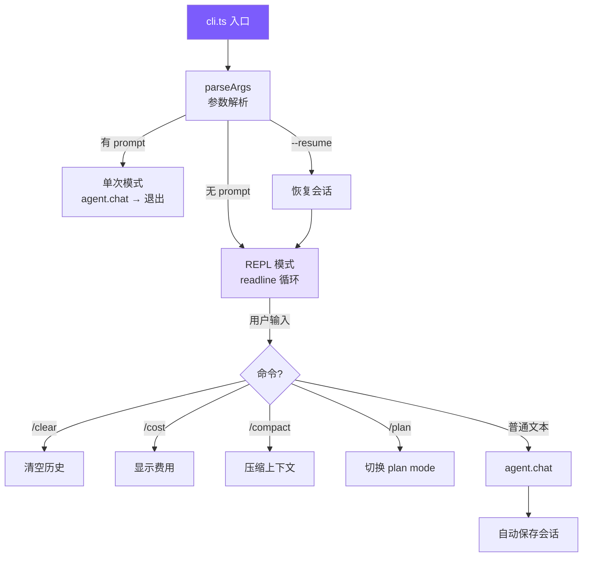

# 4. CLI 与会话

## 本章目标

构建用户接口层：命令行参数解析、交互式 REPL、Ctrl+C 中断处理、会话持久化和恢复。



## Claude Code 怎么做的

Claude Code 的入口是 `src/entrypoints/cli.tsx`——用 React/Ink 把组件模型搬进终端，支持流式 Markdown 渲染、Vim 模式、多 Tab、键盘自定义。会话用 JSONL 格式追加写入，崩溃安全。

### 终端原生 vs GUI

这是一个主动选择。开发者的工作流在终端里，打开浏览器意味着上下文切换。终端原生就是另一个命令行工具，跟 `git`、`grep` 一样嵌入到已有工作流。具体好处：SSH 环境可用、可接管道 (`echo "fix" | claude`)、支持 tmux 多实例并行、内存开销接近零。

React/Ink 的作用是弥补终端的交互限制——有了组件模型，流式输出、diff 视图这类复杂 UI 才变得可维护。

### 可观察的自主性

Claude Code UX 的核心理念：**Agent 自由行动，但让用户实时看到每一步**。

```
📖 read_file src/app.ts
  1 | import express from ...
  ... (1234 chars total)

✏️ edit_file src/app.ts
  - const port = 3000
  + const port = process.env.PORT
```

中断成本远低于撤销成本。用户在 Agent 走错方向前 3 秒就能按 Ctrl+C，而不是等 20 秒执行完再花更多时间撤销。每个工具有 4 种渲染方法（开始/完成/被拒/报错），长时间运行的工具实时流式输出 stdout，而不是等完成才展示。

### JSONL 会话存储

整体 JSON 覆盖写入有两个问题：写入中途崩溃会损坏整个文件；对话越长每次保存越慢。

JSONL 每轮追加一行，O(1) 写入，崩溃最多丢最后一行。文件系统的 append 操作通常是原子的。恢复时逐行解析，跳过末尾不完整的行即可。

## 我们的实现

### 参数解析

```typescript
// cli.ts — parseArgs

function parseArgs(): ParsedArgs {
  const args = process.argv.slice(2);
  let permissionMode: PermissionMode = "default";
  let thinking = false;
  let model = process.env.MINI_CLAUDE_MODEL || "claude-opus-4-6";
  let resume = false;
  let maxCost: number | undefined;
  let maxTurns: number | undefined;
  const positional: string[] = [];

  for (let i = 0; i < args.length; i++) {
    if (args[i] === "--yolo" || args[i] === "-y") {
      permissionMode = "bypassPermissions";
    } else if (args[i] === "--plan") {
      permissionMode = "plan";
    } else if (args[i] === "--accept-edits") {
      permissionMode = "acceptEdits";
    } else if (args[i] === "--dont-ask") {
      permissionMode = "dontAsk";
    } else if (args[i] === "--thinking") {
      thinking = true;
    } else if (args[i] === "--model" || args[i] === "-m") {
      model = args[++i] || model;
    } else if (args[i] === "--resume") {
      resume = true;
    } else if (args[i] === "--max-cost") {
      const v = parseFloat(args[++i]);
      if (!isNaN(v)) maxCost = v;
    } else if (args[i] === "--max-turns") {
      const v = parseInt(args[++i], 10);
      if (!isNaN(v)) maxTurns = v;
    } else if (args[i] === "--help" || args[i] === "-h") {
      console.log(`Usage: mini-claude [options] [prompt] ...`);
      process.exit(0);
    } else {
      positional.push(args[i]);
    }
  }

  return {
    permissionMode, model, resume, thinking, maxCost, maxTurns,
    prompt: positional.length > 0 ? positional.join(" ") : undefined,
  };
}
```

手写循环而不用 commander.js，因为只有 10 个参数，零依赖更轻。用 `for` 而不是 `forEach` 是因为带值参数（`--model claude-sonnet`）需要 `++i` 跳到下一个元素。

### 两种运行模式

```typescript
// cli.ts — main

async function main() {
  const { permissionMode, model, prompt, resume, thinking, maxCost, maxTurns } = parseArgs();

  // API key 从环境变量获取，不支持命令行传递（避免泄露到 shell history）
  const resolvedApiKey = process.env.ANTHROPIC_API_KEY;
  if (!resolvedApiKey) {
    printError(`API key is required. Set ANTHROPIC_API_KEY env var.`);
    process.exit(1);
  }

  const agent = new Agent({ permissionMode, model, apiKey: resolvedApiKey, thinking, maxCost, maxTurns });

  if (resume) {
    const sessionId = getLatestSessionId();
    if (sessionId) {
      const session = loadSession(sessionId);
      if (session) agent.restoreSession(session);
    }
  }

  if (prompt) {
    await agent.chat(prompt);       // 单次模式：执行后退出
  } else {
    await runRepl(agent);           // REPL 模式：交互循环
  }
}
```

### REPL 实现

```typescript
// cli.ts — runRepl

async function runRepl(agent: Agent) {
  const rl = readline.createInterface({ input: process.stdin, output: process.stdout });

  let sigintCount = 0;
  process.on("SIGINT", () => {
    if (agent.isProcessing) {
      agent.abort();
      console.log("\n  (interrupted)");
      sigintCount = 0;
      printUserPrompt();
    } else {
      sigintCount++;
      if (sigintCount >= 2) { console.log("\nBye!\n"); process.exit(0); }
      console.log("\n  Press Ctrl+C again to exit.");
      printUserPrompt();
    }
  });

  printWelcome();

  // rl.once 而非 rl.on：保证严格串行，避免多个 chat 并发修改消息历史
  const askQuestion = (): void => {
    printUserPrompt();
    rl.once("line", async (line) => {
      const input = line.trim();
      sigintCount = 0;

      if (!input) { askQuestion(); return; }
      if (input === "exit" || input === "quit") { console.log("\nBye!\n"); process.exit(0); }

      if (input === "/clear") { agent.clearHistory(); askQuestion(); return; }
      if (input === "/cost")  { agent.showCost(); askQuestion(); return; }
      if (input === "/compact") {
        try { await agent.compact(); } catch (e: any) { printError(e.message); }
        askQuestion(); return;
      }
      if (input === "/plan") { agent.togglePlanMode(); askQuestion(); return; }

      try {
        await agent.chat(input);
      } catch (e: any) {
        if (e.name !== "AbortError" && !e.message?.includes("aborted")) printError(e.message);
      }

      askQuestion();
    });
  };

  askQuestion();
}
```

**Ctrl+C 的双重语义**：处理中按下 → 中断当前操作，回到输入提示；空闲时按下 → 第一次提醒，第二次退出。这避免了两种意外：手滑 Ctrl+C 导致整个会话丢失，以及 Agent 跑偏时只能眼睁睁等它跑完。

**`rl.once` vs `rl.on`**：`rl.on` 注册的 handler 不会等 `await agent.chat()` 完成就响应下一行输入，导致多个 chat 并发修改消息历史。`rl.once` 每次只监听一行，处理完再递归注册，天然串行。

### 会话持久化

```typescript
// session.ts

const SESSION_DIR = join(homedir(), ".mini-claude", "sessions");

export function saveSession(id: string, data: SessionData): void {
  ensureDir();
  writeFileSync(join(SESSION_DIR, `${id}.json`), JSON.stringify(data, null, 2));
}

export function getLatestSessionId(): string | null {
  const sessions = listSessions();
  if (sessions.length === 0) return null;
  sessions.sort((a, b) => new Date(b.startTime).getTime() - new Date(a.startTime).getTime());
  return sessions[0].id;
}
```

每次 `agent.chat()` 完成后自动保存，保存失败静默忽略（不能因为磁盘满让整个对话崩溃）。恢复时直接把消息数组加载回 Agent：

```typescript
// agent.ts
private autoSave() {
  try {
    saveSession(this.sessionId, {
      metadata: { id: this.sessionId, model: this.model, cwd: process.cwd(),
                  startTime: this.sessionStartTime, messageCount: this.getMessageCount() },
      anthropicMessages: this.anthropicMessages,
    });
  } catch {}
}

restoreSession(data: { anthropicMessages?: any[] }) {
  if (data.anthropicMessages) this.anthropicMessages = data.anthropicMessages;
  printInfo(`Session restored (${this.getMessageCount()} messages).`);
}
```

### 终端 UI — ui.ts

所有输出通过 `ui.ts` 统一格式化：

```typescript
// ui.ts（使用 chalk）

export function printToolCall(name: string, input: Record<string, any>) {
  const icon = getToolIcon(name);      // read_file → 📖, run_shell → 💻
  const summary = getToolSummary(name, input);
  console.log(chalk.yellow(`\n  ${icon} ${name}`) + chalk.gray(` ${summary}`));
}

export function printToolResult(name: string, result: string) {
  const maxLen = 500;
  const truncated = result.length > maxLen
    ? result.slice(0, maxLen) + chalk.gray(`\n  ... (${result.length} chars total)`)
    : result;
  console.log(chalk.dim(truncated.split("\n").map((l) => "  " + l).join("\n")));
}
```

工具结果在 UI 层截断到 500 字符——这是给人看的显示，完整结果已在消息历史中。

> **下一章**：让 Agent 的输出实时显示——流式输出。
