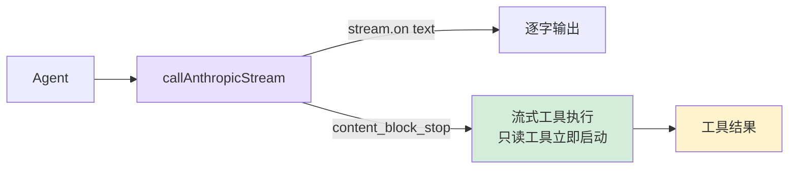

# 5. 流式输出

逐字显示 + 把工具执行"藏"进流式窗口。



## 参考：Claude Code 的做法

- **为什么流式**：模型 30-80 tok/s，长回答 10-30s；用户等待容忍 2-3s。流式让第一个字几百 ms 就出现。
- **底层 SSE**：单向持久 HTTP 推 `data:` 行，比 WebSocket 简单，LLM 场景够用。
- **`StreamingToolExecutor`**：模型还在生成时，已解析完的 tool_use block 就开始执行；5-30s 流窗口内文件读取（<100ms）几乎全部覆盖。
- **重试策略**：429/503/529 + 网络瞬断可重试，400/401/404 不重试；指数退避 + 抖动防"重试风暴"。

## SDK stream

```typescript
// agent.ts — callAnthropicStream
private async callAnthropicStream(): Promise<Anthropic.Message> {
  return withRetry(async (signal) => {
    const createParams: any = {
      model: this.model,
      max_tokens: this.thinkingMode !== "disabled" ? maxOutput : 16384,
      system: this.systemPrompt,
      tools: toolDefinitions,
      messages: this.anthropicMessages,
    };

    if (this.thinkingMode === "enabled") {
      createParams.thinking = { type: "enabled", budget_tokens: maxOutput - 1 };
    } else if (this.thinkingMode === "adaptive") {
      createParams.thinking = { type: "enabled", budget_tokens: 10000 };
    }

    const stream = this.anthropicClient!.messages.stream(createParams, { signal });

    let firstText = true;
    stream.on("text", (text) => {
      if (firstText) { printAssistantText("\n"); firstText = false; }
      printAssistantText(text);
    });

    const finalMessage = await stream.finalMessage();

    // thinking blocks 不入历史，避免占满上下文
    if (this.thinkingMode !== "disabled") {
      finalMessage.content = finalMessage.content.filter((b: any) => b.type !== "thinking");
    }
    return finalMessage;
  }, this.abortController?.signal);
}
```

SDK 封装 SSE 解析：`stream.on("text")` 拿增量、`stream.finalMessage()` 拿最终 `Message`（等同非流式）。`{ signal }` 让 Ctrl+C 能中断网络。

## 重试

```typescript
function isRetryable(error: any): boolean {
  const status = error?.status || error?.statusCode;
  if ([429, 503, 529].includes(status)) return true;
  if (error?.code === "ECONNRESET" || error?.code === "ETIMEDOUT") return true;
  if (error?.message?.includes("overloaded")) return true;
  return false;
}

async function withRetry<T>(fn: (s?: AbortSignal) => Promise<T>, signal?: AbortSignal, maxRetries = 3): Promise<T> {
  for (let attempt = 0; ; attempt++) {
    try { return await fn(signal); }
    catch (error: any) {
      if (signal?.aborted) throw error;
      if (attempt >= maxRetries || !isRetryable(error)) throw error;
      const delay = Math.min(1000 * Math.pow(2, attempt), 30000) + Math.random() * 1000;
      const reason = error?.status ? `HTTP ${error.status}` : error?.code || "network error";
      printRetry(attempt + 1, maxRetries, reason);
      await new Promise((r) => setTimeout(r, delay));
    }
  }
}
```

`min(1000 * 2^attempt, 30000) + random(0, 1000)`：指数退避 + 30s 上限 + 抖动。

## Extended Thinking

三种模式：`adaptive`（4.x 自动开，budget 10000）/ `enabled`（`--thinking` 开，budget 最大化）/ `disabled`（3.x 不支持）。

```typescript
function resolveThinkingMode(model: string, thinkingFlag: boolean): "adaptive" | "enabled" | "disabled" {
  if (!modelSupportsThinking(model)) return "disabled";
  if (thinkingFlag) return "enabled";
  if (modelSupportsAdaptiveThinking(model)) return "adaptive";
  return "disabled";
}
```

thinking blocks 可能数千 token 且对后续无用，过滤掉不入历史。

## 流式工具执行

只读工具（`CONCURRENCY_SAFE_TOOLS`）在 `content_block_stop` 时立即启动，Promise 存进 Map，后续 await 通常已就绪。

```typescript
// tools.ts
export const CONCURRENCY_SAFE_TOOLS = new Set([
  "read_file", "list_files", "grep_search", "web_fetch"
]);

// agent.ts — 主循环侧
const earlyExecutions = new Map<string, Promise<string>>();

const response = await this.callAnthropicStream((block) => {
  const input = block.input as Record<string, any>;
  if (CONCURRENCY_SAFE_TOOLS.has(block.name)) {
    const perm = checkPermission(block.name, input, this.permissionMode, this.planFilePath || undefined);
    if (perm.action === "allow") {
      earlyExecutions.set(block.id, this.executeToolCall(block.name, input));
    }
  }
});

// 处理工具结果时：
const earlyPromise = earlyExecutions.get(toolUse.id);
if (earlyPromise) { const raw = await earlyPromise; /* ... */ continue; }
```

`callAnthropicStream` 侧通过订阅 `streamEvent` 累积 tool_use JSON：

```typescript
// agent.ts — callAnthropicStream
private async callAnthropicStream(
  onToolBlockComplete?: (block: Anthropic.ToolUseBlock) => void,
): Promise<Anthropic.Message> {
  const toolBlocksByIndex = new Map<number, { id: string; name: string; inputJson: string }>();

  stream.on("streamEvent" as any, (event: any) => {
    if (event.type === "content_block_start" && event.content_block?.type === "tool_use") {
      toolBlocksByIndex.set(event.index, {
        id: event.content_block.id, name: event.content_block.name, inputJson: "",
      });
    }
    if (event.type === "content_block_delta" && event.delta?.type === "input_json_delta") {
      const t = toolBlocksByIndex.get(event.index);
      if (t) t.inputJson += event.delta.partial_json;
    }
    if (event.type === "content_block_stop" && onToolBlockComplete) {
      const t = toolBlocksByIndex.get(event.index);
      if (t) { try {
        onToolBlockComplete({ type: "tool_use", id: t.id, name: t.name, input: JSON.parse(t.inputJson) });
      } catch {} }
    }
  });
}
```

要点：`content_block_stop` 是**单个 block** 完成，不是整个响应；只有 `checkPermission === "allow"` 才提前跑；写操作/命令不参与。

## 简化对比

| 维度 | Claude Code | mini-claude |
|------|------------|-------------|
| **Thinking** | 深度集成 + 折叠展示 | 基础支持 + 过滤 blocks |
| **流式工具执行** | 独立 `StreamingToolExecutor` 模块 | 回调 + `earlyExecutions` Map |
| **并行调度** | 完整并发调度器 | 流式提前执行天然重叠 |

---

> **下一章**：Agent 能操作文件和执行命令了，但我们需要防止它做危险的事——权限系统保护你的系统。
