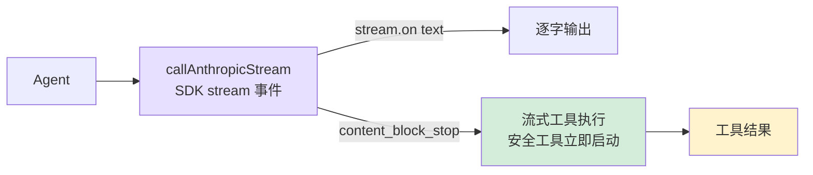

# 5. 流式输出

## 本章目标

实现流式输出，让回答逐字显示，并把工具执行"藏"进模型生成的流式窗口里。



## Claude Code 怎么做的

### 为什么需要流式输出？

模型生成速度大约每秒 30-80 个 token，稍长的回答需要 10-30 秒。用户面对空白等待的容忍极限约 2-3 秒。流式输出让第一个字在几百毫秒内出现，把"等待 30 秒"变成"看着内容逐渐写出来"——主观等待感接近零，并且用户能在方向错误时提前中断。

底层用的是 SSE（Server-Sent Events）：服务端用一条持久 HTTP 连接持续推送 `data:` 行，每几个 token 就推一个 `content_block_delta` 事件。比 WebSocket 简单，对 LLM 应用来说单向推送已经够用。

### 流式处理与并行工具执行

Claude Code 的一个关键优化：`StreamingToolExecutor` 在模型还在生成后续内容时，已解析完成的 tool_use block 就立即开始执行。串行方式下工具执行只能等 API 完整响应后开始；流式并行下，第一个 tool_use 解析完毕时直接分发，不等第二个。

在典型的 5-30 秒 API 流窗口内，文件读取（< 100ms）几乎能全部覆盖进去——流结束时工具结果往往已全部就绪。

### 错误重试

不是所有错误都值得重试：429/503/529 和网络瞬断（ECONNRESET）可以重试；400/401/404 反映代码或配置问题，重试没有意义。

指数退避（而不是固定间隔）的原因：服务过载时，大量客户端固定 1 秒后同时重试会形成"重试风暴"，反而加剧过载。指数退避让间隔逐轮翻倍（1s → 2s → 4s），加上随机抖动打破多客户端同步，是标准的分布式容错做法。

## 我们的实现

### SDK 内置 stream

```typescript
// agent.ts — callAnthropicStream

private async callAnthropicStream(): Promise<Anthropic.Message> {
  return withRetry(async (signal) => {
    const createParams: any = {
      model: this.model,
      max_tokens: this.thinkingMode !== "disabled" ? maxOutput : 16384,
      system: this.systemPrompt,
      tools: toolDefinitions,
      messages: this.anthropicMessages,
    };

    if (this.thinkingMode === "enabled") {
      createParams.thinking = { type: "enabled", budget_tokens: maxOutput - 1 };
    } else if (this.thinkingMode === "adaptive") {
      createParams.thinking = { type: "enabled", budget_tokens: 10000 };
    }

    const stream = this.anthropicClient!.messages.stream(createParams, { signal });

    let firstText = true;
    stream.on("text", (text) => {
      if (firstText) { printAssistantText("\n"); firstText = false; }
      printAssistantText(text);
    });

    const finalMessage = await stream.finalMessage();

    // thinking blocks 不存入历史，避免浪费上下文窗口
    if (this.thinkingMode !== "disabled") {
      finalMessage.content = finalMessage.content.filter(
        (block: any) => block.type !== "thinking"
      );
    }

    return finalMessage;
  }, this.abortController?.signal);
}
```

Anthropic SDK 封装了全部 SSE 解析细节：`stream.on("text")` 直接给文本增量，`stream.finalMessage()` 返回和非流式完全一样的 `Message` 对象。`{ signal }` 把 AbortController 传进去，Ctrl+C 可以中断网络请求。

### 重试机制

```typescript
function isRetryable(error: any): boolean {
  const status = error?.status || error?.statusCode;
  if ([429, 503, 529].includes(status)) return true;
  if (error?.code === "ECONNRESET" || error?.code === "ETIMEDOUT") return true;
  if (error?.message?.includes("overloaded")) return true;
  return false;
}

async function withRetry<T>(
  fn: (signal?: AbortSignal) => Promise<T>,
  signal?: AbortSignal,
  maxRetries = 3
): Promise<T> {
  for (let attempt = 0; ; attempt++) {
    try {
      return await fn(signal);
    } catch (error: any) {
      if (signal?.aborted) throw error;
      if (attempt >= maxRetries || !isRetryable(error)) throw error;
      const delay = Math.min(1000 * Math.pow(2, attempt), 30000) + Math.random() * 1000;
      const reason = error?.status ? `HTTP ${error.status}` : error?.code || "network error";
      printRetry(attempt + 1, maxRetries, reason);
      await new Promise((r) => setTimeout(r, delay));
    }
  }
}
```

延迟公式 `min(1000 * 2^attempt, 30000) + random(0, 1000)`：指数部分控制退避速度，30 秒上限防止等待过久，随机抖动防止多个客户端同步重试形成"重试风暴"。

### Extended Thinking

Extended Thinking 让模型在输出前有一个私有"草稿纸"做推理规划，对需要多步决策的 coding 任务有明显帮助。

三种模式：
- **adaptive**：claude-4.x 模型自动开启，budget 10000 tokens，模型自行决定是否使用
- **enabled**：`--thinking` flag 显式开启，budget 最大化
- **disabled**：不支持 thinking 的模型（Claude 3.x）

```typescript
function resolveThinkingMode(model: string, thinkingFlag: boolean): "adaptive" | "enabled" | "disabled" {
  if (!modelSupportsThinking(model)) return "disabled";
  if (thinkingFlag) return "enabled";
  if (modelSupportsAdaptiveThinking(model)) return "adaptive";
  return "disabled";
}

// 构造请求参数
if (this.thinkingMode === "enabled") {
  createParams.thinking = { type: "enabled", budget_tokens: maxOutput - 1 };
} else if (this.thinkingMode === "adaptive") {
  createParams.thinking = { type: "enabled", budget_tokens: 10000 };
}

// 过滤 thinking blocks，不存入历史
finalMessage.content = finalMessage.content.filter((block: any) => block.type !== "thinking");
```

thinking blocks 可能长达数千 token，对后续对话没有参考价值，过滤掉是避免上下文窗口被无效内容占满的直接手段。

### 流式工具执行

当 Anthropic 流式响应中某个 `tool_use` block 完整接收（`content_block_stop` 事件触发）时，如果该工具是并发安全的（`read_file`、`list_files`、`grep_search`、`web_fetch`），立即开始执行——不必等待整个 API 响应完成。这样可以把工具执行时间"藏"进模型生成后续内容的流式窗口中。

```typescript
// agent.ts — 流式工具执行

// 在流式过程中跟踪提前执行的工具
const earlyExecutions = new Map<string, Promise<string>>();

const response = await this.callAnthropicStream((block) => {
  const input = block.input as Record<string, any>;
  if (CONCURRENCY_SAFE_TOOLS.has(block.name)) {
    const perm = checkPermission(block.name, input, this.permissionMode, this.planFilePath || undefined);
    if (perm.action === "allow") {
      earlyExecutions.set(block.id, this.executeToolCall(block.name, input));
    }
  }
});

// 后续处理工具结果时：
const earlyPromise = earlyExecutions.get(toolUse.id);
if (earlyPromise) {
  const raw = await earlyPromise;  // 已完成或即将完成
  // ... 直接使用结果
  continue;
}
```

`callAnthropicStream` 内部通过回调机制实现：

```typescript
// agent.ts — callAnthropicStream 工具 block 跟踪

private async callAnthropicStream(
  onToolBlockComplete?: (block: Anthropic.ToolUseBlock) => void,
): Promise<Anthropic.Message> {
  // ...
  const toolBlocksByIndex = new Map<number, { id: string; name: string; inputJson: string }>();

  stream.on("streamEvent" as any, (event: any) => {
    // 工具 block 跟踪：随着流式接收累积 input JSON
    if (event.type === "content_block_start" && event.content_block?.type === "tool_use") {
      toolBlocksByIndex.set(event.index, {
        id: event.content_block.id,
        name: event.content_block.name,
        inputJson: "",
      });
    }
    if (event.type === "content_block_delta" && event.delta?.type === "input_json_delta") {
      const tracked = toolBlocksByIndex.get(event.index);
      if (tracked) tracked.inputJson += event.delta.partial_json;
    }
    if (event.type === "content_block_stop" && onToolBlockComplete) {
      const tracked = toolBlocksByIndex.get(event.index);
      if (tracked) {
        try {
          const input = JSON.parse(tracked.inputJson);
          onToolBlockComplete({ type: "tool_use", id: tracked.id, name: tracked.name, input });
        } catch {}
      }
    }
  });
  // ...
}
```

设计要点：

- **`content_block_stop` 是 block 级别事件**：当单个 `tool_use` block 的 JSON 完整接收时触发，并非整个响应结束。模型可能在一次响应中返回多个工具调用，第一个 block 完整时第二个可能还在流式传输中
- **仅并发安全工具提前执行**：只有只读工具（`read_file`、`list_files`、`grep_search`、`web_fetch`）会被提前执行，写操作和命令执行不会
- **权限检查仍然生效**：只有 `checkPermission` 返回 `"allow"` 的工具才会提前执行，需要用户确认的工具（`"confirm"`）不会被提前触发
- **Promise 存储，后续直接 await**：`earlyExecutions` Map 存储的是 Promise，后续工具处理循环检查到已有提前执行的结果时，直接 await 即可——通常此时已经完成
- **核心收益**：5-30 秒的流式窗口期内，工具执行与模型生成并行进行，文件读取等快速操作在流结束时往往已经就绪

### 并行工具执行

并行执行的前提是标记哪些工具是并发安全的——只读工具不会产生副作用，可以安全地同时运行：

```typescript
// tools.ts
export const CONCURRENCY_SAFE_TOOLS = new Set([
  "read_file", "list_files", "grep_search", "web_fetch"
]);
```

流式工具执行天然处理了并行——每个工具 block 完整时就启动执行，多个工具自然重叠运行。

策略要点：

- **流式提前执行**：工具 block 完整时立即启动，多个工具的执行时间自然重叠
- **混合序列保持安全**：写操作前后的只读工具各自独立执行，不会跨越写操作并行
- **典型加速效果**：当模型在一次响应中读取 3-5 个文件时，并行执行通常带来 2-3 倍的速度提升

## 简化对比

| 维度 | Claude Code | mini-claude |
|------|------------|-------------|
| **重试策略** | 类似指数退避 | 指数退避 + 随机抖动 |
| **Thinking 处理** | 深度集成，独立展示与折叠 | 基础支持，过滤 thinking blocks |
| **流式工具执行** | StreamingToolExecutor 独立模块，全量事件处理 | 回调 + earlyExecutions Map，精简实现 |
| **并行工具执行** | 完整的并发调度器 | 流式提前执行，工具 block 完整即启动 |

---

> **下一章**：Agent 能操作文件和执行命令了，但我们需要防止它做危险的事——权限系统保护你的系统。
