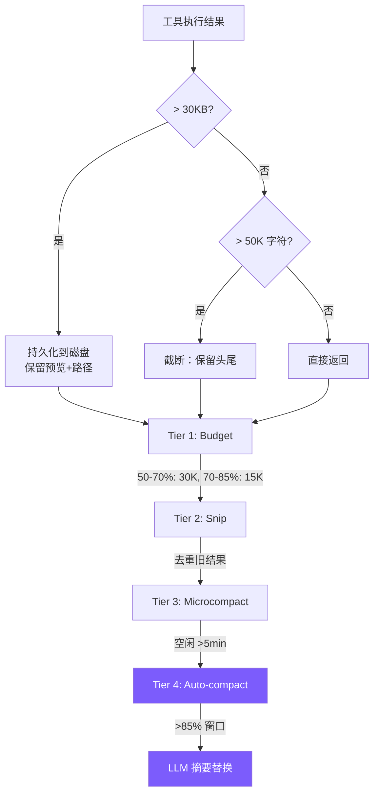

# 7. 上下文管理

4 层压缩管道，从轻量截断到全量摘要逐级递进。



## 参考：Claude Code 的做法

**上下文构建**：静态半区 + `SYSTEM_PROMPT_DYNAMIC_BOUNDARY` 哨兵 + 动态半区。静态半区标记 `scope: 'global'` 全球共享缓存，是主要成本优化。系统上下文后置于 sysprompt、用户上下文前置于消息，最大化缓存命中。

**5 级流水线**（渐进式压缩）：

1. **Tool Result 预算裁剪** — `maxResultSizeChars` 超限持久化到磁盘 + 2KB 预览。
2. **History Snip** — Feature-gated；释放量传递给 autocompact 阈值计算，避免过早触发。
3. **Microcompact** — 双路径：缓存冷（空闲>N分钟）→ 直接改消息；缓存热 → API `cache_edits` 服务端就地删除，不失效前缀。
4. **Context Collapse** — 投影式折叠，**不改原始消息**只创建视图；启用时抑制 Autocompact。
5. **Autocompact** — fork 子 Agent，"分析-摘要"两阶段（`<analysis>` → `<summary>` 9 部分），阈值约 85.5%。

**Token 预算**：`usage` 锚点 + 字符/4 粗估，误差 <5%。**熔断器**：曾有会话连续 autocompact 失败 3272 次，现连续 3 次失败停止。

我们简化为 **4 层**（budget + snip + microcompact + 摘要），无 collapse、无熔断、无缓存感知。

## 第 0 层：执行时截断

```typescript
// tools.ts
const MAX_RESULT_CHARS = 50000;
function truncateResult(result: string): string {
  if (result.length <= MAX_RESULT_CHARS) return result;
  const keepEach = Math.floor((MAX_RESULT_CHARS - 60) / 2);
  return (
    result.slice(0, keepEach) +
    "\n\n[... truncated " + (result.length - keepEach * 2) + " chars ...]\n\n" +
    result.slice(-keepEach)
  );
}
```

保留头尾（文件头有 imports、命令输出的错误摘要通常在末尾）。

## 第 0.5 层：大结果持久化

```typescript
// agent.ts
private persistLargeResult(toolName: string, result: string): string {
  const THRESHOLD = 30 * 1024; // 30 KB
  if (Buffer.byteLength(result) <= THRESHOLD) return result;

  const dir = join(homedir(), ".mini-claude", "tool-results");
  mkdirSync(dir, { recursive: true });
  const filepath = join(dir, `${Date.now()}-${toolName}.txt`);
  writeFileSync(filepath, result);

  const lines = result.split("\n");
  const preview = lines.slice(0, 200).join("\n");
  const sizeKB = (Buffer.byteLength(result) / 1024).toFixed(1);

  return `[Result too large (${sizeKB} KB, ${lines.length} lines). Full output saved to ${filepath}. You can use read_file to see the full result.]\n\nPreview (first 200 lines):\n${preview}`;
}
```

30KB < 50K 阈值 —— 在截断（不可逆）**之前**先拦截，写盘可通过 `read_file` 恢复。对齐 Claude Code Level 1（区别：CC 用 2KB 预览，我们用 200 行）。

## 第 1 层：Budget（动态收紧）

```typescript
// agent.ts
private budgetToolResultsAnthropic(): void {
  const utilization = this.lastInputTokenCount / this.effectiveWindow;
  if (utilization < 0.5) return;

  const budget = utilization > 0.7 ? 15000 : 30000;

  for (const msg of this.anthropicMessages) {
    if (msg.role !== "user" || !Array.isArray(msg.content)) continue;
    for (const block of msg.content as any[]) {
      if (block.type === "tool_result" && typeof block.content === "string"
          && block.content.length > budget) {
        const keepEach = Math.floor((budget - 80) / 2);
        block.content = block.content.slice(0, keepEach) +
          `\n\n[... budgeted: ${block.content.length - keepEach * 2} chars truncated ...]\n\n` +
          block.content.slice(-keepEach);
      }
    }
  }
}
```

第 0 层是一次性硬限制；Budget 每次 API 调用前重算，双阈值（50%/70%）在宽裕时多留细节。

## 第 2 层：Snip（去重旧结果）

```typescript
// agent.ts
const SNIPPABLE_TOOLS = new Set(["read_file", "grep_search", "list_files", "run_shell"]);
const SNIP_PLACEHOLDER = "[Content snipped - re-read if needed]";
const KEEP_RECENT_RESULTS = 3;
```

利用率 >60% 触发：同文件重复读取只留最新，同类搜索超 3 个 snip 最旧的，最近 3 个永远保留。

**关键点**：只清 `tool_result` 的 content，保留 `tool_use` 不变 —— 模型仍知"我读了 /src/main.ts"，需要时可重读。**保留元数据比保留数据更重要**。

## 第 3 层：Microcompact（缓存冷时激进清理）

```typescript
// agent.ts
const MICROCOMPACT_IDLE_MS = 5 * 60 * 1000;

private microcompactAnthropic(): void {
  if (!this.lastApiCallTime ||
      (Date.now() - this.lastApiCallTime) < MICROCOMPACT_IDLE_MS) return;
  // 除最近 3 个外所有旧 tool_result → "[Old result cleared]"
}
```

prompt cache TTL 5 分钟；空闲后大概率已过期，激进清理不损失缓存收益。Snip 是选择性的、Microcompact 是无差别的（更激进但触发更严格）。

我们只实现时间路径；`cache_edits` 路径对教学过于复杂。

## 第 4 层：Auto-compact

```typescript
// agent.ts
private async checkAndCompact(): Promise<void> {
  if (this.lastInputTokenCount > this.effectiveWindow * 0.85) {
    printInfo("Context window filling up, compacting conversation...");
    await this.compactConversation();
  }
}
```

`effectiveWindow = 模型窗口 - 20000`（预留新一轮输入/输出）。Claude 200K 窗口 → 触发点约 76.5% 总利用率。

> ⚠️ **调用方契约**：`checkAndCompact` **只能在 turn boundary 调用**（用户输入 push 之后、API 调用之前）。`compactAnthropic` 会 `slice(0, -1)` 生成摘要 —— 若在 tool 循环中段调用，最后一条是 `tool_result`，slice 后前面 `assistant` 的 `tool_use` 失配，API 直接报错 *"tool_use ids were found without tool_result blocks immediately after"*。

```typescript
// agent.ts
private async compactAnthropic(): Promise<void> {
  if (this.anthropicMessages.length < 4) return;
  const lastUserMsg = this.anthropicMessages[this.anthropicMessages.length - 1];

  const summaryResp = await this.anthropicClient!.messages.create({
    model: this.model,
    max_tokens: 2048,
    system: "You are a conversation summarizer. Be concise but preserve important details.",
    messages: [
      ...this.anthropicMessages.slice(0, -1),
      { role: "user",
        content: "Summarize the conversation so far in a concise paragraph, "
               + "preserving key decisions, file paths, and context needed to continue the work." },
    ],
  });

  const summaryText = summaryResp.content[0]?.type === "text"
    ? summaryResp.content[0].text : "No summary available.";

  this.anthropicMessages = [
    { role: "user",      content: `[Previous conversation summary]\n${summaryText}` },
    { role: "assistant", content: "Understood. How can I continue helping?" },
  ];
  if (lastUserMsg.role === "user") this.anthropicMessages.push(lastUserMsg);
  this.lastInputTokenCount = 0;
}
```

与 CC 差异：CC 用两阶段提示词（`<analysis>` + `<summary>`）+ 恢复最近 5 文件 + 熔断器；我们单段摘要、无恢复、无熔断。

## 管道编排

```typescript
private runCompressionPipeline(): void {
  this.budgetToolResultsAnthropic();   // Tier 1
  this.snipStaleResultsAnthropic();    // Tier 2
  this.microcompactAnthropic();         // Tier 3
}
```

**Tier 1-3 每次 API 调用前跑**（零 API 成本）；**Tier 4 在 turn boundary 跑**。顺序有意义：Budget 先压大结果 → Snip 判断更准 → Microcompact 最后无差别清理。

## Token 统计

```typescript
this.totalInputTokens += response.usage.input_tokens;
this.totalOutputTokens += response.usage.output_tokens;
this.lastInputTokenCount = response.usage.input_tokens;
```

直接用 API 返回值 —— 比 CC 的"锚点+估算"方案简单，够用。

## 简化对比

| 维度 | Claude Code | mini-claude |
|------|------------|-------------|
| **压缩层级** | 5 级 | 4 层 |
| **Token 计数** | 锚点+粗估 | 直接用 `input_tokens` |
| **Budget** | 剩余预算 | 50%/70% 双阈值 |
| **Snip** | 选择性 + cache 感知 | 同文件去重 + 保留最近 3 个 |
| **Microcompact** | 时间 + 缓存编辑双路径 | 只 5 分钟空闲 |
| **Autocompact** | 两阶段摘要 + 恢复 + 熔断 | 单段摘要 |
| **溢出存储** | 磁盘 + 按需读取 | 磁盘 >30KB + 按需读取 |
