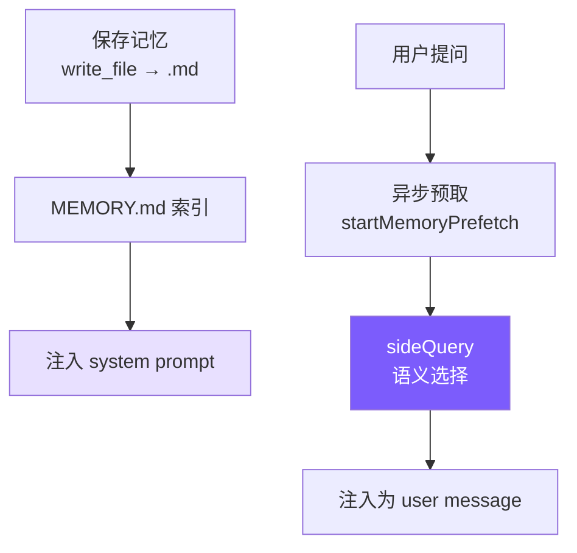

# 8. 记忆系统

跨会话记忆：不依赖对话历史，让 Agent 在多次对话间保持对用户和项目的认知。



## 参考：Claude Code 的做法

**唯一硬约束**：**只记忆不可从当前项目状态推导的信息**。代码/架构/git log 能得的东西记忆版只会漂移。用户说"记住这个 PR 列表"也要追问：其中不可推导的是什么？

**四种类型**（封闭分类，防标签膨胀）：

| 类型 | 记什么 | 触发 |
|------|--------|------|
| **user** | 身份/偏好/背景 | 了解用户角色/偏好时 |
| **feedback** | 纠正**+肯定** | 用户纠正/肯定时（要含 Why + How to apply） |
| **project** | 进展/决策/截止（**相对日期→绝对日期**） | 项目动态时 |
| **reference** | 外部系统定位 | 了解外部位置时 |

**MEMORY.md 是索引不是容器** —— 每次会话完整加载入 sysprompt，必须紧凑；每条一行链接，正文按需读；200 行/25KB 双截断，超限提示"keep entries under ~200 chars"。

**`sideQuery` 语义召回** > 关键词匹配 —— "部署流程"能匹配"CI/CD 注意事项"。异步预取（`pendingMemoryPrefetch`）与首轮生成并行执行，用户零延迟。每次最多 5 条，会话总预算 60KB。

**Freshness warning**：>1 天的记忆标注过期天数 —— 记忆是时间切片非实时状态。

## 存储

```
~/.mini-claude/projects/{sha256-hash}/memory/
├── MEMORY.md
├── user_prefers_concise_output.md
├── feedback_no_summary_at_end.md
├── project_auth_migration_q2.md
└── reference_ci_dashboard_url.md
```

哈希 = `process.cwd()` 的 sha256 前 16 位；同项目目录 → 同记忆空间。

## 记忆文件格式

```markdown
---
name: 不要在回复末尾总结
description: 用户明确要求省略总结段落
type: feedback
---
用户说"不要在响应末尾总结"，因为他们能自己看 diff 和代码变更。

**Why:** 用户觉得总结浪费时间。
**How to apply:** 完成任务后直接结束，不加"总结"或"以上是..."段落。
```

## Frontmatter 解析（共享）

```typescript
// frontmatter.ts
export function parseFrontmatter(content: string): FrontmatterResult {
  const lines = content.split("\n");
  if (lines[0]?.trim() !== "---") return { meta: {}, body: content };

  let endIdx = -1;
  for (let i = 1; i < lines.length; i++) {
    if (lines[i].trim() === "---") { endIdx = i; break; }
  }
  if (endIdx === -1) return { meta: {}, body: content };

  const meta: Record<string, string> = {};
  for (let i = 1; i < endIdx; i++) {
    const colonIdx = lines[i].indexOf(":");
    if (colonIdx === -1) continue;
    const key = lines[i].slice(0, colonIdx).trim();
    const value = lines[i].slice(colonIdx + 1).trim();
    if (key) meta[key] = value;
  }
  return { meta, body: lines.slice(endIdx + 1).join("\n").trim() };
}
```

20 行手写，够用零依赖。

## 保存 & 索引

```typescript
// memory.ts
export function saveMemory(entry: Omit<MemoryEntry, "filename">): string {
  const dir = getMemoryDir();
  const filename = `${entry.type}_${slugify(entry.name)}.md`;
  const content = formatFrontmatter(
    { name: entry.name, description: entry.description, type: entry.type },
    entry.content
  );
  writeFileSync(join(dir, filename), content);
  updateMemoryIndex();
  return filename;
}

function updateMemoryIndex(): void {
  const memories = listMemories();
  const lines = ["# Memory Index", ""];
  for (const m of memories) {
    lines.push(`- **[${m.name}](${m.filename})** (${m.type}) — ${m.description}`);
  }
  writeFileSync(getIndexPath(), lines.join("\n"));
}
```

`{type}_{slugified_name}.md` 让文件系统排序自动分类型分组。

## 索引截断

```typescript
// memory.ts
const MAX_INDEX_LINES = 200;
const MAX_INDEX_BYTES = 25000;

export function loadMemoryIndex(): string {
  const lines = content.split("\n");
  if (lines.length > MAX_INDEX_LINES) {
    content = lines.slice(0, MAX_INDEX_LINES).join("\n") +
      "\n\n[... truncated, too many memory entries ...]";
  }
  if (Buffer.byteLength(content) > MAX_INDEX_BYTES) {
    content = content.slice(0, MAX_INDEX_BYTES) +
      "\n\n[... truncated, index too large ...]";
  }
  return content;
}
```

行截断防条目过多；字节截断防单行过长（CC 见过 197KB 塞在 200 行内）。

## System Prompt 注入

```typescript
// memory.ts
export function buildMemoryPromptSection(): string {
  const index = loadMemoryIndex();
  const memoryDir = getMemoryDir();
  return `# Memory System

You have a persistent, file-based memory system at \`${memoryDir}\`.

## Memory Types
- **user**, **feedback**, **project**, **reference**

## How to Save
Use write_file with YAML frontmatter. Path: \`${memoryDir}/\`, filename: \`{type}_{slug}.md\`.

## What NOT to Save
- Code patterns or architecture (read code)
- Git history (use git log)
- Anything already in CLAUDE.md
- Ephemeral task details

${index ? `## Current Memory Index\n${index}` : "(No memories saved yet.)"}`;
}

// prompt.ts
systemPrompt = systemPrompt.replace("{{memory}}", buildMemoryPromptSection());
```

三件事：教分类、教操作、教克制。

## `/memory` REPL 命令

```typescript
if (input === "/memory") {
  const memories = listMemories();
  if (memories.length === 0) printInfo("No memories saved yet.");
  else {
    printInfo(`${memories.length} memories:`);
    for (const m of memories) console.log(`    [${m.type}] ${m.name} — ${m.description}`);
  }
}
```

## 语义召回（sideQuery）

```typescript
// memory.ts
const SELECT_MEMORIES_PROMPT = `You are selecting memories that will be useful to an AI coding assistant as it processes a user's query. You will be given the user's query and a list of available memory files with their filenames and descriptions.

Return a JSON object with a "selected_memories" array of filenames for the memories that will clearly be useful (up to 5). Only include memories that you are certain will be helpful based on their name and description.
- If you are unsure if a memory will be useful, do not include it.
- If no memories would clearly be useful, return an empty array.`;

export async function selectRelevantMemories(
  query: string, sideQuery: SideQueryFn,
  alreadySurfaced: Set<string>, signal?: AbortSignal,
): Promise<RelevantMemory[]> {
  const headers = scanMemoryHeaders();
  if (headers.length === 0) return [];
  const candidates = headers.filter((h) => !alreadySurfaced.has(h.filePath));
  if (candidates.length === 0) return [];

  const manifest = formatMemoryManifest(candidates);
  try {
    const text = await sideQuery(SELECT_MEMORIES_PROMPT,
      `Query: ${query}\n\nAvailable memories:\n${manifest}`, signal);
    const jsonMatch = text.match(/\{[\s\S]*\}/);
    if (!jsonMatch) return [];
    const parsed = JSON.parse(jsonMatch[0]);
    const selectedFilenames: string[] = parsed.selected_memories || [];
    const filenameSet = new Set(selectedFilenames);
    const selected = candidates.filter((h) => filenameSet.has(h.filename));

    return selected.slice(0, 5).map((h) => {
      let content = readFileSync(h.filePath, "utf-8");
      if (Buffer.byteLength(content) > MAX_MEMORY_BYTES_PER_FILE) {
        content = content.slice(0, MAX_MEMORY_BYTES_PER_FILE) +
          "\n\n[... truncated, memory file too large ...]";
      }
      const freshness = memoryFreshnessWarning(h.mtimeMs);
      const headerText = freshness
        ? `${freshness}\n\nMemory: ${h.filePath}:`
        : `Memory (saved ${memoryAge(h.mtimeMs)}): ${h.filePath}:`;
      return { path: h.filePath, content, mtimeMs: h.mtimeMs, header: headerText };
    });
  } catch (err: any) {
    if (signal?.aborted) return [];
    console.error(`[memory] semantic recall failed: ${err.message}`);
    return [];
  }
}
```

- **sideQuery 复用主模型**（CC 用 Sonnet 单开）
- 只发文件名+描述，输入 token 少
- `alreadySurfaced` 防同会话重复召回
- 单文件 4KB 截断 + 会话总 60KB 预算

## 异步预取

```typescript
// memory.ts
export function startMemoryPrefetch(
  query: string, sideQuery: SideQueryFn,
  alreadySurfaced: Set<string>, sessionMemoryBytes: number,
  signal?: AbortSignal,
): MemoryPrefetch | null {
  if (!/\s/.test(query.trim())) return null;                // 门控 1: 单词跳过
  if (sessionMemoryBytes >= MAX_SESSION_MEMORY_BYTES) return null;  // 门控 2: 预算已满
  const dir = getMemoryDir();
  if (!readdirSync(dir).some(f => f.endsWith(".md") && f !== "MEMORY.md")) return null;  // 门控 3

  const handle: MemoryPrefetch = {
    promise: selectRelevantMemories(query, sideQuery, alreadySurfaced, signal),
    settled: false, consumed: false,
  };
  handle.promise.then(() => { handle.settled = true; }).catch(() => { handle.settled = true; });
  return handle;
}

// agent.ts —— 消费
this.anthropicMessages.push({ role: "user", content: userMessage });
let memoryPrefetch: MemoryPrefetch | null = null;
if (!this.isSubAgent) {
  const sq = this.buildSideQuery();
  if (sq) memoryPrefetch = startMemoryPrefetch(
    userMessage, sq, this.alreadySurfacedMemories, this.sessionMemoryBytes,
    this.abortController?.signal);
}

// while 循环里非阻塞轮询
if (memoryPrefetch && memoryPrefetch.settled && !memoryPrefetch.consumed) {
  memoryPrefetch.consumed = true;
  const memories = await memoryPrefetch.promise;
  if (memories.length > 0) {
    this.anthropicMessages.push({ role: "user", content: formatMemoriesForInjection(memories) });
    for (const m of memories) {
      this.alreadySurfacedMemories.add(m.path);
      this.sessionMemoryBytes += Buffer.byteLength(m.content);
    }
  }
}
```

**非阻塞轮询**：预取不 await，`.then()` 设 `settled` 标志；每轮循环检查一次，没好就跳过下轮再看。最差晚一轮，用户永远不等。

## Freshness Warning

```typescript
// memory.ts
export function memoryFreshnessWarning(mtimeMs: number): string {
  const days = Math.max(0, Math.floor((Date.now() - mtimeMs) / 86_400_000));
  if (days <= 1) return "";
  return `This memory is ${days} days old. Memories are point-in-time observations, not live state — claims about code behavior may be outdated. Verify against current code before asserting as fact.`;
}
```

给出**行动指引**（"对照当前代码验证"）而非只标 X 天前。

## 简化对比

| 维度 | Claude Code | mini-claude |
|------|------------|-------------|
| **召回方式** | Sonnet sideQuery | 同模型 sideQuery |
| **异步预取** | pendingMemoryPrefetch | startMemoryPrefetch |
| **会话预算** | 60KB | 60KB |
| **Freshness** | 过期警告 | 过期警告 |
