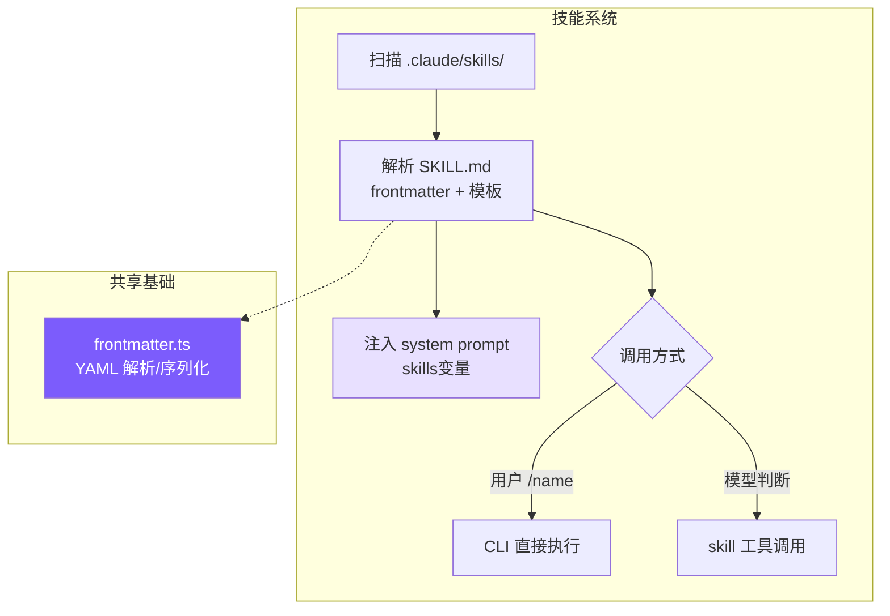
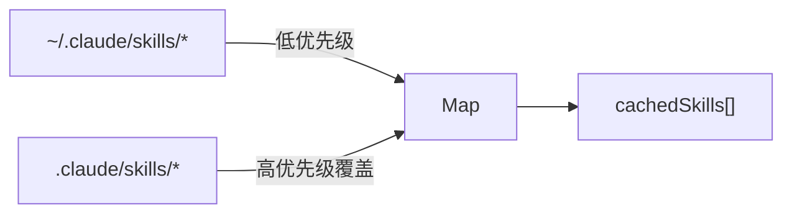
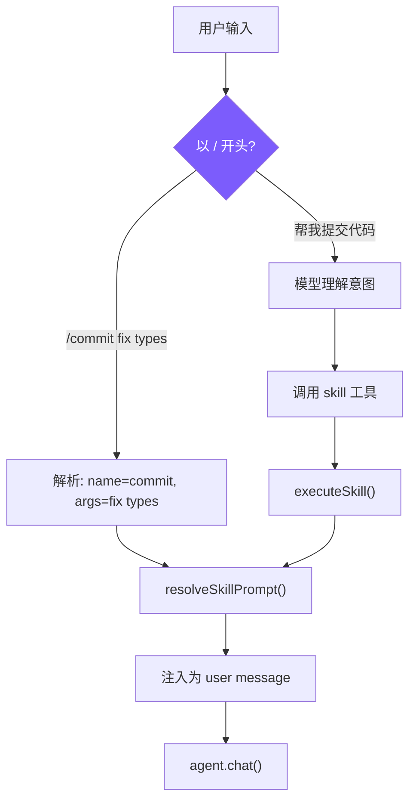

# 9. 技能系统

可复用的 Prompt 模块：用户定义一次，反复调用。



## SKILL.md 格式

```markdown
---
name: commit
description: Create a git commit with a descriptive message
when_to_use: When the user asks to commit changes or says "commit"
allowed-tools: run_shell, read_file
user-invocable: true
---
Look at the current git diff and staged changes. Write a clear, concise
commit message following conventional commits format.

The user's request: $ARGUMENTS

Project skill directory: ${CLAUDE_SKILL_DIR}
```

- `when_to_use`：给模型看的触发条件
- `allowed-tools`：安全边界，限制技能可使用的工具
- `user-invocable: false` 的技能只能被模型自动触发

## 发现与加载



```typescript
// skills.ts — discoverSkills
let cachedSkills: SkillDefinition[] | null = null;

export function discoverSkills(): SkillDefinition[] {
  if (cachedSkills) return cachedSkills;
  const skills = new Map<string, SkillDefinition>();
  loadSkillsFromDir(join(homedir(), ".claude", "skills"), "user", skills);
  loadSkillsFromDir(join(process.cwd(), ".claude", "skills"), "project", skills);
  cachedSkills = Array.from(skills.values());
  return cachedSkills;
}
```

Map 天然去重，先 user 再 project 让项目级覆盖用户级。

## 技能解析

```typescript
// skills.ts — parseSkillFile
function parseSkillFile(
  filePath: string, source: "project" | "user", skillDir: string
): SkillDefinition | null {
  const raw = readFileSync(filePath, "utf-8");
  const { meta, body } = parseFrontmatter(raw);

  const name = meta.name || skillDir.split("/").pop() || "unknown";
  const userInvocable = meta["user-invocable"] !== "false";

  let allowedTools: string[] | undefined;
  if (meta["allowed-tools"]) {
    const raw = meta["allowed-tools"];
    if (raw.startsWith("[")) {
      try { allowedTools = JSON.parse(raw); } catch {
        allowedTools = raw.replace(/[\[\]]/g, "").split(",").map((s) => s.trim());
      }
    } else {
      allowedTools = raw.split(",").map((s) => s.trim());
    }
  }

  return {
    name, description: meta.description || "",
    whenToUse: meta.when_to_use || meta["when-to-use"],
    allowedTools, userInvocable,
    promptTemplate: body, source, skillDir,
  };
}
```

`allowed-tools` 兼容逗号分隔和 JSON 数组两种写法；`when_to_use` 兼容下划线和连字符 key。

## Prompt 模板替换

```typescript
// skills.ts — resolveSkillPrompt
export function resolveSkillPrompt(skill: SkillDefinition, args: string): string {
  let prompt = skill.promptTemplate;
  prompt = prompt.replace(/\$ARGUMENTS|\$\{ARGUMENTS\}/g, args);
  prompt = prompt.replace(/\$\{CLAUDE_SKILL_DIR\}/g, skill.skillDir);
  return prompt;
}
```

Claude Code 还支持 `` !`shell_command` `` 内联执行，我们没实现（安全风险，教程场景不需要）。

## 双重调用路径



**路径 1：用户手动调用**（cli.ts）

```typescript
if (input.startsWith("/")) {
  const spaceIdx = input.indexOf(" ");
  const cmdName = spaceIdx > 0 ? input.slice(1, spaceIdx) : input.slice(1);
  const cmdArgs = spaceIdx > 0 ? input.slice(spaceIdx + 1) : "";
  const skill = getSkillByName(cmdName);
  if (skill && skill.userInvocable) {
    const resolved = resolveSkillPrompt(skill, cmdArgs);
    printInfo(`Invoking skill: ${skill.name}`);
    await agent.chat(resolved);
    return;
  }
}
```

**路径 2：模型程序化调用**（tools.ts）

```typescript
{
  name: "skill",
  description: "Invoke a registered skill by name...",
  input_schema: {
    properties: {
      skill_name: { type: "string" },
      args: { type: "string" },
    },
    required: ["skill_name"],
  },
}

function runSkillTool(input: { skill_name: string; args?: string }): string {
  const result = executeSkill(input.skill_name, input.args || "");
  if (!result) return `Unknown skill: ${input.skill_name}`;
  return `[Skill "${input.skill_name}" activated]\n\n${result.prompt}`;
}
```

skill 工具是**元工具**：返回值不是数据，是指令，模型下一回合按这个 prompt 执行。

## 执行模式：inline vs fork

```typescript
// agent.ts — executeSkillTool
private async executeSkillTool(input: Record<string, any>): Promise<string> {
  const result = executeSkill(input.skill_name, input.args || "");
  if (!result) return `Unknown skill: ${input.skill_name}`;

  if (result.context === "fork") {
    const tools = result.allowedTools
      ? this.tools.filter(t => result.allowedTools!.includes(t.name))
      : this.tools.filter(t => t.name !== "agent");
    const subAgent = new Agent({
      customSystemPrompt: result.prompt,
      customTools: tools,
      isSubAgent: true,
      permissionMode: "bypassPermissions",
    });
    const subResult = await subAgent.runOnce(input.args || "Execute this skill task.");
    return subResult.text;
  }

  return `[Skill "${input.skill_name}" activated]\n\n${result.prompt}`;
}
```

fork 时未指定 `allowedTools` 则排除 `agent` 工具防止递归。多轮工具调用的技能（代码审查等）用 fork 保持主对话干净。

## System Prompt 描述

```typescript
// skills.ts — buildSkillDescriptions
export function buildSkillDescriptions(): string {
  const skills = discoverSkills();
  if (skills.length === 0) return "";

  const lines = ["# Available Skills", ""];
  const invocable = skills.filter((s) => s.userInvocable);
  const autoOnly = skills.filter((s) => !s.userInvocable);

  if (invocable.length > 0) {
    lines.push("User-invocable skills (user types /<name> to invoke):");
    for (const s of invocable) {
      lines.push(`- **/${s.name}**: ${s.description}`);
      if (s.whenToUse) lines.push(`  When to use: ${s.whenToUse}`);
    }
  }

  if (autoOnly.length > 0) {
    lines.push("Auto-invocable skills (use the skill tool when appropriate):");
    for (const s of autoOnly) {
      lines.push(`- **${s.name}**: ${s.description}`);
      if (s.whenToUse) lines.push(`  When to use: ${s.whenToUse}`);
    }
  }

  lines.push("To invoke a skill programmatically, use the `skill` tool.");
  return lines.join("\n");
}
```

## 简化对比

| 维度 | Claude Code | mini-claude |
|------|------------|-------------|
| **技能来源** | 6 个（managed/project/user/plugin/bundled/MCP） | 2 个（project + user） |
| **技能加载** | 懒加载 + token 预算控制 | 启动时全量加载 + 缓存 |
| **Prompt 替换** | `$ARGUMENTS` + `${CLAUDE_SKILL_DIR}` + `` !`shell` `` | `$ARGUMENTS` + `${CLAUDE_SKILL_DIR}` |
