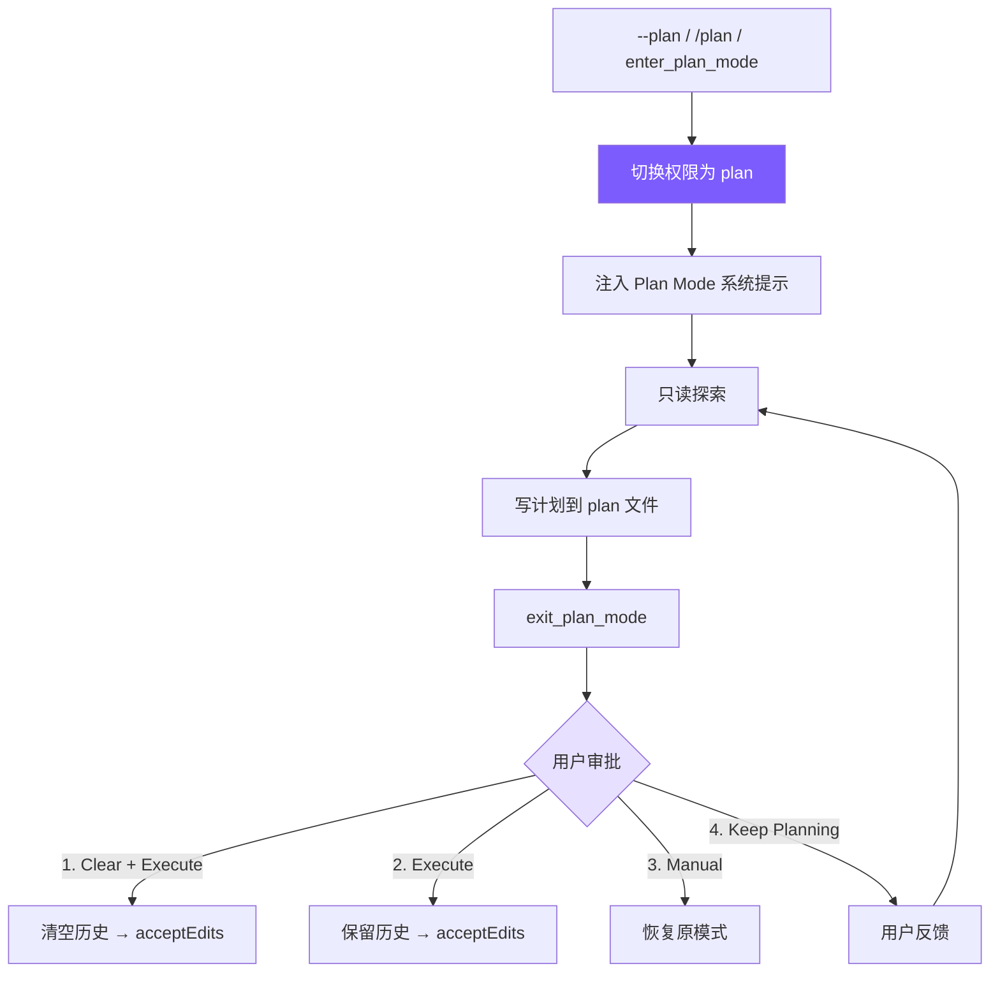

# 10. Plan Mode

先制定计划再执行；只读探索 → 写 plan → 审批 → 4 选项工作流。



## 参考：Claude Code 的做法

完整的 `EnterPlanMode` / `ExitPlanMode` 工具对：进入切 read-only + 生成 plan 文件（`~/.claude/plans/`）+ 注入系统提示 → Agent 只读探索、写 plan → 用户在 4 种执行方式中选。**核心哲学**：Plan Mode 不是"不让 Agent 做事"，而是**先想清楚再做**；plan 持久化到磁盘，即使清空上下文也不丢。

## 工具定义（deferred）

```typescript
// tools.ts
{
  name: "enter_plan_mode",
  description: "Enter plan mode to switch to a read-only planning phase. In plan mode, you can only read files and write to the plan file. Use this when you need to explore the codebase and design an implementation plan before making changes.",
  input_schema: { type: "object", properties: {} },
  deferred: true,
},
{
  name: "exit_plan_mode",
  description: "Exit plan mode after you have finished writing your plan to the plan file. The user will review and approve the plan before you proceed with implementation.",
  input_schema: { type: "object", properties: {} },
  deferred: true,
},
```

无参数（纯状态切换），deferred 因为多数会话不用（详见[第 2 章](docs/02-tools.md)）。

## 状态

```typescript
// agent.ts
private prePlanMode: PermissionMode | null = null;    // 进入前模式，用于恢复
private planFilePath: string | null = null;
private baseSystemPrompt: string = "";                 // 不含 plan 注入的基础
private contextCleared: boolean = false;
```

`prePlanMode` 是关键 —— 退出时精确恢复（原 acceptEdits 就回 acceptEdits，不变 default）。

## 切换（对称进入/退出）

```typescript
// agent.ts
togglePlanMode(): string {
  if (this.permissionMode === "plan") {
    this.permissionMode = this.prePlanMode || "default";
    this.prePlanMode = null;
    this.planFilePath = null;
    this.systemPrompt = this.baseSystemPrompt;
    printInfo(`Exited plan mode → ${this.permissionMode} mode`);
    return this.permissionMode;
  } else {
    this.prePlanMode = this.permissionMode;
    this.permissionMode = "plan";
    this.planFilePath = this.generatePlanFilePath();
    this.systemPrompt = this.baseSystemPrompt + this.buildPlanModePrompt();
    printInfo(`Entered plan mode. Plan file: ${this.planFilePath}`);
    return "plan";
  }
}

private generatePlanFilePath(): string {
  const dir = join(homedir(), ".claude", "plans");
  if (!existsSync(dir)) mkdirSync(dir, { recursive: true });
  return join(dir, `plan-${this.sessionId}.md`);
}
```

## Plan 系统提示

```typescript
// agent.ts — buildPlanModePrompt
return `

# Plan Mode Active

Plan mode is active. You MUST NOT make any edits (except the plan file below),
run non-readonly tools, or make any changes to the system.

## Plan File: ${this.planFilePath}
Write your plan incrementally to this file using write_file or edit_file.
This is the ONLY file you are allowed to edit.

## Workflow
1. **Explore**: Read code (read_file, list_files, grep_search).
2. **Design**: Design your implementation approach.
3. **Write Plan**: Write a structured plan including:
   - **Context**: Why this change is needed
   - **Steps**: Implementation steps with critical file paths
   - **Verification**: How to test the changes
4. **Exit**: Call exit_plan_mode when your plan is ready for user review.

IMPORTANT: When your plan is complete, you MUST call exit_plan_mode.
Do NOT ask the user to approve — exit_plan_mode handles that.`;
```

最后一句"Do NOT ask the user to approve"很关键：没这句，模型经常会问"这个计划可以吗？"而不是调 `exit_plan_mode`，导致审批流程无法触发。

## 权限集成（双重保障）

```typescript
// tools.ts — checkPermission()
if (mode === "plan") {
  if (EDIT_TOOLS.has(toolName)) {
    const filePath = input.file_path || input.path;
    if (planFilePath && filePath === planFilePath) {
      return { action: "allow" };  // 唯一例外：plan 文件本身
    }
    return { action: "deny", message: `Blocked in plan mode: ${toolName}` };
  }
  if (toolName === "run_shell") {
    return { action: "deny", message: "Shell commands blocked in plan mode" };
  }
}
if (toolName === "enter_plan_mode" || toolName === "exit_plan_mode") {
  return { action: "allow" };
}
```

**plan 文件路径作为参数传入 `checkPermission`** —— 目标路径必须与 plan 文件路径完全匹配才放行。系统提示是引导（少无效调用），权限检查是硬拦截。

## 工具执行

```typescript
// agent.ts
private async executePlanModeTool(name: string): Promise<string> {
  if (name === "enter_plan_mode") {
    if (this.permissionMode === "plan") return "Already in plan mode.";
    this.prePlanMode = this.permissionMode;
    this.permissionMode = "plan";
    this.planFilePath = this.generatePlanFilePath();
    this.systemPrompt = this.baseSystemPrompt + this.buildPlanModePrompt();
    printInfo("Entered plan mode (read-only). Plan file: " + this.planFilePath);
    return `Entered plan mode. You are now in read-only mode.\n\nYour plan file: ${this.planFilePath}\nWrite your plan to this file. This is the only file you can edit.\n\nWhen your plan is complete, call exit_plan_mode.`;
  }

  if (name === "exit_plan_mode") {
    if (this.permissionMode !== "plan") return "Not in plan mode.";
    let planContent = "(No plan file found)";
    if (this.planFilePath && existsSync(this.planFilePath)) {
      planContent = readFileSync(this.planFilePath, "utf-8");
    }

    if (this.planApprovalFn) {
      const result = await this.planApprovalFn(planContent);
      if (result.choice === "keep-planning") {
        const feedback = result.feedback || "Please revise the plan.";
        return `User rejected the plan and wants to keep planning.\n\nUser feedback: ${feedback}\n\nPlease revise your plan based on this feedback. When done, call exit_plan_mode again.`;
      }

      let targetMode: PermissionMode;
      if (result.choice === "clear-and-execute" || result.choice === "execute") {
        targetMode = "acceptEdits";
      } else {
        targetMode = this.prePlanMode || "default";  // manual-execute
      }

      this.permissionMode = targetMode;
      this.prePlanMode = null;
      const savedPlanPath = this.planFilePath;
      this.planFilePath = null;
      this.systemPrompt = this.baseSystemPrompt;

      if (result.choice === "clear-and-execute") {
        this.clearHistoryKeepSystem();
        this.contextCleared = true;
        printInfo(`Plan approved. Context cleared, executing in ${targetMode} mode.`);
        return `User approved the plan. Context was cleared. Permission mode: ${targetMode}\n\nPlan file: ${savedPlanPath}\n\n## Approved Plan:\n${planContent}\n\nProceed with implementation.`;
      }

      printInfo(`Plan approved. Executing in ${targetMode} mode.`);
      return `User approved the plan. Permission mode: ${targetMode}\n\n## Approved Plan:\n${planContent}\n\nProceed with implementation.`;
    }

    // Fallback：无审批函数（子 Agent 场景）
    this.permissionMode = this.prePlanMode || "default";
    this.prePlanMode = null;
    this.planFilePath = null;
    this.systemPrompt = this.baseSystemPrompt;
    return `Exited plan mode. Permission mode restored to: ${this.permissionMode}\n\n## Your Plan:\n${planContent}`;
  }
  return `Unknown plan mode tool: ${name}`;
}
```

## 审批（回调解耦）

```typescript
// cli.ts
agent.setPlanApprovalFn((planContent: string) => {
  return new Promise((resolve) => {
    printPlanForApproval(planContent);
    printPlanApprovalOptions();
    const askChoice = () => {
      rl.question("  Enter choice (1-4): ", (answer) => {
        const choice = answer.trim();
        if (choice === "1") resolve({ choice: "clear-and-execute" });
        else if (choice === "2") resolve({ choice: "execute" });
        else if (choice === "3") resolve({ choice: "manual-execute" });
        else if (choice === "4") {
          rl.question("  Feedback (what to change): ", (feedback) => {
            resolve({ choice: "keep-planning", feedback: feedback.trim() || undefined });
          });
        } else { console.log("  Invalid choice."); askChoice(); }
      });
    };
    askChoice();
  });
});
```

回调解耦 UI —— CLI 用 readline，IDE 可用 GUI，测试可注入 mock；子 Agent 无 approvalFn 走 fallback。

## 4 个选项

| 选项 | 权限切换 | 上下文 | 场景 |
|------|---------|--------|------|
| 1. Clear + Execute | → acceptEdits | 清空 | 计划完善、上下文已长，从零执行最高效 |
| 2. Execute | → acceptEdits | 保留 | 计划完善、直接执行 |
| 3. Manual | → 恢复原模式 | 保留 | 计划 OK 但想逐步审批 |
| 4. Keep Planning | 不变 | 保留 | 需修改计划，给反馈继续调整 |

## 三个入口

```typescript
// 1. --plan CLI 参数
else if (args[i] === "--plan") permissionMode = "plan";

// 2. /plan REPL 命令
if (input === "/plan") { agent.togglePlanMode(); askQuestion(); return; }

// 3. enter_plan_mode 工具（Agent 自主，需 tool_search 激活）
```

## 简化对比

| 维度 | Claude Code | mini-claude |
|------|------------|-------------|
| Plan 文件 | 全局 plans + 语义文件名 | `~/.claude/plans/plan-{sessionId}.md` |
| 审批选项 | 多种执行模式 | 4 选项（clear/execute/manual/revise） |
| 权限联动 | 深度集成 7 层权限 | `checkPermission` 特殊分支 + plan 白名单 |
| 工具加载 | 始终可用 | deferred 延迟加载 |
| 子 Agent | Plan Agent 类型 | Fallback 直接退出 |

---

> **下一章**：当单个 Agent 的上下文不够用时——多 Agent 架构，分而治之。
