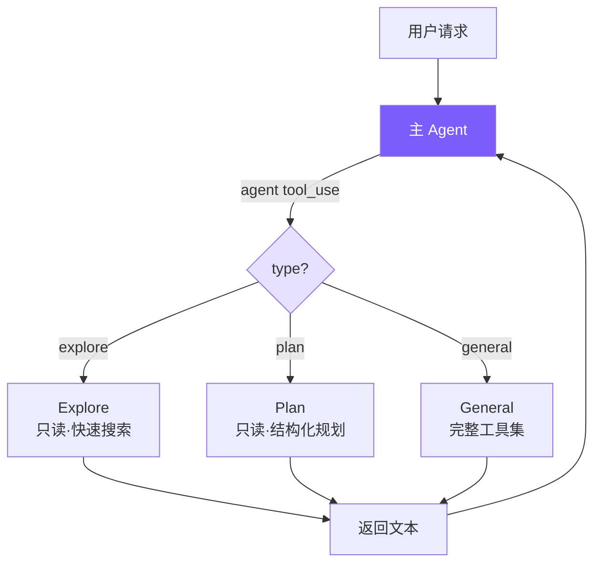

# 11. 多 Agent 架构

Sub-Agent（fork-return）：主 Agent 派生子 Agent 执行探索/规划/通用任务，完成后返回结果。



## 参考：Claude Code 的做法

三种协作模式：

| 模式 | 特点 |
|------|------|
| **Sub-Agent**（fork-return） | 分叉独立执行，完成返回结果 |
| **Coordinator** | 一个协调者分配任务给多个 Worker |
| **Swarm Team** | 多 Agent 对等协作，信箱通信 |

**内置类型**：Explore（Haiku 模型 + 只读）/ Plan（只读 + 结构化）/ General（完整工具，禁递归）/ Custom（`.claude/agents/*.md`）。

**Coordinator 的关键约束**：主 Agent 工具集硬限制为 `Agent` + `SendMessage`，完全无法直接操作文件；提示词禁止写 "based on your findings"，强制协调器真正理解并具体化研究结果。**综合阶段的反直觉约束**：Worker 从零开始独立，看不到协调器与用户对话，协调器写给 Worker 的 prompt 必须自包含。

**工具过滤 4 层管道**（纵深防御）：移除元工具 → 自定义 Agent 额外限制 → 异步 Agent 白名单 → 类型级 `disallowedTools`。

**上下文隔离**：deny-by-default，消息独立，`abortController` 单向传播（父→子）；例外是 Bash 后台进程注册到根 store 防僵尸。

**Worktree 隔离**：多 Agent 并行写文件时给每个分配独立 Git Worktree —— 共享 `.git` 但独立工作目录。

我们只实现最常用的 Sub-Agent 模式。

## 简化对比

| Claude Code | mini-claude | 简化原因 |
|-------------|-------------|---------|
| 5 阶段执行流程 | new Agent + runOnce | 不需要 fork 进程 |
| 4 层工具过滤 | 1 个 Set + filter | 只有 3 种固定类型 |
| Explore 用 Haiku | 统一用主模型 | 减少配置 |
| deny-by-default 隔离 | 天然隔离（独立 Agent 实例） | new Agent 自带独立消息历史 |

## 1. 类型配置

```typescript
// subagent.ts
export type SubAgentType = "explore" | "plan" | "general";

const READ_ONLY_TOOLS = new Set(["read_file", "list_files", "grep_search", "run_shell"]);

function getReadOnlyTools(): ToolDef[] {
  return toolDefinitions.filter((t) => READ_ONLY_TOOLS.has(t.name));
}
```

`run_shell` 在只读集里 —— `git log`、`find`、`wc` 等只读命令是探索核心。安全靠 system prompt 约束。

```typescript
const EXPLORE_PROMPT = `You are an Explore agent — a fast, READ-ONLY sub-agent...

IMPORTANT CONSTRAINTS:
- You are READ-ONLY. Do NOT modify any files.
- If using run_shell, only use read commands (ls, cat, find, grep, git log, etc.)
- Do NOT use write, edit, rm, mv, or any destructive shell commands.

Be fast and thorough. Use multiple tool calls when possible.
Return a concise summary of your findings.`;

const PLAN_PROMPT = `You are a Plan agent — a READ-ONLY sub-agent specialized for designing implementation plans.

Your job:
- Analyze the codebase to understand the current architecture
- Design a step-by-step implementation plan
- Identify critical files that need modification

Return a structured plan with:
1. Summary of current state
2. Step-by-step implementation steps
3. Critical files for implementation
4. Potential risks or considerations`;

const GENERAL_PROMPT = `You are a General sub-agent handling an independent task.
Complete the assigned task and return a concise result. You have access to all tools.`;

export function getSubAgentConfig(type: SubAgentType): SubAgentConfig {
  const custom = discoverCustomAgents().get(type);
  if (custom) {
    const tools = custom.allowedTools
      ? toolDefinitions.filter(t => custom.allowedTools!.includes(t.name))
      : toolDefinitions.filter(t => t.name !== "agent");
    return { systemPrompt: custom.systemPrompt, tools };
  }
  switch (type) {
    case "explore": return { systemPrompt: EXPLORE_PROMPT, tools: getReadOnlyTools() };
    case "plan":    return { systemPrompt: PLAN_PROMPT,    tools: getReadOnlyTools() };
    case "general": return { systemPrompt: GENERAL_PROMPT,
                             tools: toolDefinitions.filter((t) => t.name !== "agent") };
  }
}
```

## 2. agent 工具

```typescript
// tools.ts
{
  name: "agent",
  description:
    "Launch a sub-agent to handle a task autonomously. Sub-agents have isolated context " +
    "and return their result. Types: 'explore' (read-only, fast search), " +
    "'plan' (read-only, structured planning), 'general' (full tools).",
  input_schema: {
    type: "object",
    properties: {
      description: { type: "string", description: "Short (3-5 word) description of the sub-agent's task" },
      prompt:      { type: "string", description: "Detailed task instructions for the sub-agent" },
      type: { type: "string", enum: ["explore", "plan", "general"],
              description: "Agent type. Default: general" },
    },
    required: ["description", "prompt"],
  },
}
```

`type` 非 required —— LLM 不确定时省略，默认 `general`。

## 3. Agent 类改造

只需 4 处改动，同一个 Agent 类同时服务主/子 Agent。

```typescript
// agent.ts
interface AgentOptions {
  customSystemPrompt?: string;
  customTools?: ToolDef[];
  isSubAgent?: boolean;
}

constructor(options: AgentOptions = {}) {
  this.isSubAgent = options.isSubAgent || false;
  this.tools = options.customTools || toolDefinitions;
  this.systemPrompt = options.customSystemPrompt || buildSystemPrompt();
}

// 输出捕获：三态 outputBuffer
private outputBuffer: string[] | null = null;
private emitText(text: string): void {
  if (this.outputBuffer) this.outputBuffer.push(text);   // 子：收集
  else                    printAssistantText(text);       // 主：直接打印
}

// runOnce：一次性入口
async runOnce(prompt: string): Promise<{ text: string; tokens: { input: number; output: number } }> {
  this.outputBuffer = [];
  const prevInput = this.totalInputTokens;
  const prevOutput = this.totalOutputTokens;
  await this.chat(prompt);
  const text = this.outputBuffer.join("");
  this.outputBuffer = null;
  return { text, tokens: {
    input:  this.totalInputTokens  - prevInput,
    output: this.totalOutputTokens - prevOutput,
  }};
}

// executeAgentTool
private async executeAgentTool(input: Record<string, any>): Promise<string> {
  const type = (input.type || "general") as SubAgentType;
  const description = input.description || "sub-agent task";
  const prompt = input.prompt || "";
  printSubAgentStart(type, description);

  const config = getSubAgentConfig(type);
  const subAgent = new Agent({
    model: this.model,
    customSystemPrompt: config.systemPrompt,
    customTools: config.tools,
    isSubAgent: true,
    permissionMode: this.permissionMode === "plan" ? "plan" : "bypassPermissions",
  });

  try {
    const result = await subAgent.runOnce(prompt);
    this.totalInputTokens  += result.tokens.input;
    this.totalOutputTokens += result.tokens.output;
    printSubAgentEnd(type, description);
    return result.text || "(Sub-agent produced no output)";
  } catch (e: any) {
    printSubAgentEnd(type, description);
    return `Sub-agent error: ${e.message}`;
  }
}

// agent 工具需要 Agent 实例状态，特殊分发
private async executeToolCall(name: string, input: Record<string, any>): Promise<string> {
  if (name === "agent") return this.executeAgentTool(input);
  return executeTool(name, input);
}
```

**权限继承**：子默认 `bypassPermissions`（主已授权），但 Plan Mode **必须继承** —— 否则子可绕过只读限制，是安全漏洞。

**错误策略**：子出错返回字符串而非抛，让父 LLM 自行决定重试/换策略。

## 4. isSubAgent 标志：跳过主 Agent 专属操作

```typescript
if (!this.isSubAgent) { printDivider(); this.autoSave(); }
if (!this.isSubAgent)   printCost(this.totalInputTokens, this.totalOutputTokens);
```

分隔线（子输出已被 buffer 捕获）、会话保存（子是一次性任务，保存反而覆盖主的文件）、费用打印（token 已汇总到父，重复打印会误导）。

## 5. 自定义 Agent 类型

```markdown
<!-- .claude/agents/reviewer.md -->
---
name: reviewer
description: Reviews code for bugs and style issues
allowed-tools: read_file, list_files, grep_search, run_shell
---
You are a code reviewer. Analyze the code thoroughly and report:
1. Bugs and potential issues
2. Style inconsistencies
3. Performance concerns
```

发现顺序：项目级 `.claude/agents/` > 用户级 `~/.claude/agents/`。frontmatter 复用 `parseFrontmatter()`，与 Memory / Skills 共享。

## 核心洞察

**子 Agent 本质上就是一个配置不同的 Agent 实例**。通过给 Agent 类添加 `customTools` / `customSystemPrompt` / `isSubAgent` 三个可选参数，同一套 agent loop 服务主/子，避免代码重复。
