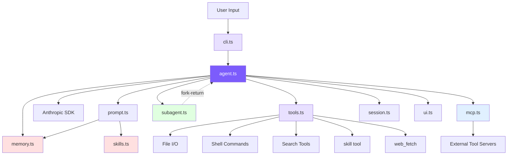

# Introduction

## Positioning

A ~3400-line TypeScript implementation covering Claude Code's core: Agent Loop, tool system, context compaction, memory, skills, multi-Agent, MCP, Plan Mode, permissions. Modeled after the Claude Code open-source snapshot (~500K lines TS), keeping only the minimal necessary components.

**Core idea**: A `while (true)` loop where the model decides what to do next — if the response contains tool_use, execute and feed results back; otherwise exit.

## Architecture



## File Line Counts

| File | Lines | Responsibility |
|------|-------|----------------|
| `agent.ts` | ~1081 | Agent main loop, message construction, API calls, tool orchestration, sub-Agent, 4-tier compaction, budget, Plan Mode |
| `tools.ts` | ~858 | 13 tools + 5 permission modes + mtime protection + deferred loading |
| `memory.ts` | ~392 | 4 types + file storage + semantic recall + async prefetch |
| `cli.ts` | ~340 | CLI entry, args, REPL |
| `prompt.ts` | ~230 | Template + @include + variable substitution + memory/skills injection |
| `ui.ts` | ~211 | Terminal colors/formatting |
| `subagent.ts` | ~199 | 3 built-in + custom Agent discovery |
| `skills.ts` | ~175 | Frontmatter parsing + inline/fork dual mode |
| `mcp.ts` | ~266 | JSON-RPC over stdio, tool discovery and forwarding |
| `session.ts` | ~62 | Session JSON persistence |
| `frontmatter.ts` | ~41 | YAML frontmatter parser |

## Quick Start

```bash
git clone https://github.com/Windy3f3f3f3f/claude-code-from-scratch.git
cd claude-code-from-scratch
npm install
export ANTHROPIC_API_KEY=sk-ant-xxx
npm run dev
```

## Common Options

```bash
mini-claude --yolo "run all tests"          # Skip all confirmations
mini-claude --plan "analyze this codebase"  # Analyze only, no modifications
mini-claude --accept-edits "refactor"       # Auto-approve file edits
mini-claude --dont-ask "check style"        # Auto-deny operations requiring confirmation
mini-claude --thinking "analyze this bug"   # Extended Thinking
mini-claude --resume                        # Resume last session
mini-claude --max-cost 0.50 --max-turns 20  # Budget control
```

## Chapter Map

| Chapter | This Project | Claude Code |
|---------|-------------|-------------|
| **Phase 1: Coding Agent Skeleton** | | |
| [1. Agent Loop](/en/docs/01-agent-loop.md) | `agent.ts::chatAnthropic()` | `src/query.ts::queryLoop` |
| [2. Tool System](/en/docs/02-tools.md) | `tools.ts` | `src/Tool.ts` + `src/tools/` (66+) |
| [3. System Prompt](/en/docs/03-system-prompt.md) | `prompt.ts` | `src/constants/prompts.ts` |
| [4. CLI & Sessions](/en/docs/04-cli-session.md) | `cli.ts` + `session.ts` | `src/entrypoints/cli.tsx` |
| [5. Streaming](/en/docs/05-streaming.md) | `agent.ts` stream | `src/services/api/claude.ts` |
| [6. Permissions & Security](/en/docs/06-permissions.md) | `tools.ts::checkPermission()` | `src/utils/permissions/` (52KB) |
| [7. Context Management](/en/docs/07-context.md) | `agent.ts::checkAndCompact()` | `src/services/compact/` |
| **Phase 2: Advanced Capabilities** | | |
| [8. Memory](/en/docs/08-memory.md) | `memory.ts` | `src/utils/memory.ts` |
| [9. Skills](/en/docs/09-skills.md) | `skills.ts` | `src/utils/skills.ts` + `SkillTool/` |
| [10. Plan Mode](/en/docs/10-plan-mode.md) | `agent.ts` + `tools.ts` + `cli.ts` | `EnterPlanMode` / `ExitPlanMode` |
| [11. Multi-Agent](/en/docs/11-multi-agent.md) | `subagent.ts` + `agent.ts` | `src/tools/AgentTool/` |
| [12. MCP](/en/docs/12-mcp.md) | `mcp.ts` | `src/services/mcpClient.ts` |
| [13. Comparison](/en/docs/13-whats-next.md) | — | — |
