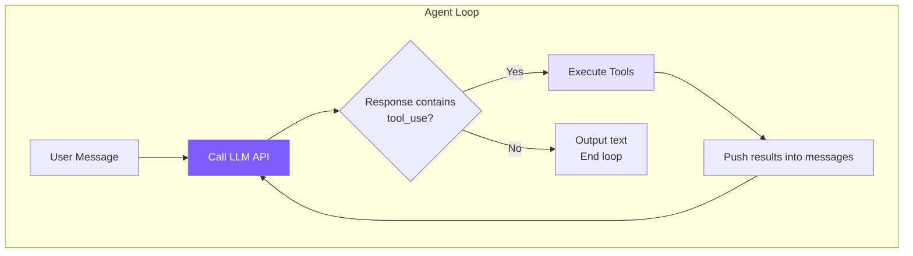

# 1. Agent Loop — Core Loop

A while loop: call LLM → if tool_use, execute → feed results back → repeat, until no tool_use.



## Reference: Claude Code's Approach

- **Two-layer architecture**: `QueryEngine` (session-level, ~1155 lines) + `queryLoop` (turn-level, ~1728 lines)
- **`async function*`**: queryLoop is an async generator, natural backpressure + linear control flow
- **7 continue reasons**: next_turn / collapse_drain_retry / reactive_compact_retry / max_output_tokens_escalate / max_output_tokens_recovery / stop_hook_blocking / token_budget_continuation
- **Error withholding**: recoverable errors are not yielded; on successful recovery, the user is unaware
- **`StreamingToolExecutor`**: executes tools in parallel during API streaming responses

Our implementation: a single class merges both layers, only handles `next_turn`, executes tools serially.

## Core Implementation

```typescript
// agent.ts — chatAnthropic
private async chatAnthropic(userMessage: string): Promise<void> {
  this.anthropicMessages.push({ role: "user", content: userMessage });
  // Trigger auto-compact at turn boundary: last message is a plain-text user,
  // so slice(0, -1) inside compactAnthropic won't split tool_use ↔ tool_result pairs.
  await this.checkAndCompact();

  while (true) {
    if (this.abortController?.signal.aborted) break;

    const response = await this.callAnthropicStream();
    this.totalInputTokens += response.usage.input_tokens;
    this.totalOutputTokens += response.usage.output_tokens;
    this.lastInputTokenCount = response.usage.input_tokens;

    const toolUses = response.content.filter(
      (b): b is Anthropic.ToolUseBlock => b.type === "tool_use"
    );
    this.anthropicMessages.push({ role: "assistant", content: response.content });

    if (toolUses.length === 0) {
      printCost(this.totalInputTokens, this.totalOutputTokens);
      break;
    }

    const toolResults: Anthropic.ToolResultBlockParam[] = [];
    for (const toolUse of toolUses) {
      if (this.abortController?.signal.aborted) break;
      const input = toolUse.input as Record<string, any>;
      printToolCall(toolUse.name, input);

      const perm = checkPermission(toolUse.name, input, this.permissionMode, this.planFilePath);
      if (perm.action === "deny") {
        toolResults.push({ type: "tool_result", tool_use_id: toolUse.id,
          content: `Action denied: ${perm.message}` });
        continue;
      }
      if (perm.action === "confirm" && perm.message && !this.confirmedPaths.has(perm.message)) {
        const confirmed = await this.confirmDangerous(perm.message);
        if (!confirmed) {
          toolResults.push({ type: "tool_result", tool_use_id: toolUse.id,
            content: "User denied this action." });
          continue;
        }
        this.confirmedPaths.add(perm.message);
      }

      const result = await executeTool(toolUse.name, input);
      printToolResult(toolUse.name, result);
      toolResults.push({ type: "tool_result", tool_use_id: toolUse.id, content: result });
    }

    this.anthropicMessages.push({ role: "user", content: toolResults });
  }
}
```

## Message Array Growth

```
Turn 1:
  { role: "user",      content: "Fix this bug for me" }
  { role: "assistant", content: [text + tool_use(read_file)] }
  { role: "user",      content: [tool_result("file contents...")] }

Turn 2:
  ...previous 3,
  { role: "assistant", content: [text + tool_use(edit_file)] }
  { role: "user",      content: [tool_result("edit succeeded")] }

Turn 3:
  ...previous 5,
  { role: "assistant", content: [text("Fixed!")] }  ← no tool_use → break
```

+2 messages per turn. Tool results are pushed with `role: "user"` — this is required by the Anthropic API protocol, and they link back to the calling `tool_use` via `tool_use_id`.

## AbortController

```typescript
async chat(userMessage: string): Promise<void> {
  this.abortController = new AbortController();
  try { await this.chatAnthropic(userMessage); }
  finally { this.abortController = null; }
  printDivider();
  this.autoSave();
}

abort() { this.abortController?.abort(); }
```

After `abort()`, the signal becomes `aborted` and the loop exits at the next checkpoint; the signal is also passed to the API request.

---

> **Next chapter**: The driving force of the loop is tools — without tools, the LLM is just a chatbot. Let's look at the tool system implementation.
