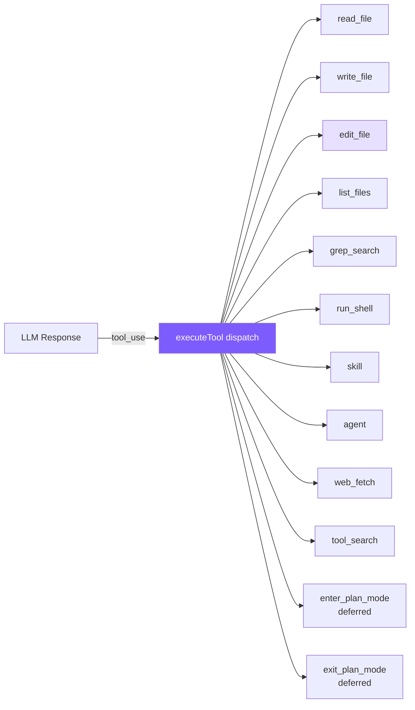

# 2. Tool System

13 tools (6 core + web_fetch + tool_search + skill + agent + 2 plan mode) + read-before-edit + mtime + deferred loading.



## Reference: Claude Code's Approach

**Unified `Tool` generic interface**: `isConcurrencySafe(input)` receives args (same tool with different args has different semantics — `ls` is read-only, `rm` is not), `prompt(options)` gives each tool its own system prompt fragment, React rendering methods included.

**`buildTool` factory fail-closed defaults**: `isConcurrencySafe`/`isReadOnly`/`isDestructive` default to `false` — mislabeling read-only as write only causes extra prompts; the reverse is dangerous.

**3-layer registration pipeline**:
- Layer 1: `getAllBaseTools()` direct import + `feature()` compile-time macros for dead-code elimination
- Layer 2: `getTools()` runtime filtering by SIMPLE mode / deny rules / `isEnabled()`
- Layer 3: `assembleToolPool()` built-ins first + MCP appended, sectioned ordering to protect cache breakpoints

**8-stage execution lifecycle**: lookup → two-stage validation (Zod + business) → parallel start Hook & Bash classifier → permission check → `call()` streaming progress → large result disk persistence → Post-Hook → `tool_result` return. **Core philosophy: errors are data, not exceptions** — errors at any stage return as `is_error: true` tool_results, letting the model self-correct.

**Concurrency control**: non-concurrency-safe runs solo, multiple concurrency-safe run together. `StreamingToolExecutor` starts as soon as it detects a complete block, hiding the ~1s tool latency inside a 5-30s streaming window. Cap: `MAX_TOOL_USE_CONCURRENCY = 10`.

**edit_file 14-step validation** (sorted by I/O cost): the 3 most critical are read-before-edit (code-enforced, not prompt suggestion), mtime detection of external modifications, config-file JSON Schema validation.

**Why search-and-replace** (vs alternatives):

| Approach | Fatal flaw |
|----------|-----------|
| Line-number editing | Position-dependent, multi-step edits require recalculation |
| AST editing | Files with syntax errors most need editing, but AST parsers reject them |
| Unified diff | LLMs perform poorly on strict formats |
| Whole-file rewrite | Wastes tokens + omits unmodified code + hard to review |
| **String replacement** | Hallucination-safe — no match = failure, model re-reads and corrects |

## Simplification Decisions

| Claude Code | mini-claude | Reason |
|-------------|-------------|--------|
| 66+ tool classes, separate directories | 1 file + 6 functions | No industrial-grade modularity needed |
| 8-stage lifecycle | switch dispatch | Skip Hook / classifier |
| StreamingToolExecutor concurrency | Streaming pre-start + read-only parallel | Simplify scheduling |
| 14-step validation pipeline | Uniqueness + quote tolerance + read-before-edit + mtime | Keep the essentials |
| 3-tier large-result limits | Single 50K truncation | Enough to prevent context blowup |

## Tool Definitions

```typescript
// tools.ts — Anthropic native schema, passed straight to API
export const toolDefinitions: ToolDef[] = [
  {
    name: "read_file",
    description: "Read the contents of a file. Returns the file content with line numbers.",
    input_schema: {
      type: "object",
      properties: { file_path: { type: "string", description: "The path to the file to read" } },
      required: ["file_path"],
    },
  },
  {
    name: "write_file",
    description: "Write content to a file. Creates the file if it doesn't exist, overwrites if it does.",
    input_schema: {
      type: "object",
      properties: {
        file_path: { type: "string", description: "The path to the file to write" },
        content: { type: "string", description: "The content to write to the file" },
      },
      required: ["file_path", "content"],
    },
  },
  {
    name: "edit_file",
    description: "Edit a file by replacing an exact string match with new content. The old_string must match exactly.",
    input_schema: {
      type: "object",
      properties: {
        file_path: { type: "string" },
        old_string: { type: "string", description: "The exact string to find and replace" },
        new_string: { type: "string" },
      },
      required: ["file_path", "old_string", "new_string"],
    },
  },
  // ... list_files, grep_search, run_shell, skill, agent, web_fetch, tool_search, enter/exit_plan_mode
];
```

Static array + switch — 13 tools don't need a class hierarchy.

## Dispatcher

```typescript
// tools.ts
export async function executeTool(name: string, input: Record<string, any>): Promise<string> {
  let result: string;
  switch (name) {
    case "read_file":   result = readFile(input as any); break;
    case "write_file":  result = writeFile(input as any); break;
    case "edit_file":   result = editFile(input as any); break;
    case "list_files":  result = await listFiles(input as any); break;
    case "grep_search": result = grepSearch(input as any); break;
    case "run_shell":   result = runShell(input as any); break;
    default: return `Unknown tool: ${name}`;
  }
  return truncateResult(result);  // 50K guard
}
```

`default` returns a string instead of throwing — lets the model correct hallucinated tool names.

## edit_file — Core

```typescript
function editFile(input: { file_path: string; old_string: string; new_string: string }): string {
  try {
    const content = readFileSync(input.file_path, "utf-8");
    const count = content.split(input.old_string).length - 1;
    if (count === 0) return `Error: old_string not found in ${input.file_path}`;
    if (count > 1)  return `Error: old_string found ${count} times. Must be unique.`;
    const newContent = content.replace(input.old_string, input.new_string);
    writeFileSync(input.file_path, newContent);
    return `Successfully edited ${input.file_path}`;
  } catch (e: any) { return `Error editing file: ${e.message}`; }
}
```

**Uniqueness check** is core: 0 matches = hallucination, >1 = insufficient context. **Better to fail than guess**.

## Quote Tolerance

LLM tokenization can turn straight quotes into curly quotes; without tolerance this fails 100%:

```typescript
function normalizeQuotes(s: string): string {
  return s
    .replace(/[\u2018\u2019\u2032]/g, "'")   // curly single → straight
    .replace(/[\u201C\u201D\u2033]/g, '"');   // curly double → straight
}

function findActualString(fileContent: string, searchString: string): string | null {
  if (fileContent.includes(searchString)) return searchString;
  const normSearch = normalizeQuotes(searchString);
  const normFile = normalizeQuotes(fileContent);
  const idx = normFile.indexOf(normSearch);
  if (idx !== -1) return fileContent.substring(idx, idx + searchString.length);
  return null;
}
```

Returns the **original string from the file** (not the normalized version) after matching, preserving original character style. On success, prints `@@ -N,1 +N,1 @@` mini-diff (line number = count of `\n` before `old_string`).

## Other Tools (Highlights)

**read_file**: `readFileSync` + line numbers (for LLM positioning; `edit_file` matches content, not line numbers).

**write_file**: `mkdirSync({recursive: true})` auto-creates parent dirs so the model doesn't need extra shell calls. System prompt guides preferring `edit_file`.

**grep_search**: `grep --line-number --color=never -r`, exit code 1 (no match) is not treated as error — 2+ is; truncates to first 100 hits with `... and N more` appended. (Claude Code uses ripgrep; we use system grep.)

**run_shell**: `execSync` + timeout; on failure returns **both** stdout & stderr (compilers often error on stderr while having partial output on stdout); empty output returns `"(no output)"` to avoid confusion.

**web_fetch**: 30s timeout + HTML tag stripping + 50KB cap; marked `CONCURRENCY_SAFE`.

## Result Truncation (keep head + tail)

```typescript
const MAX_RESULT_CHARS = 50000;
function truncateResult(result: string): string {
  if (result.length <= MAX_RESULT_CHARS) return result;
  const keepEach = Math.floor((MAX_RESULT_CHARS - 60) / 2);
  return (
    result.slice(0, keepEach) +
    "\n\n[... truncated " + (result.length - keepEach * 2) + " chars ...]\n\n" +
    result.slice(-keepEach)
  );
}
```

Keep head + tail — many outputs put critical info at the end (compile-error summaries, test totals).

## Read-before-edit + mtime Guard

```typescript
// tools.ts — mtime tracking in executeTool
export async function executeTool(
  name: string, input: Record<string, any>,
  readFileState?: Map<string, number>  // filepath → mtimeMs
): Promise<string> {
  switch (name) {
    case "read_file":
      result = readFile(input as any);
      if (readFileState && !result.startsWith("Error")) {
        const absPath = resolve(input.file_path);
        try { readFileState.set(absPath, statSync(absPath).mtimeMs); } catch {}
      }
      break;

    case "write_file": {
      const absPath = resolve(input.file_path);
      if (readFileState && existsSync(absPath)) {
        if (!readFileState.has(absPath))
          return "Error: You must read this file before writing. Use read_file first.";
        if (statSync(absPath).mtimeMs !== readFileState.get(absPath)!)
          return "Warning: file was modified externally. Please read_file again.";
      }
      result = writeFile(input as any);
      if (readFileState && !result.startsWith("Error")) {
        try { readFileState.set(absPath, statSync(absPath).mtimeMs); } catch {}
      }
      break;
    }
    // edit_file same idea
  }
}
```

- `readFileState` Map lives on the Agent instance; key = absolute path, value = `mtimeMs`
- New files skip the check (when `existsSync` is false, no forced read-first)
- Mismatched mtime = file was externally modified → warn instead of silently overwriting

## Deferred Loading

With many tools (66+), sending all schemas is a token waste. **Deferred tools send only the name; the model activates them on-demand via `tool_search`**.

```typescript
// tools.ts
{
  name: "enter_plan_mode",
  description: "Enter plan mode to switch to a read-only planning phase...",
  input_schema: { type: "object", properties: {} },
  deferred: true,  // ← marker
},

const activatedTools = new Set<string>();

export function getActiveToolDefinitions(allTools?: ToolDef[]): Anthropic.Tool[] {
  const tools = allTools || toolDefinitions;
  return tools
    .filter(t => !t.deferred || activatedTools.has(t.name))
    .map(({ deferred, ...rest }) => rest);
}

// tool_search execution
case "tool_search": {
  const query = (input.query as string || "").toLowerCase();
  const matches = toolDefinitions.filter(t => t.deferred).filter(t =>
    t.name.toLowerCase().includes(query) ||
    (t.description || "").toLowerCase().includes(query)
  );
  if (matches.length === 0) return "No matching deferred tools found.";
  for (const m of matches) activatedTools.add(m.name);
  return JSON.stringify(matches.map(t => ({
    name: t.name, description: t.description, input_schema: t.input_schema,
  })), null, 2);
}
```

Flow: `getActiveToolDefinitions` filters → system prompt announces activatable list via `getDeferredToolNames()` → model calls `tool_search` → adds to `activatedTools` → next call carries full schema.

## Simplification Comparison

| Dimension | Claude Code | mini-claude |
|-----------|------------|-------------|
| **Tool count** | 66+ | 13 |
| **Execution mode** | StreamingToolExecutor concurrency | Streaming pre-start + read-only parallel |
| **Search engine** | ripgrep | system grep |
| **Edit validation** | 14 steps + readFileTimestamps | Uniqueness + quote tolerance + read-before-edit + mtime |
| **Shell safety** | AST + sandbox + 23 checks | Regex + confirm |
| **Deferred loading** | deferred + ToolSearch | Same |

---

> **Next chapter**: Tool definitions determine the agent's capabilities, but the System Prompt defines its behavior -- how to use these tools and when to be careful.
