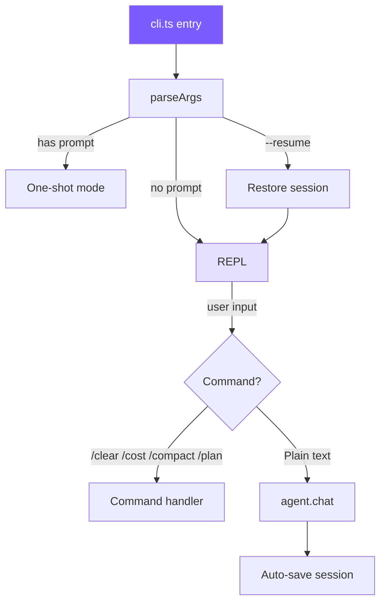

# 4. CLI & Sessions

Argument parsing, REPL, Ctrl+C interruption, session persistence.



## Reference: Claude Code's Approach

- **Entry** `src/entrypoints/cli.tsx` — React/Ink component model transplanted into the terminal, supporting streaming Markdown, Vim mode, multi-tab
- **Observable autonomy**: Agent acts freely + user sees each step in real-time. Interruption cost ≪ undo cost, so the user can Ctrl+C within 3 seconds
- **JSONL append-only**: O(1) writes; a crash loses at most the last line. Compare to whole-JSON overwrite writes (which get slower over long conversations + risk corruption on crash)

We simplify: plain readline REPL + whole-JSON save (JSONL is not necessary at tutorial scale).

## Argument Parsing

```typescript
// cli.ts
function parseArgs(): ParsedArgs {
  const args = process.argv.slice(2);
  let permissionMode: PermissionMode = "default";
  let thinking = false;
  let model = process.env.MINI_CLAUDE_MODEL || "claude-opus-4-6";
  let resume = false;
  let maxCost: number | undefined;
  let maxTurns: number | undefined;
  const positional: string[] = [];

  for (let i = 0; i < args.length; i++) {
    if (args[i] === "--yolo" || args[i] === "-y")  permissionMode = "bypassPermissions";
    else if (args[i] === "--plan")                 permissionMode = "plan";
    else if (args[i] === "--accept-edits")         permissionMode = "acceptEdits";
    else if (args[i] === "--dont-ask")             permissionMode = "dontAsk";
    else if (args[i] === "--thinking")             thinking = true;
    else if (args[i] === "--model" || args[i] === "-m") model = args[++i] || model;
    else if (args[i] === "--resume")               resume = true;
    else if (args[i] === "--max-cost")  { const v = parseFloat(args[++i]); if (!isNaN(v)) maxCost = v; }
    else if (args[i] === "--max-turns") { const v = parseInt(args[++i], 10); if (!isNaN(v)) maxTurns = v; }
    else if (args[i] === "--help" || args[i] === "-h") { console.log("Usage: mini-claude ..."); process.exit(0); }
    else positional.push(args[i]);
  }

  return { permissionMode, model, resume, thinking, maxCost, maxTurns,
           prompt: positional.length > 0 ? positional.join(" ") : undefined };
}
```

10 flags, hand-written loop, zero dependencies. Value-taking flags (`--model X`) use `++i` to jump to the next element.

## main: One-shot vs REPL

```typescript
// cli.ts
async function main() {
  const { permissionMode, model, prompt, resume, thinking, maxCost, maxTurns } = parseArgs();

  const apiKey = process.env.ANTHROPIC_API_KEY;
  if (!apiKey) { printError("API key required. Set ANTHROPIC_API_KEY."); process.exit(1); }

  const agent = new Agent({
    permissionMode, model, thinking, maxCostUsd: maxCost, maxTurns, apiKey,
    baseURL: process.env.ANTHROPIC_BASE_URL,
  });

  if (resume) {
    const sessionId = getLatestSessionId();
    if (sessionId) { const s = loadSession(sessionId); if (s) agent.restoreSession(s); }
  }

  if (prompt) await agent.chat(prompt);
  else        await runRepl(agent);
}
```

API key is read only from env — no CLI arg support (avoids leaking to shell history).

## REPL

```typescript
// cli.ts
async function runRepl(agent: Agent) {
  const rl = readline.createInterface({ input: process.stdin, output: process.stdout });

  let sigintCount = 0;
  process.on("SIGINT", () => {
    if (agent.isProcessing) {
      agent.abort();
      console.log("\n  (interrupted)");
      sigintCount = 0;
      printUserPrompt();
    } else {
      sigintCount++;
      if (sigintCount >= 2) { console.log("\nBye!\n"); process.exit(0); }
      console.log("\n  Press Ctrl+C again to exit.");
      printUserPrompt();
    }
  });

  printWelcome();

  // rl.once ensures strict serialization: concurrent chats would corrupt message history
  const askQuestion = (): void => {
    printUserPrompt();
    rl.once("line", async (line) => {
      const input = line.trim();
      sigintCount = 0;
      if (!input) { askQuestion(); return; }
      if (input === "exit" || input === "quit") { console.log("\nBye!\n"); process.exit(0); }
      if (input === "/clear")   { agent.clearHistory(); askQuestion(); return; }
      if (input === "/cost")    { agent.showCost();     askQuestion(); return; }
      if (input === "/compact") { try { await agent.compact(); } catch (e: any) { printError(e.message); } askQuestion(); return; }
      if (input === "/plan")    { agent.togglePlanMode(); askQuestion(); return; }
      try { await agent.chat(input); }
      catch (e: any) { if (e.name !== "AbortError" && !e.message?.includes("aborted")) printError(e.message); }
      askQuestion();
    });
  };
  askQuestion();
}
```

**Ctrl+C dual semantics**: while processing → interrupt; while idle → first press warns, second exits. Prevents both accidental session loss and stuck agents you can't interrupt.

## Session Persistence

```typescript
// session.ts
const SESSION_DIR = join(homedir(), ".mini-claude", "sessions");

export function saveSession(id: string, data: SessionData): void {
  ensureDir();
  writeFileSync(join(SESSION_DIR, `${id}.json`), JSON.stringify(data, null, 2));
}

export function getLatestSessionId(): string | null {
  const sessions = listSessions();
  if (sessions.length === 0) return null;
  sessions.sort((a, b) => new Date(b.startTime).getTime() - new Date(a.startTime).getTime());
  return sessions[0].id;
}

// agent.ts
private autoSave() {
  try {
    saveSession(this.sessionId, {
      metadata: { id: this.sessionId, model: this.model, cwd: process.cwd(),
                  startTime: this.sessionStartTime, messageCount: this.getMessageCount() },
      anthropicMessages: this.anthropicMessages,
    });
  } catch {}  // A full disk shouldn't crash the conversation
}
```

## UI Output

```typescript
// ui.ts
export function printToolCall(name: string, input: Record<string, any>) {
  const icon = getToolIcon(name);        // read_file → 📖, run_shell → 💻
  const summary = getToolSummary(name, input);
  console.log(chalk.yellow(`\n  ${icon} ${name}`) + chalk.gray(` ${summary}`));
}

export function printToolResult(name: string, result: string) {
  const maxLen = 500;
  const truncated = result.length > maxLen
    ? result.slice(0, maxLen) + chalk.gray(`\n  ... (${result.length} chars total)`)
    : result;
  console.log(chalk.dim(truncated.split("\n").map((l) => "  " + l).join("\n")));
}
```

UI truncates to 500 chars (for humans); the full result is still in the message history.
