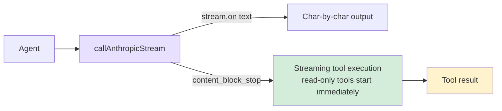

# 5. Streaming Output

Char-by-char display + hiding tool execution inside the streaming window.



## Reference: Claude Code's Approach

- **Why streaming**: Models generate at 30-80 tok/s, long answers take 10-30s; users tolerate 2-3s of waiting. Streaming gets the first character on screen in a few hundred ms.
- **Underlying SSE**: Unidirectional persistent HTTP pushing `data:` lines — simpler than WebSocket, sufficient for LLM scenarios.
- **`StreamingToolExecutor`**: While the model is still generating, already-parsed tool_use blocks start executing; within a 5-30s streaming window, file reads (<100ms) are almost fully covered.
- **Retry policy**: 429/503/529 + transient network errors are retryable, 400/401/404 are not; exponential backoff + jitter to prevent "retry storms".

## SDK stream

```typescript
// agent.ts — callAnthropicStream
private async callAnthropicStream(): Promise<Anthropic.Message> {
  return withRetry(async (signal) => {
    const createParams: any = {
      model: this.model,
      max_tokens: this.thinkingMode !== "disabled" ? maxOutput : 16384,
      system: this.systemPrompt,
      tools: toolDefinitions,
      messages: this.anthropicMessages,
    };

    if (this.thinkingMode === "enabled") {
      createParams.thinking = { type: "enabled", budget_tokens: maxOutput - 1 };
    } else if (this.thinkingMode === "adaptive") {
      createParams.thinking = { type: "enabled", budget_tokens: 10000 };
    }

    const stream = this.anthropicClient!.messages.stream(createParams, { signal });

    let firstText = true;
    stream.on("text", (text) => {
      if (firstText) { printAssistantText("\n"); firstText = false; }
      printAssistantText(text);
    });

    const finalMessage = await stream.finalMessage();

    // thinking blocks aren't kept in history to avoid context bloat
    if (this.thinkingMode !== "disabled") {
      finalMessage.content = finalMessage.content.filter((b: any) => b.type !== "thinking");
    }
    return finalMessage;
  }, this.abortController?.signal);
}
```

The SDK wraps SSE parsing: `stream.on("text")` gives increments; `stream.finalMessage()` gives the final `Message` (equivalent to non-streaming). `{ signal }` lets Ctrl+C interrupt the network call.

## Retry

```typescript
function isRetryable(error: any): boolean {
  const status = error?.status || error?.statusCode;
  if ([429, 503, 529].includes(status)) return true;
  if (error?.code === "ECONNRESET" || error?.code === "ETIMEDOUT") return true;
  if (error?.message?.includes("overloaded")) return true;
  return false;
}

async function withRetry<T>(fn: (s?: AbortSignal) => Promise<T>, signal?: AbortSignal, maxRetries = 3): Promise<T> {
  for (let attempt = 0; ; attempt++) {
    try { return await fn(signal); }
    catch (error: any) {
      if (signal?.aborted) throw error;
      if (attempt >= maxRetries || !isRetryable(error)) throw error;
      const delay = Math.min(1000 * Math.pow(2, attempt), 30000) + Math.random() * 1000;
      const reason = error?.status ? `HTTP ${error.status}` : error?.code || "network error";
      printRetry(attempt + 1, maxRetries, reason);
      await new Promise((r) => setTimeout(r, delay));
    }
  }
}
```

`min(1000 * 2^attempt, 30000) + random(0, 1000)`: exponential backoff + 30s cap + jitter.

## Extended Thinking

Three modes: `adaptive` (auto-on for 4.x, budget 10000) / `enabled` (`--thinking` flag, budget maximized) / `disabled` (3.x doesn't support).

```typescript
function resolveThinkingMode(model: string, thinkingFlag: boolean): "adaptive" | "enabled" | "disabled" {
  if (!modelSupportsThinking(model)) return "disabled";
  if (thinkingFlag) return "enabled";
  if (modelSupportsAdaptiveThinking(model)) return "adaptive";
  return "disabled";
}
```

Thinking blocks can be thousands of tokens and aren't useful for later turns — filtered out before entering history.

## Streaming Tool Execution

Read-only tools (`CONCURRENCY_SAFE_TOOLS`) are launched at `content_block_stop`; the Promise is stored in a Map and later awaited (usually already resolved).

```typescript
// tools.ts
export const CONCURRENCY_SAFE_TOOLS = new Set([
  "read_file", "list_files", "grep_search", "web_fetch"
]);

// agent.ts — main loop side
const earlyExecutions = new Map<string, Promise<string>>();

const response = await this.callAnthropicStream((block) => {
  const input = block.input as Record<string, any>;
  if (CONCURRENCY_SAFE_TOOLS.has(block.name)) {
    const perm = checkPermission(block.name, input, this.permissionMode, this.planFilePath || undefined);
    if (perm.action === "allow") {
      earlyExecutions.set(block.id, this.executeToolCall(block.name, input));
    }
  }
});

// When processing tool results:
const earlyPromise = earlyExecutions.get(toolUse.id);
if (earlyPromise) { const raw = await earlyPromise; /* ... */ continue; }
```

The `callAnthropicStream` side accumulates tool_use JSON via `streamEvent` subscription:

```typescript
// agent.ts — callAnthropicStream
private async callAnthropicStream(
  onToolBlockComplete?: (block: Anthropic.ToolUseBlock) => void,
): Promise<Anthropic.Message> {
  const toolBlocksByIndex = new Map<number, { id: string; name: string; inputJson: string }>();

  stream.on("streamEvent" as any, (event: any) => {
    if (event.type === "content_block_start" && event.content_block?.type === "tool_use") {
      toolBlocksByIndex.set(event.index, {
        id: event.content_block.id, name: event.content_block.name, inputJson: "",
      });
    }
    if (event.type === "content_block_delta" && event.delta?.type === "input_json_delta") {
      const t = toolBlocksByIndex.get(event.index);
      if (t) t.inputJson += event.delta.partial_json;
    }
    if (event.type === "content_block_stop" && onToolBlockComplete) {
      const t = toolBlocksByIndex.get(event.index);
      if (t) { try {
        onToolBlockComplete({ type: "tool_use", id: t.id, name: t.name, input: JSON.parse(t.inputJson) });
      } catch {} }
    }
  });
}
```

Key points: `content_block_stop` fires per **single block**, not the whole response; only `checkPermission === "allow"` runs early; writes/commands don't participate.

## Simplification Comparison

| Dimension | Claude Code | mini-claude |
|-----------|------------|-------------|
| **Thinking** | Deep integration + collapse UI | Basic support + block filtering |
| **Streaming tool execution** | Standalone `StreamingToolExecutor` module | Callback + `earlyExecutions` Map |
| **Parallel scheduling** | Full concurrency scheduler | Streaming pre-execution provides natural overlap |

---

> **Next chapter**: The Agent can now manipulate files and execute commands, but we need to prevent it from doing dangerous things -- the permission system protects your system.
