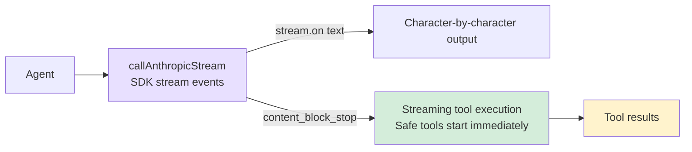

# 5. Streaming

## Chapter Goals

Implement streaming output so responses appear character by character.



## How Claude Code Does It

### Why Streaming Output?

Models generate at roughly 30-80 tokens per second, so longer responses take 10-30 seconds. Users can tolerate staring at a blank screen for about 2-3 seconds at most. Streaming output makes the first character appear within a few hundred milliseconds, turning "wait 30 seconds" into "watch content gradually being written" -- the perceived wait drops to near zero, and users can interrupt early if things go off track.

Under the hood, it uses SSE (Server-Sent Events): the server pushes `data:` lines over a single persistent HTTP connection, sending a `content_block_delta` event every few tokens. Simpler than WebSocket, and one-way push is sufficient for LLM applications.

### Streaming Processing and Parallel Tool Execution

A key optimization in Claude Code: the `StreamingToolExecutor` starts executing fully-parsed tool_use blocks while the model is still generating subsequent content. In a serial approach, tool execution can only begin after the full API response arrives; with streaming parallelism, the first tool_use block is dispatched the moment it's fully parsed, without waiting for the second.

Within a typical 5-30 second API stream window, file reads (< 100ms) can almost entirely fit in -- by the time the stream ends, tool results are often already ready.

### Error Retry

Not all errors are worth retrying: 429/503/529 and transient network failures (ECONNRESET) are retryable; 400/401/404 reflect code or configuration issues, so retrying is pointless.

The rationale for exponential backoff (rather than fixed intervals): when a service is overloaded, many clients retrying simultaneously after a fixed 1-second delay creates a "retry storm" that makes the overload worse. Exponential backoff doubles the interval each round (1s -> 2s -> 4s), and adding random jitter breaks client synchronization -- this is standard distributed fault tolerance practice.

## Our Implementation

### SDK Built-in Stream

#### **TypeScript**
```typescript
// agent.ts -- callAnthropicStream

private async callAnthropicStream(): Promise<Anthropic.Message> {
  return withRetry(async (signal) => {
    const createParams: any = {
      model: this.model,
      max_tokens: this.thinkingMode !== "disabled" ? maxOutput : 16384,
      system: this.systemPrompt,
      tools: toolDefinitions,
      messages: this.anthropicMessages,
    };

    if (this.thinkingMode === "enabled") {
      createParams.thinking = { type: "enabled", budget_tokens: maxOutput - 1 };
    } else if (this.thinkingMode === "adaptive") {
      createParams.thinking = { type: "enabled", budget_tokens: 10000 };
    }

    const stream = this.anthropicClient!.messages.stream(createParams, { signal });

    let firstText = true;
    stream.on("text", (text) => {
      if (firstText) { printAssistantText("\n"); firstText = false; }
      printAssistantText(text);
    });

    const finalMessage = await stream.finalMessage();

    // Don't store thinking blocks in history to avoid wasting context window
    if (this.thinkingMode !== "disabled") {
      finalMessage.content = finalMessage.content.filter(
        (block: any) => block.type !== "thinking"
      );
    }

    return finalMessage;
  }, this.abortController?.signal);
}
```

The Anthropic SDK encapsulates all SSE parsing details: `stream.on("text")` directly delivers text deltas, and `stream.finalMessage()` returns a `Message` object identical to the non-streaming version. `{ signal }` passes in an AbortController, allowing Ctrl+C to abort the network request.

### Retry Mechanism

#### **TypeScript**
```typescript
function isRetryable(error: any): boolean {
  const status = error?.status || error?.statusCode;
  if ([429, 503, 529].includes(status)) return true;
  if (error?.code === "ECONNRESET" || error?.code === "ETIMEDOUT") return true;
  if (error?.message?.includes("overloaded")) return true;
  return false;
}

async function withRetry<T>(
  fn: (signal?: AbortSignal) => Promise<T>,
  signal?: AbortSignal,
  maxRetries = 3
): Promise<T> {
  for (let attempt = 0; ; attempt++) {
    try {
      return await fn(signal);
    } catch (error: any) {
      if (signal?.aborted) throw error;
      if (attempt >= maxRetries || !isRetryable(error)) throw error;
      const delay = Math.min(1000 * Math.pow(2, attempt), 30000) + Math.random() * 1000;
      const reason = error?.status ? `HTTP ${error.status}` : error?.code || "network error";
      printRetry(attempt + 1, maxRetries, reason);
      await new Promise((r) => setTimeout(r, delay));
    }
  }
}
```

The delay formula `min(1000 * 2^attempt, 30000) + random(0, 1000)`: the exponential part controls backoff speed, the 30-second cap prevents excessively long waits, and random jitter prevents multiple clients from retrying in sync and creating a "retry storm."

### Extended Thinking

Extended Thinking gives the model a private "scratchpad" for reasoning and planning before output, which noticeably helps with coding tasks requiring multi-step decisions.

Three modes:
- **adaptive**: Automatically enabled for claude-4.x models, budget of 10000 tokens, model decides whether to use it
- **enabled**: Explicitly enabled via `--thinking` flag, budget maximized
- **disabled**: For models that don't support thinking (Claude 3.x)

#### **TypeScript**
```typescript
function resolveThinkingMode(model: string, thinkingFlag: boolean): "adaptive" | "enabled" | "disabled" {
  if (!modelSupportsThinking(model)) return "disabled";
  if (thinkingFlag) return "enabled";
  if (modelSupportsAdaptiveThinking(model)) return "adaptive";
  return "disabled";
}

// Constructing request parameters
if (this.thinkingMode === "enabled") {
  createParams.thinking = { type: "enabled", budget_tokens: maxOutput - 1 };
} else if (this.thinkingMode === "adaptive") {
  createParams.thinking = { type: "enabled", budget_tokens: 10000 };
}

// Filter out thinking blocks, don't store in history
finalMessage.content = finalMessage.content.filter((block: any) => block.type !== "thinking");
```

Thinking blocks can be thousands of tokens long and have no reference value for subsequent conversation. Filtering them out is the most direct way to prevent the context window from being filled with useless content.

### Streaming Tool Execution

When a `tool_use` block in the Anthropic streaming response is fully received (triggered by a `content_block_stop` event), if the tool is concurrency-safe (`read_file`, `list_files`, `grep_search`, `web_fetch`), execution starts immediately -- without waiting for the entire API response to complete. This "hides" tool execution time within the streaming window while the model generates subsequent content.

#### **TypeScript**
```typescript
// agent.ts -- Streaming tool execution

// Track early-executed tools during streaming
const earlyExecutions = new Map<string, Promise<string>>();

const response = await this.callAnthropicStream((block) => {
  const input = block.input as Record<string, any>;
  if (CONCURRENCY_SAFE_TOOLS.has(block.name)) {
    const perm = checkPermission(block.name, input, this.permissionMode, this.planFilePath || undefined);
    if (perm.action === "allow") {
      earlyExecutions.set(block.id, this.executeToolCall(block.name, input));
    }
  }
});

// When processing tool results later:
const earlyPromise = earlyExecutions.get(toolUse.id);
if (earlyPromise) {
  const raw = await earlyPromise;  // Already complete or about to complete
  // ... use result directly
  continue;
}
```

`callAnthropicStream` implements this internally through a callback mechanism:

#### **TypeScript**
```typescript
// agent.ts -- callAnthropicStream tool block tracking

private async callAnthropicStream(
  onToolBlockComplete?: (block: Anthropic.ToolUseBlock) => void,
): Promise<Anthropic.Message> {
  // ...
  const toolBlocksByIndex = new Map<number, { id: string; name: string; inputJson: string }>();

  stream.on("streamEvent" as any, (event: any) => {
    // Tool block tracking: accumulate input JSON as stream arrives
    if (event.type === "content_block_start" && event.content_block?.type === "tool_use") {
      toolBlocksByIndex.set(event.index, {
        id: event.content_block.id,
        name: event.content_block.name,
        inputJson: "",
      });
    }
    if (event.type === "content_block_delta" && event.delta?.type === "input_json_delta") {
      const tracked = toolBlocksByIndex.get(event.index);
      if (tracked) tracked.inputJson += event.delta.partial_json;
    }
    if (event.type === "content_block_stop" && onToolBlockComplete) {
      const tracked = toolBlocksByIndex.get(event.index);
      if (tracked) {
        try {
          const input = JSON.parse(tracked.inputJson);
          onToolBlockComplete({ type: "tool_use", id: tracked.id, name: tracked.name, input });
        } catch {}
      }
    }
  });
  // ...
}
```

Key design points:

- **`content_block_stop` is a block-level event**: It fires when a single `tool_use` block's JSON is fully received, not when the entire response ends. The model may return multiple tool calls in one response -- the first block may complete while the second is still streaming
- **Only concurrency-safe tools execute early**: Only read-only tools (`read_file`, `list_files`, `grep_search`, `web_fetch`) are executed early; write operations and command execution are not
- **Permission checks still apply**: Only tools where `checkPermission` returns `"allow"` execute early; tools requiring user confirmation (`"confirm"`) are not triggered early
- **Promises are stored, awaited later**: The `earlyExecutions` Map stores Promises. When the subsequent tool processing loop finds an early execution result, it simply awaits it -- typically already complete by then
- **Core benefit**: During the 5-30 second streaming window, tool execution runs in parallel with model generation. Fast operations like file reads are often already complete by the time the stream ends

### Parallel Tool Execution

The prerequisite for parallel execution is marking which tools are concurrency-safe -- read-only tools have no side effects and can safely run simultaneously:

#### **TypeScript**
```typescript
// tools.ts
export const CONCURRENCY_SAFE_TOOLS = new Set([
  "read_file", "list_files", "grep_search", "web_fetch"
]);
```

For the Anthropic backend, streaming tool execution naturally handles parallelism -- each tool block starts executing upon completion, and multiple tools naturally overlap in execution.

Design points of the parallel strategy:

- **Streaming execution handles parallelism automatically**: Tools start upon block completion, and multiple tool executions naturally overlap
- **Mixed sequences maintain safety**: Write operations and command execution are not concurrency-safe and run sequentially; only read-only tools (`read_file`, `list_files`, `grep_search`, `web_fetch`) execute in parallel
- **Typical speedup**: When the model reads 3-5 files in a single response, parallel execution usually brings a 2-3x speed improvement

## Comparison

| Dimension | Claude Code | mini-claude |
|-----------|------------|-------------|
| **Retry strategy** | Similar exponential backoff | Exponential backoff + random jitter |
| **Thinking handling** | Deep integration, independent display and folding | Basic support, filter thinking blocks |
| **Streaming tool execution** | StreamingToolExecutor as standalone module, full event handling | Callback + earlyExecutions Map, streamlined implementation |
| **Parallel tool execution** | Full concurrency scheduler | Anthropic streaming early execution |

---

> **Next chapter**: The Agent can now manipulate files and execute commands, but we need to prevent it from doing dangerous things -- the permission system protects your system.
