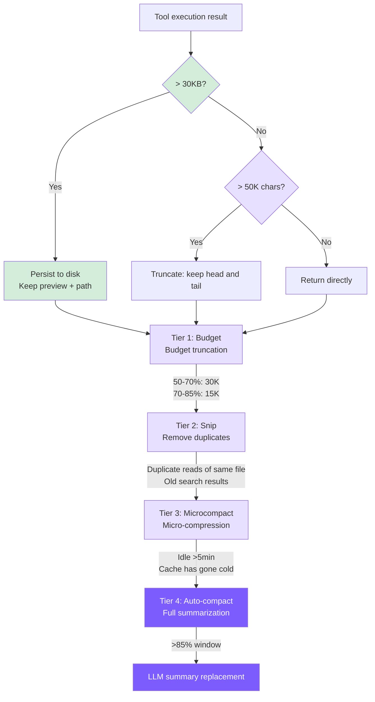

# 7. Context Management

## Chapter Goals

Prevent conversation history from exceeding the LLM's context window: a 4-tier graduated compression pipeline, progressively escalating from lightweight truncation to full summarization.



## How Claude Code Does It

### Context Construction

Before each API call, Claude Code assembles three categories of information into the request:

**System prompt** is the most stable part, composed of attribution headers, tool schemas, security rules, etc. It contains a `SYSTEM_PROMPT_DYNAMIC_BOUNDARY` sentinel that splits it into a static half and a dynamic half -- the static half is identical for all users and marked `scope: 'global'` for globally shared caching; the dynamic half (MCP tools, language preferences, etc.) varies by user and is not shared. This allows millions of users worldwide to share the same cached core system prompt, making it one of the primary cost optimization techniques.

**System/user context** is computed once per session and memoized: git status (5 commands executed in parallel), CLAUDE.md files (traversing the directory tree upward from CWD), current date, etc. The injection order is deliberate -- system context is placed after the system prompt, and user context is prepended to the message array, ensuring the most stable content comes first to maximize cache hits.

**Message history** records everything in the conversation and is the primary target of the compression pipeline. Before sending to the API, it goes through `normalizeMessagesForAPI()` to fix formatting issues: attachment reordering, handling thinking blocks, merging split messages, validating `tool_use`/`tool_result` pairing, etc.

### 5-Level Compression Pipeline

The design philosophy is **progressive compression**: use the cheapest methods first, only escalating to heavier weapons when necessary.

**Level 1: Tool Result Budget Trimming** -- Tools declare `maxResultSizeChars` (default 50K chars); when exceeded, results are **persisted to disk**, and only a compact reference with a 2KB preview is kept in context. The choice of persistence over truncation is deliberate: no data is lost, and the model can retrieve the full file at any time using the Read tool.

**Level 2: History Snip** -- A feature-gated capability that trims redundant parts of history. The amount freed is passed to subsequent autocompact threshold calculations, because after snip removes messages, the `usage` on the last assistant message still reflects the pre-snip size -- without correction, this would trigger autocompact prematurely.

**Level 3: Microcompact** -- Cleans up old tool results that are no longer needed, with two paths:
- **Cache has gone cold** (idle for more than N minutes): Directly modifies message content, replacing old tool results with placeholders. Since the cache has expired, modifications won't cause additional invalidation.
- **Cache is still hot**: Uses the API-level `cache_edits` mechanism to delete server-side in place, without modifying local messages at all, avoiding cache prefix invalidation.

**Level 4: Context Collapse** -- Projection-based folding, with the key characteristic of **not modifying original messages**, only creating a folded view. Analogous to a database View: the underlying table doesn't change, but queries see filtered results. When enabled, it suppresses Autocompact to prevent the two from competing.

**Level 5: Autocompact** -- The last resort, forking a sub-Agent to call the API and generate a summary. The trigger threshold is approximately 85.5% context utilization. The compression prompt uses a two-stage "analyze-summarize" approach: first the model reasons in an `<analysis>` block, then generates a standardized `<summary>` (9 sections), and finally strips the reasoning process to keep only the summary -- a classic chain-of-thought draft technique.

### Token Budget and Caching

**Token estimation** never calls additional APIs: it uses the `usage` from the most recent API response as an anchor, and estimates new messages at characters / 4. This reduces error from 30%+ with pure estimation to <5%.

**Prompt caching** is fragile because any byte change in the prefix causes invalidation. Claude Code maintains stability at multiple levels: static/dynamic boundary markers, beta header sticky latching (once sent, it persists regardless of feature flag changes), cache breakpoints at the end of the tools array, and rupture detection (automatic attribution when `cache_read_input_tokens` drops >5%).

**Circuit breaker**: There was once a session that failed autocompact 3,272 consecutive times, wasting massive API calls. Now it stops retrying after 3 consecutive failures.

## Our Implementation

4-tier pipeline: execution-time truncation + Budget + Snip + Microcompact + Auto-compact.

### Tier 0: Execution-Time Truncation (truncateResult)

#### **TypeScript**
```typescript
// tools.ts
const MAX_RESULT_CHARS = 50000;

function truncateResult(result: string): string {
  if (result.length <= MAX_RESULT_CHARS) return result;
  const keepEach = Math.floor((MAX_RESULT_CHARS - 60) / 2);
  return (
    result.slice(0, keepEach) +
    "\n\n[... truncated " + (result.length - keepEach * 2) + " chars ...]\n\n" +
    result.slice(-keepEach)
  );
}
```

Keeping both head and tail rather than just the head: the beginning of files contains imports, class definitions, and other structural information, while command output error summaries are typically at the end.

Difference from Claude Code: Claude Code persists to disk, and the model can retrieve full content later with the Read tool. We now also implement persistence -- see persistLargeResult below. The two tiers work together: persistLargeResult first intercepts results >30KB and saves them to disk, then truncateResult handles content that passed the first tier but still exceeds 50K.

### Tier 0.5: Large Result Persistence (persistLargeResult)

When a tool returns a result exceeding 30KB, the full content is written to disk, and only a preview and file path are kept in context. The model can later use `read_file` to retrieve the full output on demand.

```typescript
// agent.ts -- persistLargeResult

private persistLargeResult(toolName: string, result: string): string {
  const THRESHOLD = 30 * 1024; // 30 KB
  if (Buffer.byteLength(result) <= THRESHOLD) return result;

  const dir = join(homedir(), ".mini-claude", "tool-results");
  mkdirSync(dir, { recursive: true });
  const filename = `${Date.now()}-${toolName}.txt`;
  const filepath = join(dir, filename);
  writeFileSync(filepath, result);

  const lines = result.split("\n");
  const preview = lines.slice(0, 200).join("\n");
  const sizeKB = (Buffer.byteLength(result) / 1024).toFixed(1);

  return `[Result too large (${sizeKB} KB, ${lines.length} lines). Full output saved to ${filepath}. You can use read_file to see the full result.]\n\nPreview (first 200 lines):\n${preview}`;
}
```

Key design points for this tier:

- **30KB threshold is lower than truncateResult's 50K limit**: Intercepts large results before truncation occurs, avoiding irreversible information loss. If a result is 80KB, persistLargeResult saves the full content to disk and returns a preview, rather than letting truncateResult permanently discard the middle portion.
- **200-line preview**: Gives the model enough context to decide whether it needs to read the full output. In most cases, the first 200 lines already contain the key information (beginning of file listings, first few matches of search results, main content of command output).
- **Recoverable vs irrecoverable**: This is the fundamental difference from truncateResult. truncateResult is irreversible -- truncated content is gone forever. persistLargeResult saves data to `~/.mini-claude/tool-results/{timestamp}-{toolName}.txt`, and the model can retrieve it at any time with `read_file`.
- **Invocation timing**: Called after each tool execution completes and before results are added to messages in the main loop. This means it takes effect before truncateResult -- the preview text returned after saving is usually well under 50K, so truncation won't be triggered.
- **Alignment with Claude Code**: This design directly corresponds to Claude Code's Level 1 strategy (persist to disk, keep only references in context). The difference is that Claude Code uses a 2KB preview while we use 200 lines -- same concept, simplified implementation.

### Tier 1: Budget -- Dynamic Tool Result Reduction

Dynamically tightens the size of tool results in history based on context pressure:

#### **TypeScript**
```typescript
// agent.ts
private budgetToolResultsAnthropic(): void {
  const utilization = this.lastInputTokenCount / this.effectiveWindow;
  if (utilization < 0.5) return;

  const budget = utilization > 0.7 ? 15000 : 30000;

  for (const msg of this.anthropicMessages) {
    if (msg.role !== "user" || !Array.isArray(msg.content)) continue;
    for (let i = 0; i < msg.content.length; i++) {
      const block = msg.content[i] as any;
      if (block.type === "tool_result" && typeof block.content === "string"
          && block.content.length > budget) {
        const keepEach = Math.floor((budget - 80) / 2);
        block.content = block.content.slice(0, keepEach) +
          `\n\n[... budgeted: ${block.content.length - keepEach * 2} chars truncated ...]\n\n` +
          block.content.slice(-keepEach);
      }
    }
  }
}
```

Tier 0 is a one-time 50K hard limit; Budget recalculates before every API call, with the budget automatically tightening as utilization increases. Using dual thresholds (50%/70%) rather than a single threshold preserves more detail when context space is still ample.

### Tier 2: Snip -- Replace Stale Tool Results

#### **TypeScript**
```typescript
// agent.ts
const SNIPPABLE_TOOLS = new Set(["read_file", "grep_search", "list_files", "run_shell"]);
const SNIP_PLACEHOLDER = "[Content snipped - re-read if needed]";
const KEEP_RECENT_RESULTS = 3;
```

Snip strategy (triggered when utilization > 60%):
- Same file read multiple times by `read_file` -> keep only the latest, snip older ones
- More than 3 search results of the same type -> snip the oldest
- The 3 most recent `tool_result` entries are always preserved

Key point: **Only the `tool_result` content is cleared; the `tool_use` block is kept intact**. The model can still see "I previously read /src/main.ts" -- it just can't see the content anymore. If needed, it can call `read_file` again. Preserving metadata matters more than preserving data.

### Tier 3: Microcompact -- Aggressive Cleanup When Cache Goes Cold

#### **TypeScript**
```typescript
// agent.ts
const MICROCOMPACT_IDLE_MS = 5 * 60 * 1000;

private microcompactAnthropic(): void {
  if (!this.lastApiCallTime ||
      (Date.now() - this.lastApiCallTime) < MICROCOMPACT_IDLE_MS) return;
  // All old tool_results except the most recent 3 -> "[Old result cleared]"
}
```

The reason for using a time-based trigger: prompt cache has a TTL, and after 5+ minutes of idleness the cache has most likely expired. Continuing to retain old message content has no cost advantage, so aggressive cleanup is preferable.

Snip is selective (only replaces "stale" results); Microcompact is indiscriminate (clears everything except the newest 3) -- more aggressive, but with stricter trigger conditions.

We only implemented the time-based path. Claude Code's cache-edit path relies on the `cache_edits` API mechanism, which is too complex for a teaching implementation.

### Tier 4: Auto-compact -- Full Summary Compression

#### Trigger Condition

#### **TypeScript**
```typescript
// agent.ts
private async checkAndCompact(): Promise<void> {
  if (this.lastInputTokenCount > this.effectiveWindow * 0.85) {
    printInfo("Context window filling up, compacting conversation...");
    await this.compactConversation();
  }
}
```

`effectiveWindow = model context window - 20000`, reserving space for new input/output. For Claude (200K window), the trigger point is at approximately 76.5% total utilization.

> ⚠️ **Caller contract**: `checkAndCompact` must only be called at a turn boundary — after the user message is pushed into the message array and before the API call. The `compactAnthropic` function below assumes the last message is a plain user-text message: it `slice(0, -1)` it off when building the summarization request and re-appends it after the summary lands. If you call it mid-tool-loop, the last message will be a `tool_result`; slicing it off orphans the preceding `assistant`'s `tool_use`, and the API will reject the summarize request.

#### Anthropic Backend Compression

#### **TypeScript**
```typescript
// agent.ts
private async compactAnthropic(): Promise<void> {
  if (this.anthropicMessages.length < 4) return;

  const lastUserMsg = this.anthropicMessages[this.anthropicMessages.length - 1];

  const summaryResp = await this.anthropicClient!.messages.create({
    model: this.model,
    max_tokens: 2048,
    system: "You are a conversation summarizer. Be concise but preserve important details.",
    messages: [
      ...this.anthropicMessages.slice(0, -1),
      {
        role: "user",
        content: "Summarize the conversation so far in a concise paragraph, "
               + "preserving key decisions, file paths, and context needed to continue the work.",
      },
    ],
  });

  const summaryText = summaryResp.content[0]?.type === "text"
    ? summaryResp.content[0].text
    : "No summary available.";

  this.anthropicMessages = [
    {
      role: "user",
      content: `[Previous conversation summary]\n${summaryText}`,
    },
    {
      role: "assistant",
      content: "Understood. I have the context from our previous conversation. "
             + "How can I continue helping?",
    },
  ];

  if (lastUserMsg.role === "user") {
    this.anthropicMessages.push(lastUserMsg);
  }

  this.lastInputTokenCount = 0;
}
```

Key differences from Claude Code: Claude Code uses a two-stage "analyze-summarize" prompt for higher quality summaries, restores the 5 most recent files and active skills after compression, and has a circuit breaker to prevent infinite loops. Ours is a simplified version -- single-paragraph summary, no restoration mechanism, no circuit breaker.

### Manual Compaction

```
> /compact
  ℹ Conversation compacted.
```

Call chain: `cli.ts` -> `agent.compact()` -> `compactConversation()` -> `compactAnthropic()`

### Token Statistics and Pipeline Orchestration

Updated after each API call:

#### **TypeScript**
```typescript
this.totalInputTokens += response.usage.input_tokens;
this.totalOutputTokens += response.usage.output_tokens;
this.lastInputTokenCount = response.usage.input_tokens;
```

`lastInputTokenCount` is used to determine if we're approaching the window limit; `totalInputTokens` accumulates across all calls for cost estimation. We use API return values directly, which is simpler than Claude Code's anchor+estimation approach, and sufficient for our needs.

The 4 tiers execute sequentially before each API call:

#### **TypeScript**
```typescript
private runCompressionPipeline(): void {
  this.budgetToolResultsAnthropic();   // Tier 1
  this.snipStaleResultsAnthropic();    // Tier 2
  this.microcompactAnthropic();         // Tier 3
}
```

Tiers 1-3 run **before** every API call (zero API cost). Tier 4 runs at the **turn boundary** — after the user message is pushed into the array and before the `while` loop starts. **Do not** place Tier 4 at the end of the tool loop: at that point the last message is `{role: "user", content: [tool_result, ...]}`, and `compactAnthropic`'s `slice(0, -1)` would sever its pairing with the preceding `assistant` message's `tool_use`, causing the Anthropic API to reject the summarize call with *"tool_use ids were found without tool_result blocks immediately after"*. `lastInputTokenCount` is still usable in the new location — it reflects the state of the previous turn's final API call, which is enough to decide whether to trigger. The intra-pipeline order is also intentional: Budget compresses large results first, making Snip's deduplication judgments more accurate, and Microcompact performs indiscriminate cleanup last when the time condition is met.

## Comparison

| Dimension | Claude Code | mini-claude |
|-----------|------------|-------------|
| **Compression tiers** | 5-level pipeline | 4 tiers (budget + snip + microcompact + summary) |
| **Token counting** | Anchor + rough estimation, no extra API calls | Direct use of API-returned input_tokens |
| **Budget trigger** | Based on remaining budget | 50%/70% dual threshold |
| **Snip strategy** | Selective trimming + cache awareness | Same-file dedup + keep most recent 3 |
| **Microcompact** | Time path + cache edit path | Only 5-minute idle trigger |
| **Auto-compact** | Two-stage summary + post-compression recovery + circuit breaker | Single-paragraph summary, no recovery |
| **Overflow storage** | Disk persistence, retrievable on demand | Disk persistence (>30KB), retrievable on demand |

---

> **Next chapter**: Let the Agent remember information across sessions -- the memory system.
