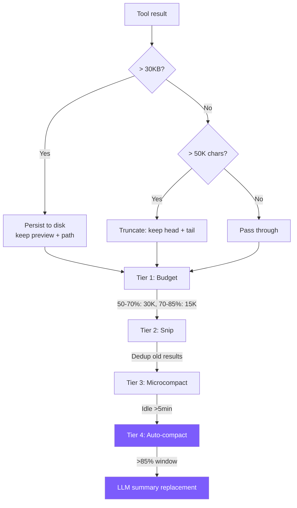

# 7. Context Management

4-tier compression pipeline, from lightweight truncation to full summarization, progressively.



## Reference: Claude Code's Approach

**Context construction**: Static half + `SYSTEM_PROMPT_DYNAMIC_BOUNDARY` sentinel + dynamic half. The static half is marked `scope: 'global'` for globally shared caching — the primary cost optimization. System context after sysprompt, user context before messages, maximizing cache hits.

**5-tier pipeline** (progressive compression):

1. **Tool Result budget trimming** — over `maxResultSizeChars` limit persists to disk + 2KB preview.
2. **History Snip** — Feature-gated; freed amount is passed to autocompact threshold calculation to avoid premature triggering.
3. **Microcompact** — Two paths: cache cold (idle >N min) → modify messages directly; cache warm → API `cache_edits` for server-side in-place removal without invalidating prefix.
4. **Context Collapse** — Projection-based folding, **doesn't modify original messages**, only creates a view; when enabled, suppresses Autocompact.
5. **Autocompact** — Fork sub-Agent, "analysis-summary" two-phase (`<analysis>` → `<summary>` with 9 sections), threshold ~85.5%.

**Token budget**: `usage` anchor + char/4 rough estimate, error <5%. **Circuit breaker**: A session once had 3272 consecutive autocompact failures — now stops after 3.

We simplify to **4 tiers** (budget + snip + microcompact + summary), no collapse, no circuit breaker, no cache awareness.

## Tier 0: Execution-time truncation

```typescript
// tools.ts
const MAX_RESULT_CHARS = 50000;
function truncateResult(result: string): string {
  if (result.length <= MAX_RESULT_CHARS) return result;
  const keepEach = Math.floor((MAX_RESULT_CHARS - 60) / 2);
  return (
    result.slice(0, keepEach) +
    "\n\n[... truncated " + (result.length - keepEach * 2) + " chars ...]\n\n" +
    result.slice(-keepEach)
  );
}
```

Keep head + tail (files start with imports, command output error summaries usually at the end).

## Tier 0.5: Large-result persistence

```typescript
// agent.ts
private persistLargeResult(toolName: string, result: string): string {
  const THRESHOLD = 30 * 1024; // 30 KB
  if (Buffer.byteLength(result) <= THRESHOLD) return result;

  const dir = join(homedir(), ".mini-claude", "tool-results");
  mkdirSync(dir, { recursive: true });
  const filepath = join(dir, `${Date.now()}-${toolName}.txt`);
  writeFileSync(filepath, result);

  const lines = result.split("\n");
  const preview = lines.slice(0, 200).join("\n");
  const sizeKB = (Buffer.byteLength(result) / 1024).toFixed(1);

  return `[Result too large (${sizeKB} KB, ${lines.length} lines). Full output saved to ${filepath}. You can use read_file to see the full result.]\n\nPreview (first 200 lines):\n${preview}`;
}
```

30KB < 50K threshold — intercepts **before** truncation (which is irreversible); disk write can be recovered via `read_file`. Aligned with Claude Code Level 1 (difference: CC uses 2KB preview, we use 200 lines).

## Tier 1: Budget (dynamic tightening)

```typescript
// agent.ts
private budgetToolResultsAnthropic(): void {
  const utilization = this.lastInputTokenCount / this.effectiveWindow;
  if (utilization < 0.5) return;

  const budget = utilization > 0.7 ? 15000 : 30000;

  for (const msg of this.anthropicMessages) {
    if (msg.role !== "user" || !Array.isArray(msg.content)) continue;
    for (const block of msg.content as any[]) {
      if (block.type === "tool_result" && typeof block.content === "string"
          && block.content.length > budget) {
        const keepEach = Math.floor((budget - 80) / 2);
        block.content = block.content.slice(0, keepEach) +
          `\n\n[... budgeted: ${block.content.length - keepEach * 2} chars truncated ...]\n\n` +
          block.content.slice(-keepEach);
      }
    }
  }
}
```

Tier 0 is a one-time hard limit; Budget recomputes before every API call, dual thresholds (50%/70%) leave more detail when there's headroom.

## Tier 2: Snip (dedup old results)

```typescript
// agent.ts
const SNIPPABLE_TOOLS = new Set(["read_file", "grep_search", "list_files", "run_shell"]);
const SNIP_PLACEHOLDER = "[Content snipped - re-read if needed]";
const KEEP_RECENT_RESULTS = 3;
```

Triggered at >60% utilization: repeated reads of the same file keep only the latest, similar searches beyond 3 snip the oldest, most recent 3 always kept.

**Key point**: Only clears `tool_result` content, `tool_use` untouched — the model still knows "I read /src/main.ts" and can re-read on demand. **Preserving metadata is more important than preserving data**.

## Tier 3: Microcompact (aggressive cleanup when cache is cold)

```typescript
// agent.ts
const MICROCOMPACT_IDLE_MS = 5 * 60 * 1000;

private microcompactAnthropic(): void {
  if (!this.lastApiCallTime ||
      (Date.now() - this.lastApiCallTime) < MICROCOMPACT_IDLE_MS) return;
  // All old tool_results except the last 3 → "[Old result cleared]"
}
```

Prompt cache TTL is 5 minutes; after idle likely expired, aggressive cleanup doesn't cost cache benefits. Snip is selective, Microcompact is indiscriminate (more aggressive but stricter trigger).

We only implement the time-based path; `cache_edits` path is too complex for teaching.

## Tier 4: Auto-compact

```typescript
// agent.ts
private async checkAndCompact(): Promise<void> {
  if (this.lastInputTokenCount > this.effectiveWindow * 0.85) {
    printInfo("Context window filling up, compacting conversation...");
    await this.compactConversation();
  }
}
```

`effectiveWindow = model window - 20000` (reserved for new turn input/output). Claude 200K window → trigger point ~76.5% total utilization.

> ⚠️ **Caller contract**: `checkAndCompact` **must only be called at turn boundaries** (after user input push, before API call). `compactAnthropic` uses `slice(0, -1)` to generate the summary — if called mid-tool-loop, the last message is a `tool_result`, and after slicing, the preceding `assistant` `tool_use` becomes unpaired, and the API errors *"tool_use ids were found without tool_result blocks immediately after"*.

```typescript
// agent.ts
private async compactAnthropic(): Promise<void> {
  if (this.anthropicMessages.length < 4) return;
  const lastUserMsg = this.anthropicMessages[this.anthropicMessages.length - 1];

  const summaryResp = await this.anthropicClient!.messages.create({
    model: this.model,
    max_tokens: 2048,
    system: "You are a conversation summarizer. Be concise but preserve important details.",
    messages: [
      ...this.anthropicMessages.slice(0, -1),
      { role: "user",
        content: "Summarize the conversation so far in a concise paragraph, "
               + "preserving key decisions, file paths, and context needed to continue the work." },
    ],
  });

  const summaryText = summaryResp.content[0]?.type === "text"
    ? summaryResp.content[0].text : "No summary available.";

  this.anthropicMessages = [
    { role: "user",      content: `[Previous conversation summary]\n${summaryText}` },
    { role: "assistant", content: "Understood. How can I continue helping?" },
  ];
  if (lastUserMsg.role === "user") this.anthropicMessages.push(lastUserMsg);
  this.lastInputTokenCount = 0;
}
```

Differences from CC: CC uses a two-phase prompt (`<analysis>` + `<summary>`) + recovers 5 recent files + circuit breaker; we use a single-paragraph summary, no recovery, no circuit breaker.

## Pipeline Orchestration

```typescript
private runCompressionPipeline(): void {
  this.budgetToolResultsAnthropic();   // Tier 1
  this.snipStaleResultsAnthropic();    // Tier 2
  this.microcompactAnthropic();         // Tier 3
}
```

**Tier 1-3 run before every API call** (zero API cost); **Tier 4 runs at turn boundary**. Order matters: Budget compresses large results first → Snip judges more accurately → Microcompact cleans indiscriminately last.

## Token Counting

```typescript
this.totalInputTokens += response.usage.input_tokens;
this.totalOutputTokens += response.usage.output_tokens;
this.lastInputTokenCount = response.usage.input_tokens;
```

Uses API return value directly — simpler than CC's "anchor + estimate" approach, sufficient.

## Simplification Comparison

| Dimension | Claude Code | mini-claude |
|-----------|------------|-------------|
| **Compression tiers** | 5 | 4 |
| **Token counting** | Anchor + rough estimate | Direct `input_tokens` |
| **Budget** | Remaining budget | 50%/70% dual threshold |
| **Snip** | Selective + cache-aware | Same-file dedup + keep recent 3 |
| **Microcompact** | Time + cache-edit dual paths | Only 5-min idle |
| **Autocompact** | Two-phase summary + recovery + circuit breaker | Single-paragraph summary |
| **Overflow storage** | Disk + on-demand read | Disk >30KB + on-demand read |

---

> **Next chapter**: Let the Agent remember information across sessions -- the memory system.
