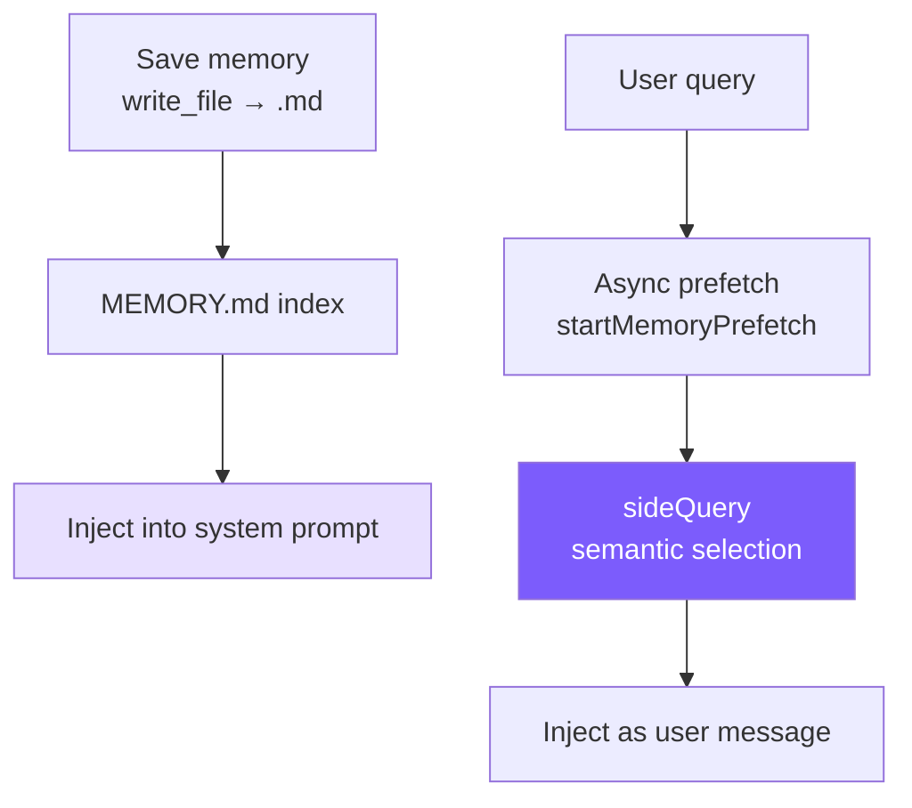

# 8. Memory System

Cross-session memory: independent of conversation history, keeping the Agent's awareness of user and project across multiple sessions.



## Reference: Claude Code's Approach

**Only hard constraint**: **Only remember information that cannot be derived from the current project state**. Anything derivable from code/architecture/git log will drift in memory. When the user says "remember this PR list," push back: what part of it is non-derivable?

**Four types** (closed classification, prevents label bloat):

| Type | Records | Trigger |
|------|---------|---------|
| **user** | Identity/preferences/background | When learning about user role/preferences |
| **feedback** | Corrections **+ affirmations** | When user corrects/affirms (must include Why + How to apply) |
| **project** | Progress/decisions/deadlines (**relative → absolute dates**) | Project dynamics |
| **reference** | External system pointers | When learning external locations |

**MEMORY.md is an index, not a container** — fully loaded into sysprompt every session, must be compact; each entry one link line, body read on demand; 200 lines / 25KB dual truncation, over-limit prompts "keep entries under ~200 chars".

**`sideQuery` semantic recall** > keyword matching — "deployment flow" can match "CI/CD notes". Async prefetch (`pendingMemoryPrefetch`) runs in parallel with the first turn generation, zero user latency. Max 5 per shot, 60KB session budget.

**Freshness warning**: Memories >1 day old get age-annotated — memories are time-slices, not live state.

## Storage

```
~/.mini-claude/projects/{sha256-hash}/memory/
├── MEMORY.md
├── user_prefers_concise_output.md
├── feedback_no_summary_at_end.md
├── project_auth_migration_q2.md
└── reference_ci_dashboard_url.md
```

Hash = first 16 chars of sha256 of `process.cwd()`; same project directory → same memory space.

## Memory File Format

```markdown
---
name: Don't summarize at the end of responses
description: User explicitly requested skipping summary paragraphs
type: feedback
---
User said "don't summarize at the end of responses" because they can read the diff and code changes themselves.

**Why:** User feels summaries waste time.
**How to apply:** After completing a task, end directly without a "Summary" or "Above is..." paragraph.
```

## Frontmatter Parsing (shared)

```typescript
// frontmatter.ts
export function parseFrontmatter(content: string): FrontmatterResult {
  const lines = content.split("\n");
  if (lines[0]?.trim() !== "---") return { meta: {}, body: content };

  let endIdx = -1;
  for (let i = 1; i < lines.length; i++) {
    if (lines[i].trim() === "---") { endIdx = i; break; }
  }
  if (endIdx === -1) return { meta: {}, body: content };

  const meta: Record<string, string> = {};
  for (let i = 1; i < endIdx; i++) {
    const colonIdx = lines[i].indexOf(":");
    if (colonIdx === -1) continue;
    const key = lines[i].slice(0, colonIdx).trim();
    const value = lines[i].slice(colonIdx + 1).trim();
    if (key) meta[key] = value;
  }
  return { meta, body: lines.slice(endIdx + 1).join("\n").trim() };
}
```

20 lines hand-written, sufficient with zero deps.

## Save & Index

```typescript
// memory.ts
export function saveMemory(entry: Omit<MemoryEntry, "filename">): string {
  const dir = getMemoryDir();
  const filename = `${entry.type}_${slugify(entry.name)}.md`;
  const content = formatFrontmatter(
    { name: entry.name, description: entry.description, type: entry.type },
    entry.content
  );
  writeFileSync(join(dir, filename), content);
  updateMemoryIndex();
  return filename;
}

function updateMemoryIndex(): void {
  const memories = listMemories();
  const lines = ["# Memory Index", ""];
  for (const m of memories) {
    lines.push(`- **[${m.name}](${m.filename})** (${m.type}) — ${m.description}`);
  }
  writeFileSync(getIndexPath(), lines.join("\n"));
}
```

`{type}_{slugified_name}.md` naming lets filesystem sorting auto-group by type.

## Index Truncation

```typescript
// memory.ts
const MAX_INDEX_LINES = 200;
const MAX_INDEX_BYTES = 25000;

export function loadMemoryIndex(): string {
  const lines = content.split("\n");
  if (lines.length > MAX_INDEX_LINES) {
    content = lines.slice(0, MAX_INDEX_LINES).join("\n") +
      "\n\n[... truncated, too many memory entries ...]";
  }
  if (Buffer.byteLength(content) > MAX_INDEX_BYTES) {
    content = content.slice(0, MAX_INDEX_BYTES) +
      "\n\n[... truncated, index too large ...]";
  }
  return content;
}
```

Line truncation prevents too many entries; byte truncation prevents overly long single lines (CC has seen 197KB stuffed into 200 lines).

## System Prompt Injection

```typescript
// memory.ts
export function buildMemoryPromptSection(): string {
  const index = loadMemoryIndex();
  const memoryDir = getMemoryDir();
  return `# Memory System

You have a persistent, file-based memory system at \`${memoryDir}\`.

## Memory Types
- **user**, **feedback**, **project**, **reference**

## How to Save
Use write_file with YAML frontmatter. Path: \`${memoryDir}/\`, filename: \`{type}_{slug}.md\`.

## What NOT to Save
- Code patterns or architecture (read code)
- Git history (use git log)
- Anything already in CLAUDE.md
- Ephemeral task details

${index ? `## Current Memory Index\n${index}` : "(No memories saved yet.)"}`;
}

// prompt.ts
systemPrompt = systemPrompt.replace("{{memory}}", buildMemoryPromptSection());
```

Three things: teach classification, teach operation, teach restraint.

## `/memory` REPL Command

```typescript
if (input === "/memory") {
  const memories = listMemories();
  if (memories.length === 0) printInfo("No memories saved yet.");
  else {
    printInfo(`${memories.length} memories:`);
    for (const m of memories) console.log(`    [${m.type}] ${m.name} — ${m.description}`);
  }
}
```

## Semantic Recall (sideQuery)

```typescript
// memory.ts
const SELECT_MEMORIES_PROMPT = `You are selecting memories that will be useful to an AI coding assistant as it processes a user's query. You will be given the user's query and a list of available memory files with their filenames and descriptions.

Return a JSON object with a "selected_memories" array of filenames for the memories that will clearly be useful (up to 5). Only include memories that you are certain will be helpful based on their name and description.
- If you are unsure if a memory will be useful, do not include it.
- If no memories would clearly be useful, return an empty array.`;

export async function selectRelevantMemories(
  query: string, sideQuery: SideQueryFn,
  alreadySurfaced: Set<string>, signal?: AbortSignal,
): Promise<RelevantMemory[]> {
  const headers = scanMemoryHeaders();
  if (headers.length === 0) return [];
  const candidates = headers.filter((h) => !alreadySurfaced.has(h.filePath));
  if (candidates.length === 0) return [];

  const manifest = formatMemoryManifest(candidates);
  try {
    const text = await sideQuery(SELECT_MEMORIES_PROMPT,
      `Query: ${query}\n\nAvailable memories:\n${manifest}`, signal);
    const jsonMatch = text.match(/\{[\s\S]*\}/);
    if (!jsonMatch) return [];
    const parsed = JSON.parse(jsonMatch[0]);
    const selectedFilenames: string[] = parsed.selected_memories || [];
    const filenameSet = new Set(selectedFilenames);
    const selected = candidates.filter((h) => filenameSet.has(h.filename));

    return selected.slice(0, 5).map((h) => {
      let content = readFileSync(h.filePath, "utf-8");
      if (Buffer.byteLength(content) > MAX_MEMORY_BYTES_PER_FILE) {
        content = content.slice(0, MAX_MEMORY_BYTES_PER_FILE) +
          "\n\n[... truncated, memory file too large ...]";
      }
      const freshness = memoryFreshnessWarning(h.mtimeMs);
      const headerText = freshness
        ? `${freshness}\n\nMemory: ${h.filePath}:`
        : `Memory (saved ${memoryAge(h.mtimeMs)}): ${h.filePath}:`;
      return { path: h.filePath, content, mtimeMs: h.mtimeMs, header: headerText };
    });
  } catch (err: any) {
    if (signal?.aborted) return [];
    console.error(`[memory] semantic recall failed: ${err.message}`);
    return [];
  }
}
```

- **sideQuery reuses main model** (CC opens a separate Sonnet)
- Only sends filenames + descriptions, low input tokens
- `alreadySurfaced` prevents duplicate recall in same session
- 4KB per-file truncation + 60KB session budget

## Async Prefetch

```typescript
// memory.ts
export function startMemoryPrefetch(
  query: string, sideQuery: SideQueryFn,
  alreadySurfaced: Set<string>, sessionMemoryBytes: number,
  signal?: AbortSignal,
): MemoryPrefetch | null {
  if (!/\s/.test(query.trim())) return null;                // Gate 1: single word skip
  if (sessionMemoryBytes >= MAX_SESSION_MEMORY_BYTES) return null;  // Gate 2: budget full
  const dir = getMemoryDir();
  if (!readdirSync(dir).some(f => f.endsWith(".md") && f !== "MEMORY.md")) return null;  // Gate 3

  const handle: MemoryPrefetch = {
    promise: selectRelevantMemories(query, sideQuery, alreadySurfaced, signal),
    settled: false, consumed: false,
  };
  handle.promise.then(() => { handle.settled = true; }).catch(() => { handle.settled = true; });
  return handle;
}

// agent.ts — consumption
this.anthropicMessages.push({ role: "user", content: userMessage });
let memoryPrefetch: MemoryPrefetch | null = null;
if (!this.isSubAgent) {
  const sq = this.buildSideQuery();
  if (sq) memoryPrefetch = startMemoryPrefetch(
    userMessage, sq, this.alreadySurfacedMemories, this.sessionMemoryBytes,
    this.abortController?.signal);
}

// Non-blocking poll inside the while loop
if (memoryPrefetch && memoryPrefetch.settled && !memoryPrefetch.consumed) {
  memoryPrefetch.consumed = true;
  const memories = await memoryPrefetch.promise;
  if (memories.length > 0) {
    this.anthropicMessages.push({ role: "user", content: formatMemoriesForInjection(memories) });
    for (const m of memories) {
      this.alreadySurfacedMemories.add(m.path);
      this.sessionMemoryBytes += Buffer.byteLength(m.content);
    }
  }
}
```

**Non-blocking poll**: prefetch is not awaited; `.then()` sets `settled`; each loop iteration checks once — if not ready, defer to next iteration. Worst case one turn late, user never waits.

## Freshness Warning

```typescript
// memory.ts
export function memoryFreshnessWarning(mtimeMs: number): string {
  const days = Math.max(0, Math.floor((Date.now() - mtimeMs) / 86_400_000));
  if (days <= 1) return "";
  return `This memory is ${days} days old. Memories are point-in-time observations, not live state — claims about code behavior may be outdated. Verify against current code before asserting as fact.`;
}
```

Provides **actionable guidance** ("verify against current code") rather than just labeling "X days old".

## Simplification Comparison

| Dimension | Claude Code | mini-claude |
|-----------|------------|-------------|
| **Recall method** | Sonnet sideQuery | Same-model sideQuery |
| **Async prefetch** | pendingMemoryPrefetch | startMemoryPrefetch |
| **Session budget** | 60KB | 60KB |
| **Freshness** | Age warning | Age warning |
