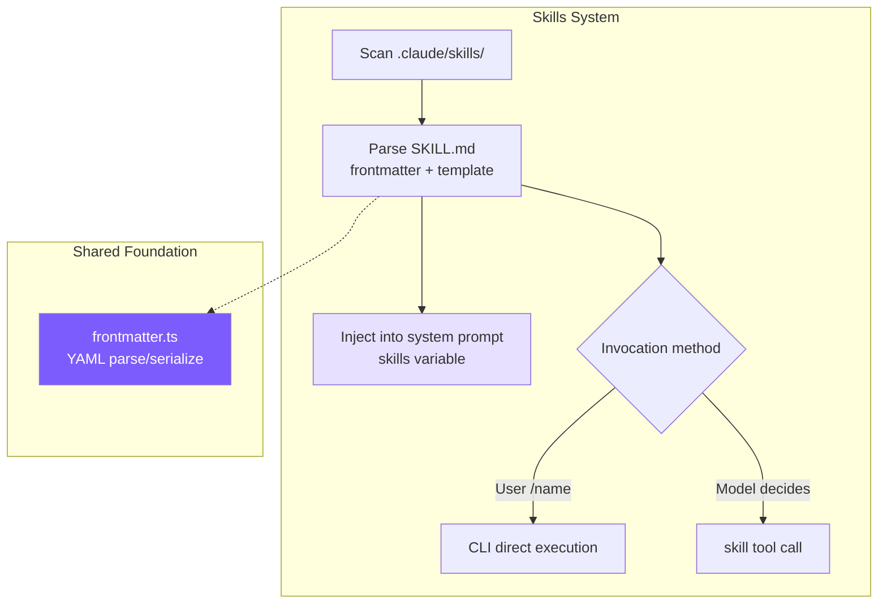
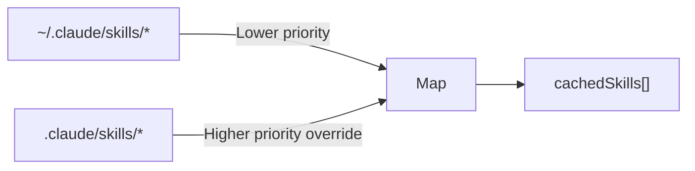
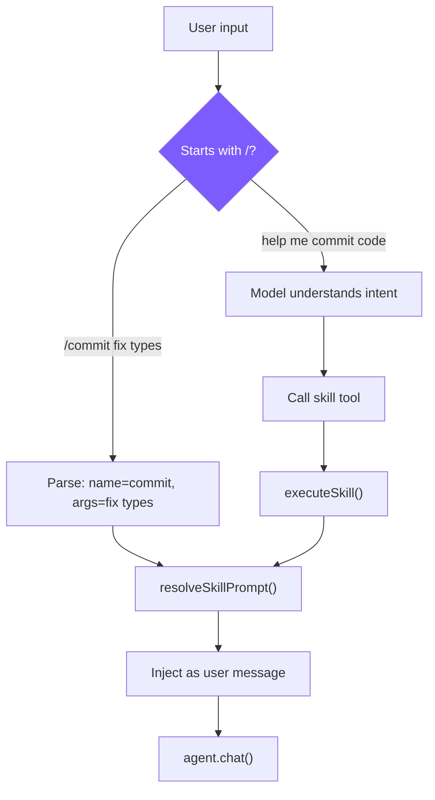

# 9. Skills System

## Chapter Goals

Give the Agent reusable prompt modules: defined once by the user, invoked repeatedly. Like shell scripts -- install and use.



---

## How Claude Code Does It

Skills are Claude Code's "AI Shell Scripts" -- templatizing AI workflows for one-time definition and repeated reuse. A `/commit` skill encapsulates the complete prompt for "read diff -> analyze changes -> write commit message -> commit."

Skills are loaded from 6 sources, with priority from high to low: enterprise policy (managed) > project-level > user-level > plugin > built-in (bundled) > MCP. The pattern is simple: sources closer to user control have higher priority, while MCP sits at the bottom since it comes from untrusted remote servers. Each skill must be in directory format `skill-name/SKILL.md`, allowing skills to bundle resource files referenced via `${CLAUDE_SKILL_DIR}`.

At startup, only frontmatter is preloaded (name/description/whenToUse); the full prompt is read only when invoked. Loading all skills fully with dozens of them would consume significant context space, so lazy loading defers the cost to the moment it's actually needed. Even just frontmatter requires token space -- `formatCommandsWithinBudget()` uses a three-stage algorithm: when budget is ample, show everything; when exceeded, built-in skills (`/commit`, `/review`) always keep full descriptions while others split the remaining budget equally; when each skill gets fewer than 20 characters, degrade to showing names only.

Skill prompts undergo multi-layer substitution before execution: `$ARGUMENTS` replaces user arguments, `${CLAUDE_SKILL_DIR}` replaces the skill directory path, and `` !`command` `` executes inline shell commands (disabled for MCP skills to prevent remote prompt injection from executing arbitrary commands).

There are two execution modes: **inline** (default) injects directly into the current conversation, and **fork** creates an independent sub-Agent that executes and returns results. Fork is suitable for skills requiring many tool calls -- for example, code review needs to read multiple files, and those calls would pollute the main conversation context. With fork, only the final result returns to the main thread.

---

## Our Implementation

### SKILL.md Format

```markdown
---
name: commit
description: Create a git commit with a descriptive message
when_to_use: When the user asks to commit changes or says "commit"
allowed-tools: run_shell, read_file
user-invocable: true
---
Look at the current git diff and staged changes. Write a clear, concise
commit message following conventional commits format.

The user's request: $ARGUMENTS

Project skill directory: ${CLAUDE_SKILL_DIR}
```

- `when_to_use`: Trigger condition shown to the model, which decides whether to auto-invoke based on this
- `allowed-tools`: Security boundary, limiting which tools the skill can use
- `user-invocable`: Skills with `false` can only be triggered automatically by the model

### Discovery and Loading



#### **TypeScript**
```typescript
// skills.ts -- discoverSkills

let cachedSkills: SkillDefinition[] | null = null;

export function discoverSkills(): SkillDefinition[] {
  if (cachedSkills) return cachedSkills;

  const skills = new Map<string, SkillDefinition>();

  loadSkillsFromDir(join(homedir(), ".claude", "skills"), "user", skills);
  loadSkillsFromDir(join(process.cwd(), ".claude", "skills"), "project", skills);

  cachedSkills = Array.from(skills.values());
  return cachedSkills;
}
```

Using a Map for deduplication naturally implements "project-level overrides user-level" -- load user first, then project; same-name keys get overwritten by the latter. Claude Code has 6 sources because it needs to support enterprise and MCP scenarios; project + user covers the core needs of individual developers.

### Skill Parsing

#### **TypeScript**
```typescript
// skills.ts -- parseSkillFile

function parseSkillFile(
  filePath: string, source: "project" | "user", skillDir: string
): SkillDefinition | null {
  const raw = readFileSync(filePath, "utf-8");
  const { meta, body } = parseFrontmatter(raw);

  const name = meta.name || skillDir.split("/").pop() || "unknown";
  const userInvocable = meta["user-invocable"] !== "false";

  let allowedTools: string[] | undefined;
  if (meta["allowed-tools"]) {
    const raw = meta["allowed-tools"];
    if (raw.startsWith("[")) {
      try { allowedTools = JSON.parse(raw); } catch {
        allowedTools = raw.replace(/[\[\]]/g, "").split(",").map((s) => s.trim());
      }
    } else {
      allowedTools = raw.split(",").map((s) => s.trim());
    }
  }

  return {
    name, description: meta.description || "",
    whenToUse: meta.when_to_use || meta["when-to-use"],
    allowedTools, userInvocable,
    promptTemplate: body, source, skillDir,
  };
}
```

`allowed-tools` supports both comma-separated and JSON array formats, trying JSON.parse first and falling back to comma splitting on failure -- both formats are natural when writing YAML, and fault-tolerant parsing prevents skill loading failures due to formatting issues. `when_to_use` accepts both underscore and hyphen key names for the same reason.

### Prompt Template Substitution

#### **TypeScript**
```typescript
// skills.ts -- resolveSkillPrompt

export function resolveSkillPrompt(skill: SkillDefinition, args: string): string {
  let prompt = skill.promptTemplate;
  prompt = prompt.replace(/\$ARGUMENTS|\$\{ARGUMENTS\}/g, args);
  prompt = prompt.replace(/\$\{CLAUDE_SKILL_DIR\}/g, skill.skillDir);
  return prompt;
}
```

`$ARGUMENTS` is replaced with user-provided arguments, and `${CLAUDE_SKILL_DIR}` is replaced with the skill directory path (skills can place template files in their directory and reference them with `read_file` in the prompt). Claude Code also supports `` !`shell_command` `` inline execution, which we haven't implemented -- it adds security risk and isn't needed for tutorial scenarios.

### Dual Invocation Paths



**Path 1: User manual invocation** (cli.ts)

#### **TypeScript**
```typescript
if (input.startsWith("/")) {
  const spaceIdx = input.indexOf(" ");
  const cmdName = spaceIdx > 0 ? input.slice(1, spaceIdx) : input.slice(1);
  const cmdArgs = spaceIdx > 0 ? input.slice(spaceIdx + 1) : "";
  const skill = getSkillByName(cmdName);
  if (skill && skill.userInvocable) {
    const resolved = resolveSkillPrompt(skill, cmdArgs);
    printInfo(`Invoking skill: ${skill.name}`);
    await agent.chat(resolved);
    return;
  }
}
```

**Path 2: Model programmatic invocation** (tools.ts)

#### **TypeScript**
```typescript
// tools.ts -- skill tool definition and execution

{
  name: "skill",
  description: "Invoke a registered skill by name...",
  input_schema: {
    properties: {
      skill_name: { type: "string" },
      args: { type: "string" },
    },
    required: ["skill_name"],
  },
}

function runSkillTool(input: { skill_name: string; args?: string }): string {
  const result = executeSkill(input.skill_name, input.args || "");
  if (!result) return `Unknown skill: ${input.skill_name}`;
  return `[Skill "${input.skill_name}" activated]\n\n${result.prompt}`;
}
```

After the model calls the `skill` tool, it receives the expanded prompt text and executes the task according to that prompt in subsequent turns. This is essentially a **meta-tool** -- the tool's return value isn't data, but instructions.

### Execution Modes: inline vs fork

#### **TypeScript**
```typescript
// agent.ts -- executeSkillTool

private async executeSkillTool(input: Record<string, any>): Promise<string> {
  const result = executeSkill(input.skill_name, input.args || "");
  if (!result) return `Unknown skill: ${input.skill_name}`;

  if (result.context === "fork") {
    const tools = result.allowedTools
      ? this.tools.filter(t => result.allowedTools!.includes(t.name))
      : this.tools.filter(t => t.name !== "agent");
    const subAgent = new Agent({
      customSystemPrompt: result.prompt,
      customTools: tools,
      isSubAgent: true,
      permissionMode: "bypassPermissions",
    });
    const subResult = await subAgent.runOnce(input.args || "Execute this skill task.");
    return subResult.text;
  }

  return `[Skill "${input.skill_name}" activated]\n\n${result.prompt}`;
}
```

When forking, the sub-Agent's tools are constrained by the `allowedTools` whitelist; if unspecified, the `agent` tool is excluded to prevent recursion. Use fork when a skill needs multiple rounds of tool calls (like code review reading multiple files) to keep the main conversation clean.

### System Prompt Description

#### **TypeScript**
```typescript
// skills.ts -- buildSkillDescriptions

export function buildSkillDescriptions(): string {
  const skills = discoverSkills();
  if (skills.length === 0) return "";

  const lines = ["# Available Skills", ""];
  const invocable = skills.filter((s) => s.userInvocable);
  const autoOnly = skills.filter((s) => !s.userInvocable);

  if (invocable.length > 0) {
    lines.push("User-invocable skills (user types /<name> to invoke):");
    for (const s of invocable) {
      lines.push(`- **/${s.name}**: ${s.description}`);
      if (s.whenToUse) lines.push(`  When to use: ${s.whenToUse}`);
    }
  }

  if (autoOnly.length > 0) {
    lines.push("Auto-invocable skills (use the skill tool when appropriate):");
    for (const s of autoOnly) {
      lines.push(`- **${s.name}**: ${s.description}`);
      if (s.whenToUse) lines.push(`  When to use: ${s.whenToUse}`);
    }
  }

  lines.push("To invoke a skill programmatically, use the `skill` tool.");
  return lines.join("\n");
}
```

Skills are displayed in two groups: user-invocable ones get the `/` prefix, model-only ones don't. `whenToUse` is the judgment condition shown to the model for deciding whether to trigger proactively. Claude Code also implements token budget control (`formatCommandsWithinBudget()`), which we skip -- tutorial scenarios have limited skill counts.

---

## Key Design Decisions

**Why Markdown instead of JSON/YAML for skills?** The essence of a skill is a large block of natural language prompt. Markdown's body is directly the prompt itself, with frontmatter providing structured metadata. Storing in JSON would require escaping newlines and quotes in the prompt, resulting in poor readability.

**Why dual invocation paths?** Supporting only `/commit` for manual invocation isn't enough -- users might say "help me commit code" without knowing the skill exists. Supporting only model auto-invocation isn't enough either -- users sometimes want precise control over trigger timing. Both paths ultimately converge at the same `resolveSkillPrompt()`, so logic isn't duplicated.

### Comparison Overview

| Dimension | Claude Code | mini-claude |
|-----------|------------|-------------|
| **Skill sources** | 6 (managed/project/user/plugin/bundled/MCP) | 2 (project + user) |
| **Skill loading** | Lazy loading + token budget control | Full loading at startup + caching |
| **Prompt substitution** | `$ARGUMENTS` + `${CLAUDE_SKILL_DIR}` + `` !`shell` `` | `$ARGUMENTS` + `${CLAUDE_SKILL_DIR}` |

---

> **Next chapter**: Let the Agent think before acting -- Plan Mode, read-only planning mode.
