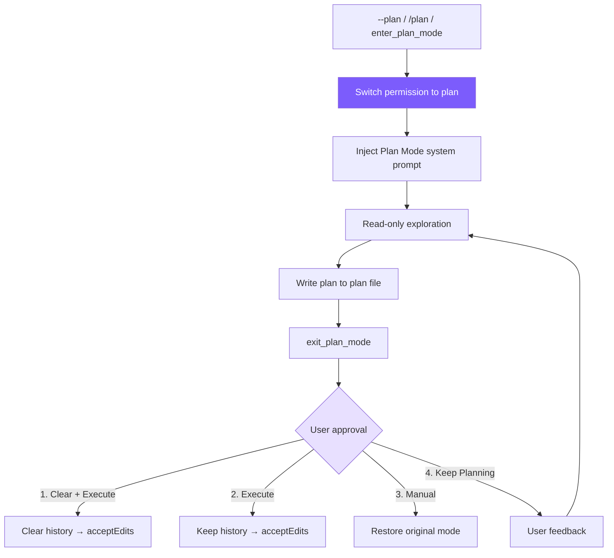

# 10. Plan Mode

Plan first, then execute; read-only exploration → write plan → approval → 4-option workflow.



## Reference: Claude Code's Approach

Full `EnterPlanMode` / `ExitPlanMode` tool pair: entering switches to read-only + generates plan file (`~/.claude/plans/`) + injects system prompt → Agent explores read-only, writes plan → user chooses among 4 execution modes. **Core philosophy**: Plan Mode isn't "prevent Agent from doing things", it's **think before doing**; the plan is persisted to disk, so even clearing context doesn't lose it.

## Tool Definitions (deferred)

```typescript
// tools.ts
{
  name: "enter_plan_mode",
  description: "Enter plan mode to switch to a read-only planning phase. In plan mode, you can only read files and write to the plan file. Use this when you need to explore the codebase and design an implementation plan before making changes.",
  input_schema: { type: "object", properties: {} },
  deferred: true,
},
{
  name: "exit_plan_mode",
  description: "Exit plan mode after you have finished writing your plan to the plan file. The user will review and approve the plan before you proceed with implementation.",
  input_schema: { type: "object", properties: {} },
  deferred: true,
},
```

No parameters (pure state switch); deferred because most sessions don't use it (see [Chapter 2](/en/docs/02-tools.md)).

## State

```typescript
// agent.ts
private prePlanMode: PermissionMode | null = null;    // Mode before entering, for restoration
private planFilePath: string | null = null;
private baseSystemPrompt: string = "";                 // Base without plan injection
private contextCleared: boolean = false;
```

`prePlanMode` is key — restores exit precisely (original acceptEdits returns to acceptEdits, not default).

## Toggle (symmetric enter/exit)

```typescript
// agent.ts
togglePlanMode(): string {
  if (this.permissionMode === "plan") {
    this.permissionMode = this.prePlanMode || "default";
    this.prePlanMode = null;
    this.planFilePath = null;
    this.systemPrompt = this.baseSystemPrompt;
    printInfo(`Exited plan mode → ${this.permissionMode} mode`);
    return this.permissionMode;
  } else {
    this.prePlanMode = this.permissionMode;
    this.permissionMode = "plan";
    this.planFilePath = this.generatePlanFilePath();
    this.systemPrompt = this.baseSystemPrompt + this.buildPlanModePrompt();
    printInfo(`Entered plan mode. Plan file: ${this.planFilePath}`);
    return "plan";
  }
}

private generatePlanFilePath(): string {
  const dir = join(homedir(), ".claude", "plans");
  if (!existsSync(dir)) mkdirSync(dir, { recursive: true });
  return join(dir, `plan-${this.sessionId}.md`);
}
```

## Plan System Prompt

```typescript
// agent.ts — buildPlanModePrompt
return `

# Plan Mode Active

Plan mode is active. You MUST NOT make any edits (except the plan file below),
run non-readonly tools, or make any changes to the system.

## Plan File: ${this.planFilePath}
Write your plan incrementally to this file using write_file or edit_file.
This is the ONLY file you are allowed to edit.

## Workflow
1. **Explore**: Read code (read_file, list_files, grep_search).
2. **Design**: Design your implementation approach.
3. **Write Plan**: Write a structured plan including:
   - **Context**: Why this change is needed
   - **Steps**: Implementation steps with critical file paths
   - **Verification**: How to test the changes
4. **Exit**: Call exit_plan_mode when your plan is ready for user review.

IMPORTANT: When your plan is complete, you MUST call exit_plan_mode.
Do NOT ask the user to approve — exit_plan_mode handles that.`;
```

The final "Do NOT ask the user to approve" is critical: without it, the model often asks "is this plan OK?" instead of calling `exit_plan_mode`, breaking the approval flow.

## Permission Integration (double guard)

```typescript
// tools.ts — checkPermission()
if (mode === "plan") {
  if (EDIT_TOOLS.has(toolName)) {
    const filePath = input.file_path || input.path;
    if (planFilePath && filePath === planFilePath) {
      return { action: "allow" };  // Only exception: the plan file itself
    }
    return { action: "deny", message: `Blocked in plan mode: ${toolName}` };
  }
  if (toolName === "run_shell") {
    return { action: "deny", message: "Shell commands blocked in plan mode" };
  }
}
if (toolName === "enter_plan_mode" || toolName === "exit_plan_mode") {
  return { action: "allow" };
}
```

**Plan file path is passed as parameter to `checkPermission`** — the target path must exactly match the plan file path to be allowed. System prompt guides (fewer invalid calls); permission check is the hard block.

## Tool Execution

```typescript
// agent.ts
private async executePlanModeTool(name: string): Promise<string> {
  if (name === "enter_plan_mode") {
    if (this.permissionMode === "plan") return "Already in plan mode.";
    this.prePlanMode = this.permissionMode;
    this.permissionMode = "plan";
    this.planFilePath = this.generatePlanFilePath();
    this.systemPrompt = this.baseSystemPrompt + this.buildPlanModePrompt();
    printInfo("Entered plan mode (read-only). Plan file: " + this.planFilePath);
    return `Entered plan mode. You are now in read-only mode.\n\nYour plan file: ${this.planFilePath}\nWrite your plan to this file. This is the only file you can edit.\n\nWhen your plan is complete, call exit_plan_mode.`;
  }

  if (name === "exit_plan_mode") {
    if (this.permissionMode !== "plan") return "Not in plan mode.";
    let planContent = "(No plan file found)";
    if (this.planFilePath && existsSync(this.planFilePath)) {
      planContent = readFileSync(this.planFilePath, "utf-8");
    }

    if (this.planApprovalFn) {
      const result = await this.planApprovalFn(planContent);
      if (result.choice === "keep-planning") {
        const feedback = result.feedback || "Please revise the plan.";
        return `User rejected the plan and wants to keep planning.\n\nUser feedback: ${feedback}\n\nPlease revise your plan based on this feedback. When done, call exit_plan_mode again.`;
      }

      let targetMode: PermissionMode;
      if (result.choice === "clear-and-execute" || result.choice === "execute") {
        targetMode = "acceptEdits";
      } else {
        targetMode = this.prePlanMode || "default";  // manual-execute
      }

      this.permissionMode = targetMode;
      this.prePlanMode = null;
      const savedPlanPath = this.planFilePath;
      this.planFilePath = null;
      this.systemPrompt = this.baseSystemPrompt;

      if (result.choice === "clear-and-execute") {
        this.clearHistoryKeepSystem();
        this.contextCleared = true;
        printInfo(`Plan approved. Context cleared, executing in ${targetMode} mode.`);
        return `User approved the plan. Context was cleared. Permission mode: ${targetMode}\n\nPlan file: ${savedPlanPath}\n\n## Approved Plan:\n${planContent}\n\nProceed with implementation.`;
      }

      printInfo(`Plan approved. Executing in ${targetMode} mode.`);
      return `User approved the plan. Permission mode: ${targetMode}\n\n## Approved Plan:\n${planContent}\n\nProceed with implementation.`;
    }

    // Fallback: no approval fn (sub-Agent scenario)
    this.permissionMode = this.prePlanMode || "default";
    this.prePlanMode = null;
    this.planFilePath = null;
    this.systemPrompt = this.baseSystemPrompt;
    return `Exited plan mode. Permission mode restored to: ${this.permissionMode}\n\n## Your Plan:\n${planContent}`;
  }
  return `Unknown plan mode tool: ${name}`;
}
```

## Approval (callback decoupled)

```typescript
// cli.ts
agent.setPlanApprovalFn((planContent: string) => {
  return new Promise((resolve) => {
    printPlanForApproval(planContent);
    printPlanApprovalOptions();
    const askChoice = () => {
      rl.question("  Enter choice (1-4): ", (answer) => {
        const choice = answer.trim();
        if (choice === "1") resolve({ choice: "clear-and-execute" });
        else if (choice === "2") resolve({ choice: "execute" });
        else if (choice === "3") resolve({ choice: "manual-execute" });
        else if (choice === "4") {
          rl.question("  Feedback (what to change): ", (feedback) => {
            resolve({ choice: "keep-planning", feedback: feedback.trim() || undefined });
          });
        } else { console.log("  Invalid choice."); askChoice(); }
      });
    };
    askChoice();
  });
});
```

Callback decouples UI — CLI uses readline, IDE can use GUI, tests can inject mocks; sub-Agents without approvalFn go the fallback path.

## 4 Options

| Option | Permission | Context | Scenario |
|--------|-----------|---------|----------|
| 1. Clear + Execute | → acceptEdits | Cleared | Plan complete, context already long, fresh start most efficient |
| 2. Execute | → acceptEdits | Kept | Plan complete, execute directly |
| 3. Manual | → Restore original | Kept | Plan OK but want per-edit approval |
| 4. Keep Planning | Unchanged | Kept | Plan needs revision, feedback to continue tuning |

## Three Entry Points

```typescript
// 1. --plan CLI arg
else if (args[i] === "--plan") permissionMode = "plan";

// 2. /plan REPL command
if (input === "/plan") { agent.togglePlanMode(); askQuestion(); return; }

// 3. enter_plan_mode tool (Agent-initiated, needs tool_search activation)
```

## Simplification Comparison

| Dimension | Claude Code | mini-claude |
|-----------|------------|-------------|
| Plan file | Global plans + semantic filenames | `~/.claude/plans/plan-{sessionId}.md` |
| Approval options | Multiple execution modes | 4 options (clear/execute/manual/revise) |
| Permission integration | Deep 7-layer permission system | `checkPermission` special branch + plan whitelist |
| Tool loading | Always available | deferred lazy loading |
| Sub-Agent | Plan Agent type | Fallback direct exit |

---

> **Next chapter**: When a single Agent's context isn't enough -- multi-agent architecture, divide and conquer.
