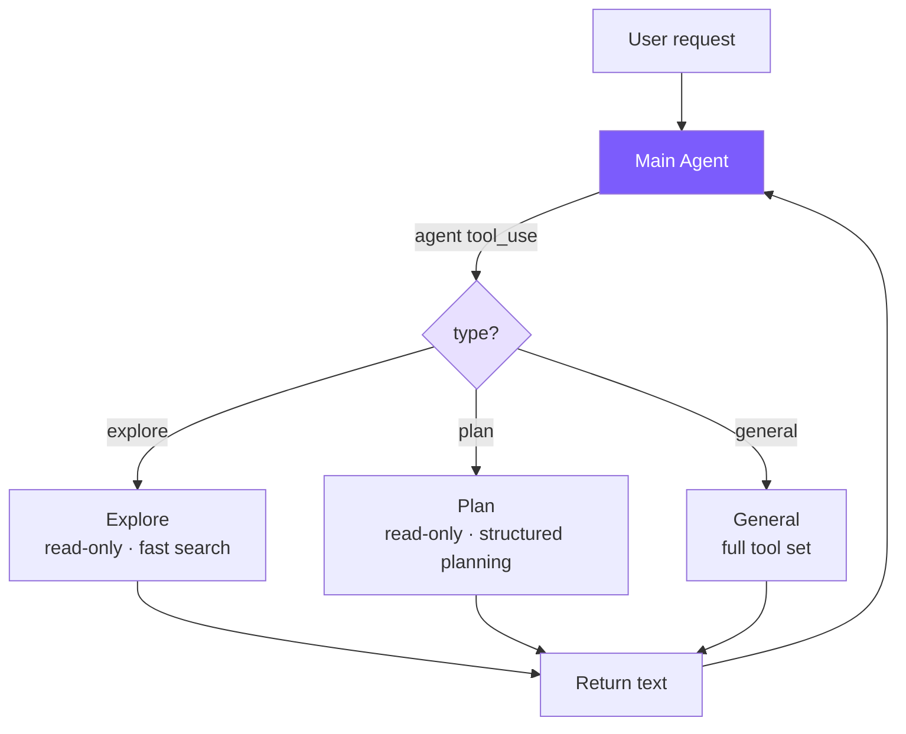

# 11. Multi-Agent Architecture

Sub-Agent (fork-return): main Agent forks a sub-Agent to execute exploration/planning/general tasks and returns the result.



## Reference: Claude Code's Approach

Three coordination modes:

| Mode | Characteristics |
|------|-----------------|
| **Sub-Agent** (fork-return) | Fork independently, return result on completion |
| **Coordinator** | One coordinator dispatches tasks to multiple Workers |
| **Swarm Team** | Peer-to-peer multi-Agent, mailbox communication |

**Built-in types**: Explore (Haiku model + read-only) / Plan (read-only + structured) / General (full tools, no recursion) / Custom (`.claude/agents/*.md`).

**Coordinator's key constraints**: Main Agent's tool set is hard-limited to `Agent` + `SendMessage`, cannot directly manipulate files; the prompt forbids writing "based on your findings" — forcing the coordinator to actually understand and concretize research results. **Counter-intuitive constraint at the synthesis stage**: Workers start from scratch independently and cannot see the coordinator ↔ user conversation, so prompts written to Workers must be self-contained.

**4-layer tool filter pipeline** (defense in depth): Remove meta-tools → additional restrictions on custom Agents → async Agent whitelist → type-level `disallowedTools`.

**Context isolation**: deny-by-default, messages independent, `abortController` propagates one-way (parent → child); exception is Bash background processes registered to root store to prevent zombies.

**Worktree isolation**: When multiple Agents write files in parallel, each is assigned an independent Git Worktree — sharing `.git` but with independent working directories.

We only implement the most-used Sub-Agent mode.

## Simplification Comparison

| Claude Code | mini-claude | Reason |
|-------------|-------------|--------|
| 5-stage execution flow | new Agent + runOnce | No process fork needed |
| 4-layer tool filter | 1 Set + filter | Only 3 fixed types |
| Explore uses Haiku | Uses main model | Reduces config |
| deny-by-default isolation | Natural isolation (independent Agent instance) | new Agent inherits independent message history |

## 1. Type Configuration

```typescript
// subagent.ts
export type SubAgentType = "explore" | "plan" | "general";

const READ_ONLY_TOOLS = new Set(["read_file", "list_files", "grep_search", "run_shell"]);

function getReadOnlyTools(): ToolDef[] {
  return toolDefinitions.filter((t) => READ_ONLY_TOOLS.has(t.name));
}
```

`run_shell` is in the read-only set — `git log`, `find`, `wc`, etc. are core to exploration. Safety enforced via system prompt.

```typescript
const EXPLORE_PROMPT = `You are an Explore agent — a fast, READ-ONLY sub-agent...

IMPORTANT CONSTRAINTS:
- You are READ-ONLY. Do NOT modify any files.
- If using run_shell, only use read commands (ls, cat, find, grep, git log, etc.)
- Do NOT use write, edit, rm, mv, or any destructive shell commands.

Be fast and thorough. Use multiple tool calls when possible.
Return a concise summary of your findings.`;

const PLAN_PROMPT = `You are a Plan agent — a READ-ONLY sub-agent specialized for designing implementation plans.

Your job:
- Analyze the codebase to understand the current architecture
- Design a step-by-step implementation plan
- Identify critical files that need modification

Return a structured plan with:
1. Summary of current state
2. Step-by-step implementation steps
3. Critical files for implementation
4. Potential risks or considerations`;

const GENERAL_PROMPT = `You are a General sub-agent handling an independent task.
Complete the assigned task and return a concise result. You have access to all tools.`;

export function getSubAgentConfig(type: SubAgentType): SubAgentConfig {
  const custom = discoverCustomAgents().get(type);
  if (custom) {
    const tools = custom.allowedTools
      ? toolDefinitions.filter(t => custom.allowedTools!.includes(t.name))
      : toolDefinitions.filter(t => t.name !== "agent");
    return { systemPrompt: custom.systemPrompt, tools };
  }
  switch (type) {
    case "explore": return { systemPrompt: EXPLORE_PROMPT, tools: getReadOnlyTools() };
    case "plan":    return { systemPrompt: PLAN_PROMPT,    tools: getReadOnlyTools() };
    case "general": return { systemPrompt: GENERAL_PROMPT,
                             tools: toolDefinitions.filter((t) => t.name !== "agent") };
  }
}
```

## 2. agent Tool

```typescript
// tools.ts
{
  name: "agent",
  description:
    "Launch a sub-agent to handle a task autonomously. Sub-agents have isolated context " +
    "and return their result. Types: 'explore' (read-only, fast search), " +
    "'plan' (read-only, structured planning), 'general' (full tools).",
  input_schema: {
    type: "object",
    properties: {
      description: { type: "string", description: "Short (3-5 word) description of the sub-agent's task" },
      prompt:      { type: "string", description: "Detailed task instructions for the sub-agent" },
      type: { type: "string", enum: ["explore", "plan", "general"],
              description: "Agent type. Default: general" },
    },
    required: ["description", "prompt"],
  },
}
```

`type` is not required — LLM omits when unsure, defaulting to `general`.

## 3. Agent Class Changes

Only 4 changes make the same Agent class serve both main and sub-Agents.

```typescript
// agent.ts
interface AgentOptions {
  customSystemPrompt?: string;
  customTools?: ToolDef[];
  isSubAgent?: boolean;
}

constructor(options: AgentOptions = {}) {
  this.isSubAgent = options.isSubAgent || false;
  this.tools = options.customTools || toolDefinitions;
  this.systemPrompt = options.customSystemPrompt || buildSystemPrompt();
}

// Output capture: tri-state outputBuffer
private outputBuffer: string[] | null = null;
private emitText(text: string): void {
  if (this.outputBuffer) this.outputBuffer.push(text);   // Child: collect
  else                    printAssistantText(text);       // Parent: print directly
}

// runOnce: one-shot entry
async runOnce(prompt: string): Promise<{ text: string; tokens: { input: number; output: number } }> {
  this.outputBuffer = [];
  const prevInput = this.totalInputTokens;
  const prevOutput = this.totalOutputTokens;
  await this.chat(prompt);
  const text = this.outputBuffer.join("");
  this.outputBuffer = null;
  return { text, tokens: {
    input:  this.totalInputTokens  - prevInput,
    output: this.totalOutputTokens - prevOutput,
  }};
}

// executeAgentTool
private async executeAgentTool(input: Record<string, any>): Promise<string> {
  const type = (input.type || "general") as SubAgentType;
  const description = input.description || "sub-agent task";
  const prompt = input.prompt || "";
  printSubAgentStart(type, description);

  const config = getSubAgentConfig(type);
  const subAgent = new Agent({
    model: this.model,
    customSystemPrompt: config.systemPrompt,
    customTools: config.tools,
    isSubAgent: true,
    permissionMode: this.permissionMode === "plan" ? "plan" : "bypassPermissions",
  });

  try {
    const result = await subAgent.runOnce(prompt);
    this.totalInputTokens  += result.tokens.input;
    this.totalOutputTokens += result.tokens.output;
    printSubAgentEnd(type, description);
    return result.text || "(Sub-agent produced no output)";
  } catch (e: any) {
    printSubAgentEnd(type, description);
    return `Sub-agent error: ${e.message}`;
  }
}

// agent tool needs Agent instance state, special dispatch
private async executeToolCall(name: string, input: Record<string, any>): Promise<string> {
  if (name === "agent") return this.executeAgentTool(input);
  return executeTool(name, input);
}
```

**Permission inheritance**: Child defaults to `bypassPermissions` (parent already authorized), but Plan Mode **must inherit** — otherwise child could bypass read-only, a security hole.

**Error strategy**: Child errors return as strings, not thrown, letting parent LLM decide retry/change strategy.

## 4. isSubAgent Flag: Skip Main-Agent-Only Operations

```typescript
if (!this.isSubAgent) { printDivider(); this.autoSave(); }
if (!this.isSubAgent)   printCost(this.totalInputTokens, this.totalOutputTokens);
```

Divider (child output already captured by buffer), session save (child is one-shot; saving would overwrite parent's file), cost printing (tokens already aggregated to parent; duplicate print misleads).

## 5. Custom Agent Types

```markdown
<!-- .claude/agents/reviewer.md -->
---
name: reviewer
description: Reviews code for bugs and style issues
allowed-tools: read_file, list_files, grep_search, run_shell
---
You are a code reviewer. Analyze the code thoroughly and report:
1. Bugs and potential issues
2. Style inconsistencies
3. Performance concerns
```

Discovery order: project-level `.claude/agents/` > user-level `~/.claude/agents/`. Frontmatter reuses `parseFrontmatter()`, shared with Memory / Skills.

## Core Insight

**A sub-Agent is essentially just an Agent instance with different configuration**. By adding `customTools` / `customSystemPrompt` / `isSubAgent` as optional Agent-class parameters, the same agent loop serves both main and sub-Agents, avoiding code duplication.

---

> **Next chapter**: Connecting the Agent to external tool servers -- MCP integration.
