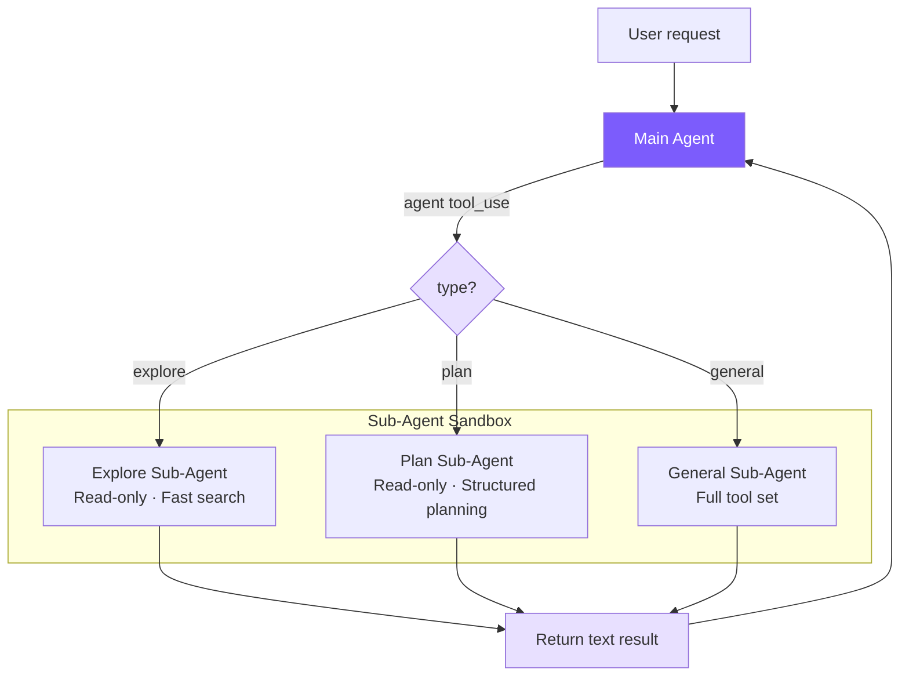

# 11. Multi-Agent Architecture

## Chapter Goals

Implement a Sub-Agent system: allow the main Agent to spawn independent sub-agents that perform exploration, planning, and general tasks, returning results to the main Agent when complete. This is Claude Code's most important "divide and conquer" mechanism for handling complex tasks.



## How Claude Code Does It

Claude Code's multi-agent system is implemented in `src/tools/AgentTool/`, supporting three collaboration modes:

| Mode | Characteristics |
|------|----------------|
| **Sub-Agent** (fork-return) | Forks to execute independently, returns result on completion |
| **Coordinator** | A coordinator assigns tasks to multiple Workers |
| **Swarm Team** | Multiple Agents collaborate as peers, communicating via mailboxes |

We implement the Sub-Agent mode, which is also the most commonly used.

### Built-in Agent Types

- **Explore**: Uses Haiku model (cheaper), read-only tool set, specialized for code search
- **Plan**: Read-only + structured output, designs implementation plans
- **General**: Full tool set (except it cannot recursively create sub-agents)
- **Custom**: Defined via `.claude/agents/*.md` files

### Key Design of Coordinator Mode

Coordinator turns the main Agent into a **pure orchestrator** -- its tool set is hard-limited to only `Agent` (spawn Workers) and `SendMessage` (continue a Worker), with absolutely no ability to perform file operations. This hard constraint prevents the coordinator from "being too lazy to delegate and doing it itself," which would cause it to degrade into a regular single Agent.

The standard workflow has four phases: **Research (parallel, read-only) -> Synthesize (coordinator, serial comprehension) -> Implement (serial, by file set) -> Verify**.

The synthesis phase has a counter-intuitive constraint: the prompt explicitly forbids writing "based on your findings." This forces the coordinator to genuinely understand and make research results concrete (including file paths, line numbers), rather than passing the comprehension work to the next Worker.

Each Worker is an independent Agent starting from scratch that cannot see the coordinator's conversation with the user, so the prompt the coordinator writes for Workers must be self-contained -- this is the biggest pitfall in Coordinator mode.

### Tool Filtering: 4-Layer Pipeline

Sub-agent tool access goes through a 4-layer filter, implementing defense in depth:

1. Remove meta-tools (`TaskOutput`, `EnterPlanMode`, `AskUserQuestion`, etc.) -- sub-agents should not control Agent execution flow
2. Additional restrictions for custom Agents -- user-defined types don't get the same trust level as built-in types
3. Async Agents use a whitelist mode -- background execution can't display interactive UI, requiring strict limits
4. Agent-type-level `disallowedTools` -- e.g., Explore explicitly excludes write tools

The first three layers are global policies; the fourth is type-level policy. Even if a custom Agent sets `disallowedTools: []`, the first three layers still apply.

### Context Isolation

Sub-agents use deny-by-default: message history is completely independent, `abortController` propagates one-way (parent abort -> child abort, but not the reverse), and sub-agent state changes don't propagate to the parent UI by default. There's only one exception: background processes started by Bash must be registered in the root store, or they become zombie processes.

### Worktree Isolation

When multiple Agents write files in parallel, Claude Code assigns each writing Agent an independent Git Worktree -- sharing the `.git` directory but with independent working directories, completely conflict-free, with much less overhead than `git clone`.

## Our Implementation

With **~199 lines** in `subagent.ts` plus minor changes to the Agent class, we implement the core of the Sub-Agent pattern.

| Claude Code | Our Implementation | Simplification Reason |
|-------------|-------------------|----------------------|
| 5-stage execution pipeline | Direct new Agent + runOnce | No need for fork processes, cache sharing |
| 4-layer tool filter pipeline | 1 Set + filter | Only 3 fixed types |
| Haiku model for Explore | Unified main model | Reduces configuration complexity |
| deny-by-default context isolation | Natural isolation (independent Agent instances) | new Agent comes with independent message history |

## Key Code

### 1. Agent Type Configuration -- `subagent.ts`

#### **TypeScript**
```typescript
export type SubAgentType = "explore" | "plan" | "general";

const READ_ONLY_TOOLS = new Set([
  "read_file", "list_files", "grep_search", "run_shell"
]);

function getReadOnlyTools(): ToolDef[] {
  return toolDefinitions.filter((t) => READ_ONLY_TOOLS.has(t.name));
}
```

Why is `run_shell` in the "read-only" tool set? Read-only commands like `git log`, `find`, and `wc` are essential for code exploration; completely prohibiting shell would severely weaken Explore's capabilities. Safety is ensured through system prompt constraints:

#### **TypeScript**
```typescript
const EXPLORE_PROMPT = `You are an Explore agent — a fast, READ-ONLY sub-agent...

IMPORTANT CONSTRAINTS:
- You are READ-ONLY. Do NOT modify any files.
- If using run_shell, only use read commands (ls, cat, find, grep, git log, etc.)
- Do NOT use write, edit, rm, mv, or any destructive shell commands.

Be fast and thorough. Use multiple tool calls when possible.
Return a concise summary of your findings.`;
```

The Plan Agent is also read-only, but its prompt guides it to produce structured plans:

#### **TypeScript**
```typescript
const PLAN_PROMPT = `You are a Plan agent — a READ-ONLY sub-agent specialized for designing implementation plans.

Your job:
- Analyze the codebase to understand the current architecture
- Design a step-by-step implementation plan
- Identify critical files that need modification
- Consider architectural trade-offs

Return a structured plan with:
1. Summary of current state
2. Step-by-step implementation steps
3. Critical files for implementation
4. Potential risks or considerations`;
```

The General Agent gets all tools except `agent`:

#### **TypeScript**
```typescript
const GENERAL_PROMPT = `You are a General sub-agent handling an independent task.
Complete the assigned task and return a concise result. You have access to all tools.`;

export function getSubAgentConfig(type: SubAgentType): SubAgentConfig {
  // Check custom agents first
  const custom = discoverCustomAgents().get(type);
  if (custom) {
    const tools = custom.allowedTools
      ? toolDefinitions.filter(t => custom.allowedTools!.includes(t.name))
      : toolDefinitions.filter(t => t.name !== "agent");
    return { systemPrompt: custom.systemPrompt, tools };
  }
  switch (type) {
    case "explore":
      return { systemPrompt: EXPLORE_PROMPT, tools: getReadOnlyTools() };
    case "plan":
      return { systemPrompt: PLAN_PROMPT, tools: getReadOnlyTools() };
    case "general":
      return {
        systemPrompt: GENERAL_PROMPT,
        tools: toolDefinitions.filter((t) => t.name !== "agent"),
      };
  }
}
```

### 2. Agent Tool Definition -- `tools.ts`

`agent` is registered as a regular tool. `type` is not required -- when the LLM is unsure, it can omit it and fall back to `general`:

#### **TypeScript**
```typescript
{
  name: "agent",
  description:
    "Launch a sub-agent to handle a task autonomously. Sub-agents have isolated context " +
    "and return their result. Types: 'explore' (read-only, fast search), " +
    "'plan' (read-only, structured planning), 'general' (full tools).",
  input_schema: {
    type: "object",
    properties: {
      description: { type: "string", description: "Short (3-5 word) description of the sub-agent's task" },
      prompt: { type: "string", description: "Detailed task instructions for the sub-agent" },
      type: {
        type: "string",
        enum: ["explore", "plan", "general"],
        description: "Agent type. Default: general",
      },
    },
    required: ["description", "prompt"],
  },
}
```

### 3. Agent Class Modifications -- `agent.ts`

Only 4 changes are needed to make the same Agent class serve both the main Agent and sub-agents.

#### 3a. Constructor: Accept Custom Configuration

#### **TypeScript**
```typescript
interface AgentOptions {
  // ...
  customSystemPrompt?: string;
  customTools?: ToolDef[];
  isSubAgent?: boolean;
}

constructor(options: AgentOptions = {}) {
  this.isSubAgent = options.isSubAgent || false;
  this.tools = options.customTools || toolDefinitions;
  this.systemPrompt = options.customSystemPrompt || buildSystemPrompt();
  // ...
}
```

When `customTools` is `None`, it falls back to the full tool list, with zero impact on the main Agent.

#### 3b. Output Capture: emitText + outputBuffer

Sub-agent text output can't be printed directly; it needs to be collected and returned to the main Agent:

#### **TypeScript**
```typescript
private outputBuffer: string[] | null = null;

private emitText(text: string): void {
  if (this.outputBuffer) {
    this.outputBuffer.push(text);   // Sub-agent: collect
  } else {
    printAssistantText(text);        // Main Agent: print directly
  }
}
```

`outputBuffer` has three states: `null` = main Agent mode (print directly), `[]` = sub-agent mode (start collecting), `[...]` = accumulating. The streaming callback only needs to call `emitText`, completely unaware of which mode it's running in.

#### 3c. runOnce: One-Shot Execution Entry Point

#### **TypeScript**
```typescript
async runOnce(prompt: string): Promise<{ text: string; tokens: { input: number; output: number } }> {
  this.outputBuffer = [];
  const prevInput = this.totalInputTokens;
  const prevOutput = this.totalOutputTokens;
  await this.chat(prompt);                         // Reuse the full agent loop
  const text = this.outputBuffer.join("");
  this.outputBuffer = null;
  return {
    text,
    tokens: {
      input: this.totalInputTokens - prevInput,
      output: this.totalOutputTokens - prevOutput,
    },
  };
}
```

Tokens are calculated incrementally (post-run minus pre-run) because the Agent instance's counters are cumulative. `chat()` is fully reused -- it doesn't care whether it's running in the main Agent or a sub-agent, since the tool set and output destination were already configured in the constructor.

#### 3d. executeAgentTool: Execute Sub-Agent

#### **TypeScript**
```typescript
private async executeAgentTool(input: Record<string, any>): Promise<string> {
  const type = (input.type || "general") as SubAgentType;
  const description = input.description || "sub-agent task";
  const prompt = input.prompt || "";

  printSubAgentStart(type, description);

  const config = getSubAgentConfig(type);
  const subAgent = new Agent({
    model: this.model,
    customSystemPrompt: config.systemPrompt,
    customTools: config.tools,
    isSubAgent: true,
    permissionMode: this.permissionMode === "plan" ? "plan" : "bypassPermissions",
  });

  try {
    const result = await subAgent.runOnce(prompt);
    this.totalInputTokens += result.tokens.input;
    this.totalOutputTokens += result.tokens.output;
    printSubAgentEnd(type, description);
    return result.text || "(Sub-agent produced no output)";
  } catch (e: any) {
    printSubAgentEnd(type, description);
    return `Sub-agent error: ${e.message}`;
  }
}
```

When a sub-agent errors, it returns an error string rather than crashing the parent Agent -- the parent Agent's LLM sees the error message and can decide on its own whether to retry or try a different strategy.

Permission inheritance: Sub-agents default to `bypassPermissions` (the main Agent has already been authorized, so sub-agents don't need to ask the user again), but Plan Mode must be inherited -- otherwise sub-agents could bypass the read-only restriction, which would be a security hole.

The `agent` tool requires special dispatch because it needs access to the current Agent instance's state (model, permissionMode, token counters) and can't go through the stateless generic dispatch function:

#### **TypeScript**
```typescript
private async executeToolCall(name: string, input: Record<string, any>): Promise<string> {
  if (name === "agent") {
    return this.executeAgentTool(input);
  }
  return executeTool(name, input);
}
```

### 4. The isSubAgent Flag

Sub-agents skip three operations that are only meaningful for the main Agent:

#### **TypeScript**
```typescript
if (!this.isSubAgent) {
  printDivider();
  this.autoSave();
}

if (!this.isSubAgent) {
  printCost(this.totalInputTokens, this.totalOutputTokens);
}
```

- Dividers: Sub-agent output is captured by the buffer and won't appear in the terminal
- Session saving: Sub-agents are one-time tasks; saving their session is pointless and could overwrite the main Agent's file
- Cost printing: Tokens are already aggregated to the parent Agent; sub-agents printing their own cost would create a false impression of double billing

### 5. Terminal UI -- `ui.ts`

#### **TypeScript**
```typescript
export function printSubAgentStart(type: string, description: string) {
  console.log(chalk.magenta(`\n  ┌─ Sub-agent [${type}]: ${description}`));
}

export function printSubAgentEnd(type: string, description: string) {
  console.log(chalk.magenta(`  └─ Sub-agent [${type}] completed`));
}
```

### 6. Custom Agent Types: `.claude/agents/*.md`

An extension mechanism identical to Claude Code's `.claude/agents/`:

```markdown
<!-- .claude/agents/reviewer.md -->
---
name: reviewer
description: Reviews code for bugs and style issues
allowed-tools: read_file, list_files, grep_search, run_shell
---
You are a code reviewer. Analyze the code thoroughly and report:
1. Bugs and potential issues
2. Style inconsistencies
3. Performance concerns
```

Discovery mechanism: Project-level (`.claude/agents/`) has higher priority than user-level (`~/.claude/agents/`), with same-name override. Frontmatter reuses `parseFrontmatter()`, sharing the same parser with Memory and Skills.

## Key Design Decisions

### Why Is Fork-Return a Better Starting Point Than Coordinator?

Fork-return's advantages are simple: no shared state (impossible to pollute the main Agent's context), deterministic control flow (send request, wait for result), and simple fault tolerance (sub-agent errors, main Agent keeps working). Coordinator is stronger at task parallelization but requires handling information sharing between Workers, conflict resolution -- an order of magnitude more complex.

### Why Can't Sub-Agents Create Sub-Agents?

The General Agent's tool list filters out `agent`. Without this restriction, recursive nesting of A creating B, B creating C would consume tokens exponentially -- each level has its own system prompt and message history. Claude Code has the same restriction; in practice, 1 level covers the vast majority of scenarios.

### Why Do Explore/Plan Keep run_shell?

Read-only shell commands like `git log --oneline -20` and `find . -name "*.ts" | wc -l` are essential for code exploration; completely prohibiting them would severely weaken capabilities. This design aligns with Claude Code's Explore Agent -- constrained via system prompt rather than completely disabling the tool.

### Why Use a Buffer to Collect Output Instead of Callbacks?

A callback approach would require passing `onText` into the constructor and adding checks throughout the agent loop. The buffer approach only modifies `emitText` in one place: `runOnce` opens it, `chat` writes to it, `runOnce` collects and closes it. The lifecycle boundaries are clear, with zero impact on existing code.

---

The core insight of the entire implementation: **a sub-agent is essentially just an Agent instance with different configuration**. By adding a few optional parameters to the Agent class (`customTools`, `customSystemPrompt`, `isSubAgent`), the same agent loop serves both the main Agent and sub-agents, avoiding code duplication.

> **Next chapter**: Connecting the Agent to external tool servers -- MCP integration.
