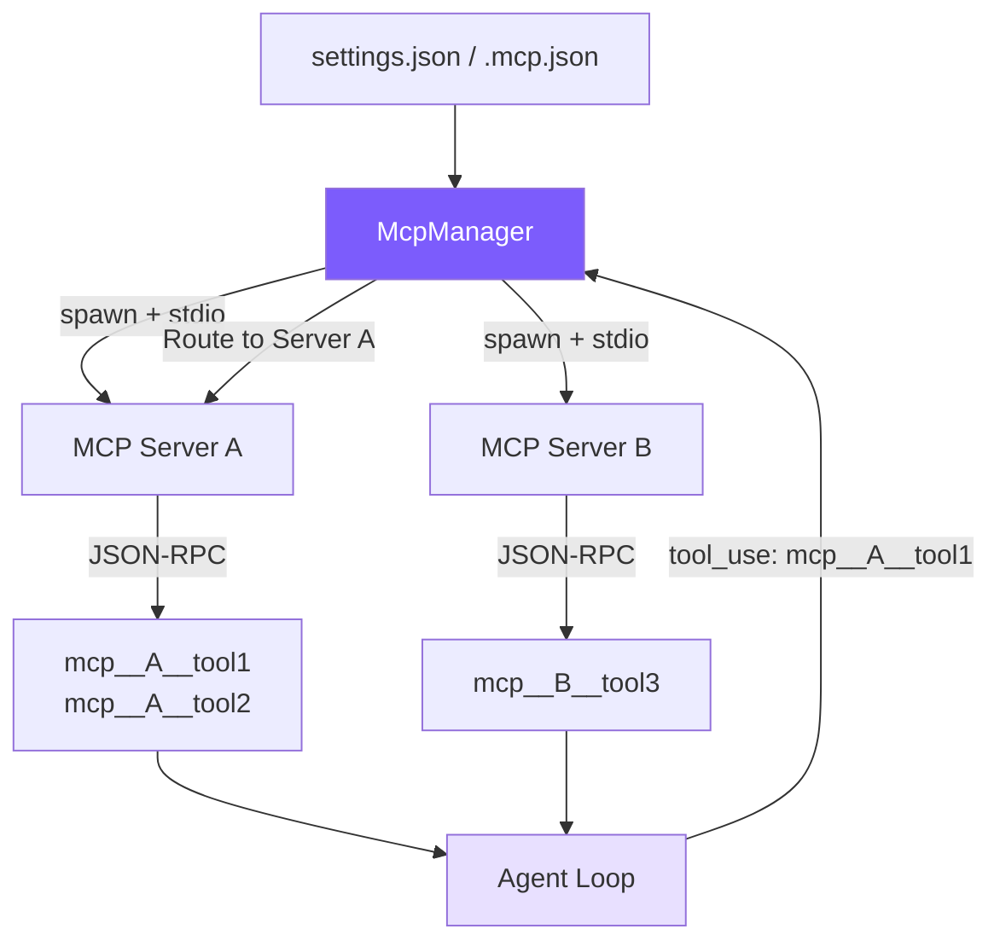

# 12. MCP Integration

Dynamically load external tools. **spawn subprocess → JSON-RPC handshake → discover tools → prefixed registration → transparent routing**.



## Reference: Claude Code's Approach

- **Config**: `settings.json` (user/project-level) + `.mcp.json` + enterprise MDM policy; later reads override earlier
- **Transport**: stdio (mainstream) + SSE (remote)
- **Naming**: `mcp__serverName__toolName` three-segment, resolves conflict + routing at once
- **Lifecycle**: spawn → `initialize` → `notifications/initialized` → `tools/list` → ready; two calls each with 15s timeout
- **Dynamic refresh**: server can notify client of tool list changes
- **Depends on `@anthropic-ai/sdk`** built-in MCP client

## Config Format

```json
// ~/.claude/settings.json or .claude/settings.json
{
  "mcpServers": {
    "filesystem": {
      "command": "npx",
      "args": ["@modelcontextprotocol/server-filesystem", "/tmp"],
      "env": {}
    },
    "github": {
      "command": "npx",
      "args": ["@modelcontextprotocol/server-github"],
      "env": { "GITHUB_TOKEN": "ghp_xxx" }
    }
  }
}
```

`.mcp.json` uses the same format. Three sources merge, later reads with same name override.

## Simplification Comparison

| Claude Code | mini-claude | Reason |
|-------------|-------------|--------|
| SDK built-in client | Raw JSON-RPC (~100 lines) | No SDK dep, protocol details visible |
| stdio + SSE | Only stdio | Covers 95% of scenarios |
| Dynamic refresh | One-time discovery | Tutorial doesn't need hot reload |
| 3 sources + enterprise policy | settings.json + .mcp.json | Drop enterprise |
| Retry + degradation | Silent skip on failure | Simplified error handling |

## McpConnection

```typescript
// mcp.ts
class McpConnection {
  private process: ChildProcess | null = null;
  private nextId = 1;
  private pending = new Map<number, { resolve: (v: any) => void; reject: (e: Error) => void }>();
  private rl: Interface | null = null;

  constructor(private serverName: string, private config: McpServerConfig) {}

  async connect(): Promise<void> {
    const env = { ...process.env, ...(this.config.env || {}) };
    this.process = spawn(this.config.command, this.config.args || [], {
      stdio: ["pipe", "pipe", "pipe"], env,
    });

    // Line-based JSON-RPC parsing on stdout
    this.rl = createInterface({ input: this.process.stdout! });
    this.rl.on("line", (line: string) => {
      try {
        const msg = JSON.parse(line);
        if (msg.id !== undefined && this.pending.has(msg.id)) {
          const { resolve, reject } = this.pending.get(msg.id)!;
          this.pending.delete(msg.id);
          if (msg.error) reject(new Error(`MCP error ${msg.error.code}: ${msg.error.message}`));
          else           resolve(msg.result);
        }
      } catch { /* Ignore non-JSON lines (server logs) */ }
    });
  }

  private sendRequest(method: string, params: any = {}): Promise<any> {
    return new Promise((resolve, reject) => {
      if (!this.process?.stdin?.writable)
        return reject(new Error(`MCP server '${this.serverName}' is not connected`));
      const id = this.nextId++;
      this.pending.set(id, { resolve, reject });
      this.process.stdin.write(JSON.stringify({ jsonrpc: "2.0", id, method, params }) + "\n");
    });
  }

  private sendNotification(method: string, params: any = {}): void {
    if (!this.process?.stdin?.writable) return;
    this.process.stdin.write(JSON.stringify({ jsonrpc: "2.0", method, params }) + "\n");
  }

  async initialize(): Promise<void> {
    await this.sendRequest("initialize", {
      protocolVersion: "2024-11-05",
      capabilities: {},
      clientInfo: { name: "mini-claude", version: "1.0.0" },
    });
    this.sendNotification("notifications/initialized");
  }

  async listTools(): Promise<McpToolInfo[]> {
    const result = await this.sendRequest("tools/list");
    if (!result?.tools || !Array.isArray(result.tools)) return [];
    return result.tools.map((t: any) => ({
      name: t.name, description: t.description || "",
      inputSchema: t.inputSchema, serverName: this.serverName,
    }));
  }

  async callTool(name: string, args: any): Promise<string> {
    const result = await this.sendRequest("tools/call", { name, arguments: args });
    if (result?.content && Array.isArray(result.content)) {
      return result.content.filter((c: any) => c.type === "text").map((c: any) => c.text).join("\n");
    }
    return JSON.stringify(result);
  }
}
```

Key points:
- **JSON-RPC request vs notification**: presence/absence of `id` field. Requests write to `pending` for pairing; notifications are fire-and-forget.
- **After `initialize`, `notifications/initialized` must be sent** to confirm ready.
- MCP returns `{ content: [{ type: "text", text: "..." }] }`; only extract text and concat (image and other types not handled).

## McpManager

```typescript
// mcp.ts
export class McpManager {
  private connections = new Map<string, McpConnection>();
  private tools: McpToolInfo[] = [];
  private connected = false;

  private loadConfigs(): Record<string, McpServerConfig> {
    const merged: Record<string, McpServerConfig> = {};
    this.mergeConfigFile(join(homedir(), ".claude", "settings.json"), merged);
    this.mergeConfigFile(join(process.cwd(), ".claude", "settings.json"), merged);
    this.mergeConfigFile(join(process.cwd(), ".mcp.json"), merged);
    return merged;
  }

  private mergeConfigFile(filePath: string, target: Record<string, McpServerConfig>): void {
    if (!existsSync(filePath)) return;
    try {
      const raw = JSON.parse(readFileSync(filePath, "utf-8"));
      const servers = raw.mcpServers || raw;   // Compatible with nested/flat
      for (const [name, config] of Object.entries(servers)) {
        if (this.isValidConfig(config)) target[name] = config as McpServerConfig;
      }
    } catch { /* Silent skip on format errors */ }
  }

  async loadAndConnect(): Promise<void> {
    if (this.connected) return;              // Idempotent
    this.connected = true;
    const configs = this.loadConfigs();
    if (Object.keys(configs).length === 0) return;

    const TIMEOUT_MS = 15_000;
    for (const [name, config] of Object.entries(configs)) {
      const conn = new McpConnection(name, config);
      try {
        await conn.connect();
        await Promise.race([
          conn.initialize(),
          new Promise((_, rej) => setTimeout(() => rej(new Error("timeout")), TIMEOUT_MS)),
        ]);
        const serverTools = await Promise.race([
          conn.listTools(),
          new Promise<McpToolInfo[]>((_, rej) => setTimeout(() => rej(new Error("timeout")), TIMEOUT_MS)),
        ]);
        this.connections.set(name, conn);
        this.tools.push(...serverTools);
        console.error(`[mcp] Connected to '${name}' — ${serverTools.length} tools`);
      } catch (err: any) {
        console.error(`[mcp] Failed to connect to '${name}': ${err.message}`);
        conn.close();
      }
    }
  }

  getToolDefinitions(): Array<{ name: string; description: string; input_schema: any }> {
    return this.tools.map((t) => ({
      name: `mcp__${t.serverName}__${t.name}`,
      description: t.description || `MCP tool ${t.name} from ${t.serverName}`,
      input_schema: t.inputSchema || { type: "object", properties: {} },
    }));
  }

  isMcpTool(name: string): boolean { return name.startsWith("mcp__"); }

  async callTool(prefixedName: string, args: any): Promise<string> {
    const parts = prefixedName.split("__");
    if (parts.length < 3) throw new Error(`Invalid MCP tool name: ${prefixedName}`);
    const serverName = parts[1];
    const toolName = parts.slice(2).join("__");   // Tool name may contain __
    const conn = this.connections.get(serverName);
    if (!conn) throw new Error(`MCP server '${serverName}' not connected`);
    return conn.callTool(toolName, args);
  }
}
```

15s timeout: first-time `npx` download often takes 3-8s, 15s covers most cases; timeout silently skips without affecting other servers.

## Agent Integration (two changes)

```typescript
// agent.ts — beginning of chat(), lazy load
if (!this.mcpInitialized && !this.isSubAgent) {
  this.mcpInitialized = true;
  try {
    await this.mcpManager.loadAndConnect();
    const mcpDefs = this.mcpManager.getToolDefinitions();
    if (mcpDefs.length > 0) this.tools = [...this.tools, ...mcpDefs as ToolDef[]];
  } catch (err: any) { console.error(`[mcp] Init failed: ${err.message}`); }
}

// agent.ts — executeToolCall() routing
private async executeToolCall(name: string, input: Record<string, any>): Promise<string> {
  if (name === "enter_plan_mode" || name === "exit_plan_mode") return await this.executePlanModeTool(name);
  if (name === "agent") return this.executeAgentTool(input);
  if (name === "skill") return this.executeSkillTool(input);
  if (this.mcpManager.isMcpTool(name)) return this.mcpManager.callTool(name, input);
  return executeTool(name, input, this.readFileState);
}
```

Three decisions: **lazy load** (connects only on first chat, zero overhead for short queries), **main Agent connects only** (child inherits), **fail without crash** (log and continue with built-ins).

## Simplification Comparison

| Dimension | Claude Code | mini-claude |
|-----------|------------|-------------|
| MCP SDK | `@anthropic-ai/sdk` built-in | Raw JSON-RPC, no dep |
| Transport | stdio + SSE | Only stdio |
| Tool discovery | Dynamic refresh | One-time |
| Config sources | settings + .mcp.json + enterprise | settings + .mcp.json |
| Error handling | Retry + degradation | Silent skip |
| Sub-Agent | Independent connection | Inherits main Agent tools |

---

> **Next chapter**: Full architecture comparison -- from ~3400 lines to 500,000, where's the gap, and what to do next.
